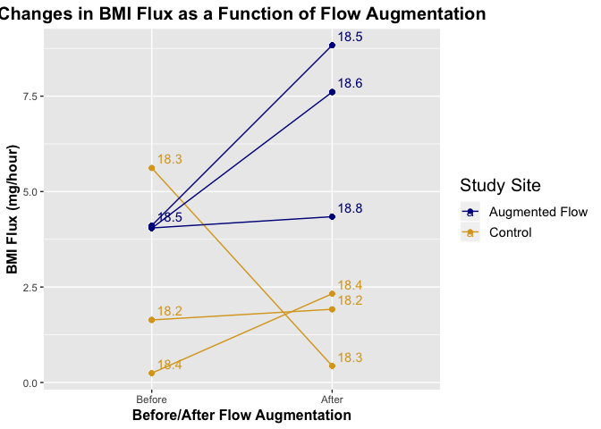

SRF-2018-Code
================
Keane Flynn & Weston Slaughter
12/30/2018

Load Libraries
--------------

``` r
library(dplyr)
```

    ## 
    ## Attaching package: 'dplyr'

    ## The following objects are masked from 'package:stats':
    ## 
    ##     filter, lag

    ## The following objects are masked from 'package:base':
    ## 
    ##     intersect, setdiff, setequal, union

``` r
library(readr)
library(tidyverse)
```

    ## ── Attaching packages ─────────────────────────────────────── tidyverse 1.2.1 ──

    ## ✔ ggplot2 3.0.0     ✔ purrr   0.2.5
    ## ✔ tibble  1.4.2     ✔ stringr 1.3.1
    ## ✔ tidyr   0.8.1     ✔ forcats 0.3.0

    ## ── Conflicts ────────────────────────────────────────── tidyverse_conflicts() ──
    ## ✖ dplyr::filter() masks stats::filter()
    ## ✖ dplyr::lag()    masks stats::lag()

``` r
library(ggplot2)
library(lubridate)
```

    ## 
    ## Attaching package: 'lubridate'

    ## The following object is masked from 'package:base':
    ## 
    ##     date

``` r
library(geometry)
```

    ## Loading required package: magic

    ## Loading required package: abind

``` r
library(rgl)
library(hypervolume)
```

    ## Loading required package: Rcpp

``` r
library(zoo)
```

    ## 
    ## Attaching package: 'zoo'

    ## The following objects are masked from 'package:base':
    ## 
    ##     as.Date, as.Date.numeric

``` r
library(stringr)
```

Productivity Data
=================

ChlA Data
---------

``` r
ChlA_Data_Porter <- 
  readr::read_csv(file = "ChlA-Data/ChlA-Data.csv",
                  col_types = "ccccdcddddddddc") %>%
  filter(Site == "Porter_Above") %>%
  group_by(Date_collected, Site_1)
```

    ## Warning: Duplicated column names deduplicated: 'Site' => 'Site_1' [4]

``` r
ChlA_Data_Porter
```

    ## # A tibble: 72 x 15
    ## # Groups:   Date_collected, Site_1 [20]
    ##    Site  Date_collected Date_processed Site_1 Cobble_SID Pool_or_Riffle
    ##    <chr> <chr>          <chr>          <chr>       <dbl> <chr>         
    ##  1 Port… 5/1/18         5/2/18         Frog_…          1 riffle        
    ##  2 Port… 5/1/18         5/2/18         Frog_…          5 riffle        
    ##  3 Port… 5/1/18         5/2/18         Frog_…          7 pool          
    ##  4 Port… 5/1/18         5/2/18         Frog_…         11 pool          
    ##  5 Port… 5/1/18         5/2/18         Jesus…          8 riffle        
    ##  6 Port… 5/1/18         5/2/18         Jesus…          9 riffle        
    ##  7 Port… 5/1/18         5/2/18         Jesus…         15 pool          
    ##  8 Port… 5/1/18         5/2/18         Jesus…         16 pool          
    ##  9 Port… 5/1/18         5/2/18         Golf_…          4 riffle        
    ## 10 Port… 5/1/18         5/2/18         Golf_…          6 riffle        
    ## # ... with 62 more rows, and 9 more variables: Volume_mL <dbl>,
    ## #   Volume_Added_mL <dbl>, Canister_Num <dbl>, Chla_reading <dbl>,
    ## #   Total_Chla_extracted <dbl>, Total_Chla_in_Sample <dbl>,
    ## #   Chla_area <dbl>, Cobble_Area <dbl>, Notes <chr>

### Summarized ChlA Data

``` r
Summarized_ChlA_Data_Pool <- ChlA_Data_Porter %>%
  filter(Pool_or_Riffle == "pool") %>%
  group_by(Date_collected, Site_1) %>%
  summarise(mean_ChlA_area = mean(Chla_area))

Summarized_ChlA_Data_Riffle <- ChlA_Data_Porter %>%
  filter(Pool_or_Riffle == "riffle") %>%
  group_by(Date_collected, Site_1) %>%
  summarise(mean_ChlA_area = mean(Chla_area))
```

### Plotting ChlA vs Time (Pool)

``` r
ChlA_Graph_Pool <- Summarized_ChlA_Data_Pool %>%
  ggplot(aes(x = Date_collected, y = mean_ChlA_area)) +
  geom_line(aes(group = Site_1, color = Site_1)) +
  geom_point(aes(shape = Site_1)) +
  labs(x = "Date", y = "Average Chlorophyll-A Reading per Unit Area of Cobble") +
  ggtitle("Chlorophyll-A Measurements vs Time (Pool)")
ChlA_Graph_Pool
```


### Plotting ChlA vs Time (Riffle)

``` r
ChlA_Graph_Riffle <- Summarized_ChlA_Data_Riffle %>%
  ggplot(aes(x = Date_collected, y = mean_ChlA_area)) +
  geom_line(aes(group = Site_1, color = Site_1)) +
  geom_point(aes(shape = Site_1)) +
  labs(x = "Date", y = "Average Chlorophyll-A Reading per Unit Area of Cobble") +
  ggtitle("Chlorophyll-A Measurements vs Time (Riffle)")
ChlA_Graph_Riffle
```


AFD Data
--------

``` r
AFD_Data_Porter <-
  readr::read_csv(file = "ChlA-Data/AFD-Data.csv",
                  col_types = "ccccdcddddddddc") %>%
  filter(Site == "Porter_Above") %>%
  group_by(Date_collected, Site_1) %>%
  select(Date_collected, Site_1, Cobble_SID, Pool_or_Riffle, Dry_Weight_g, AFD_Weight_g, Difference)
```

    ## Warning: Missing column names filled in: 'X14' [14], 'X15' [15]

    ## Warning: Duplicated column names deduplicated: 'Site' => 'Site_1' [4]

    ## Warning in rbind(names(probs), probs_f): number of columns of result is not
    ## a multiple of vector length (arg 1)

    ## Warning: 19 parsing failures.
    ## row # A tibble: 5 x 5 col     row col   expected actual                            file              expected   <int> <chr> <chr>    <chr>                             <chr>             actual 1    30 Notes a double Odd donut shape in filter         'ChlA-Data/AFD-D… file 2    33 Notes a double very small amount of algae scrap… 'ChlA-Data/AFD-D… row 3    48 Notes a double in oven at 5:10 PM                'ChlA-Data/AFD-D… col 4    64 Notes a double in oven at 5:45 PM                'ChlA-Data/AFD-D… expected 5    69 Notes a double MELTED IN OVEN REDO               'ChlA-Data/AFD-D…
    ## ... ................. ... .......................................................................... ........ .......................................................................... ...... .......................................................................... .... .......................................................................... ... .......................................................................... ... .......................................................................... ........ ..........................................................................
    ## See problems(...) for more details.

``` r
AFD_Data_Porter
```

    ## # A tibble: 72 x 7
    ## # Groups:   Date_collected, Site_1 [20]
    ##    Date_collected Site_1 Cobble_SID Pool_or_Riffle Dry_Weight_g
    ##    <chr>          <chr>       <dbl> <chr>                 <dbl>
    ##  1 5/1/18         Frog_…          1 riffle                 1.14
    ##  2 5/1/18         Frog_…          5 riffle                 1.18
    ##  3 5/1/18         Frog_…          7 pool                   1.16
    ##  4 5/1/18         Frog_…         11 pool                   1.15
    ##  5 5/1/18         Jesus…          8 riffle                 1.14
    ##  6 5/1/18         Jesus…          9 riffle                 1.14
    ##  7 5/1/18         Jesus…         15 pool                   1.15
    ##  8 5/1/18         Jesus…         16 pool                   1.15
    ##  9 5/1/18         Golf_…          4 riffle                 1.15
    ## 10 5/1/18         Golf_…          6 riffle                 1.14
    ## # ... with 62 more rows, and 2 more variables: AFD_Weight_g <dbl>,
    ## #   Difference <dbl>

### Summarizing AFD Data (Pool)

``` r
Summarized_AFD_Data_Pool <- AFD_Data_Porter %>%
  filter(Pool_or_Riffle == "pool") %>%
  filter(!AFD_Weight_g == "NA") %>%
  group_by(Date_collected, Site_1) %>%
  summarise(mean_diff = mean(Difference))

Summarized_AFD_Data_Riffle <- AFD_Data_Porter %>%
  filter(Pool_or_Riffle == "riffle") %>%
  filter(!AFD_Weight_g == "NA") %>%
  group_by(Date_collected, Site_1) %>%
  summarise(mean_diff = mean(Difference))
```

### Plotting AFD vs Time (Pool)

``` r
AFD_Graph_Pool <- Summarized_AFD_Data_Pool %>%
  ggplot(aes(x = Date_collected, y = mean_diff)) +
  geom_line(aes(group = Site_1, color = Site_1)) +
  geom_point(aes(shape = Site_1)) +
  labs(x = "Date", y = "Average Ash Free Dry Mass (Grams)") +
  ggtitle("Ash Free Dry Mass Measurements vs Time (Pool)")
AFD_Graph_Pool
```


### Plotting AFD vs Time (Riffle)

``` r
AFD_Graph_Riffle <- Summarized_AFD_Data_Riffle %>%
  ggplot(aes(x = Date_collected, y = mean_diff)) +
  geom_line(aes(group = Site_1, color = Site_1)) +
  geom_point(aes(shape = Site_1)) +
  labs(x = "Date", y = "Average Ash Free Dry Mass (Grams)") +
  ggtitle("Ash Free Dry Mass Measurements vs Time (Riffle)")
AFD_Graph_Riffle
```


Dissolved Oxygen Data
=====================

``` r
DO_Data_Porter <-
  readr::read_csv(file = "Photosynthesis/2018-Photosynthesis.csv",
                  col_types = "ccccdcddddcdddcdddcdddcddddddcdddddd") %>%
  filter(Stream == "Porter") %>%
  mutate(Max_Depth_DO = (MaxDepth_DO1 + MaxDepth_DO2 + MaxDepth_DO3)/3) %>%
  select(Stream, Date, Site_Name, Site_Num, Pool_Riffle, Max_Depth_DO, Light_Do_s, Light_DO_e, Dark_Do_s, Dark_DO_e)
```

    ## Warning in rbind(names(probs), probs_f): number of columns of result is not
    ## a multiple of vector length (arg 1)

    ## Warning: 50 parsing failures.
    ## row # A tibble: 5 x 5 col     row col        expected actual            file                         expected   <int> <chr>      <chr>    <chr>             <chr>                        actual 1     1 MaxDepth_… a double n/a (did not mea… 'Photosynthesis/2018-Photos… file 2     1 MaxDepth_… a double n/a               'Photosynthesis/2018-Photos… row 3     1 MaxDepth_… a double n/a               'Photosynthesis/2018-Photos… col 4     2 MaxDepth_… a double n/a               'Photosynthesis/2018-Photos… expected 5     2 MaxDepth_… a double n/a               'Photosynthesis/2018-Photos…
    ## ... ................. ... .......................................................................... ........ .......................................................................... ...... .......................................................................... .... .......................................................................... ... .......................................................................... ... .......................................................................... ........ ..........................................................................
    ## See problems(...) for more details.

``` r
DO_Data_Porter
```

    ## # A tibble: 72 x 10
    ##    Stream Date  Site_Name Site_Num Pool_Riffle Max_Depth_DO Light_Do_s
    ##    <chr>  <chr> <chr>        <dbl> <chr>              <dbl>      <dbl>
    ##  1 Porter 5/1/… Frog_Legs     18.1 R                   10.4       10.0
    ##  2 Porter 5/1/… Frog_Legs     18.1 R                   10.4       10.6
    ##  3 Porter 5/1/… Frog_Legs     18.1 P                   10.4       10.6
    ##  4 Porter 5/1/… Frog_Legs     18.1 P                   10.4       10.6
    ##  5 Porter 5/1/… Jesus_To…     18.2 R                   10.1       10.4
    ##  6 Porter 5/1/… Jesus_To…     18.2 R                   10.1       10.5
    ##  7 Porter 5/1/… Jesus_To…     18.2 P                   10.1       10.5
    ##  8 Porter 5/1/… Jesus_To…     18.2 P                   10.1       10.5
    ##  9 Porter 5/1/… Golf_Ball     18.3 R                   10.0       10.6
    ## 10 Porter 5/1/… Golf_Ball     18.3 R                   10.0       10.5
    ## # ... with 62 more rows, and 3 more variables: Light_DO_e <dbl>,
    ## #   Dark_Do_s <dbl>, Dark_DO_e <dbl>

Dissolved Oxygen (Pool)
-----------------------

``` r
Summary_DO_Data_Porter_Pool <- DO_Data_Porter %>%
  group_by(Stream, Date, Site_Name, Site_Num) %>%
  summarise(Max_Depth_DO = mean(Max_Depth_DO), Light_Do_s = mean(Light_Do_s), Light_DO_e = mean(Light_DO_e), Dark_Do_s = mean(Dark_Do_s), Dark_DO_e = mean(Dark_DO_e)) %>%
  arrange(Date, Site_Num)
Summary_DO_Data_Porter_Pool
```

    ## # A tibble: 20 x 9
    ## # Groups:   Stream, Date, Site_Name [20]
    ##    Stream Date  Site_Name Site_Num Max_Depth_DO Light_Do_s Light_DO_e
    ##    <chr>  <chr> <chr>        <dbl>        <dbl>      <dbl>      <dbl>
    ##  1 Porter 5/1/… Frog_Legs     18.1        10.4       10.5       11.1 
    ##  2 Porter 5/1/… Jesus_To…     18.2        10.1       10.5       11.4 
    ##  3 Porter 5/1/… Golf_Ball     18.3        10.0       10.5       11.3 
    ##  4 Porter 5/1/… Waterfall     18.4         9.90      10.3       11.7 
    ##  5 Porter 5/18… Frog_Legs     18.1        10.2       10.3       10.5 
    ##  6 Porter 5/18… Jesus_To…     18.2         9.92      10         10.4 
    ##  7 Porter 5/18… Golf_Ball     18.3         9.65       9.84      10.3 
    ##  8 Porter 5/18… Waterfall     18.4         9.52       9.62       9.96
    ##  9 Porter 6/13… Frog_Legs     18.1        10.3       10.0       10.2 
    ## 10 Porter 6/13… Jesus_To…     18.2        10.3       10.0       10.9 
    ## 11 Porter 6/13… Golf_Ball     18.3        10.3       10.8       11.5 
    ## 12 Porter 6/13… Waterfall     18.4         8.31      10.4       10.9 
    ## 13 Porter 7/13… Frog_Legs     18.1         7.84       7.72       8.34
    ## 14 Porter 7/13… Jesus_To…     18.2         8.51       7.96       9.44
    ## 15 Porter 7/13… Golf_Ball     18.3        10.8       10.6       11.7 
    ## 16 Porter 7/13… Waterfall     18.4         7.60       6.77       8.12
    ## 17 Porter 8/8/… Frog_Legs     18.1         3.17       4.34       6.02
    ## 18 Porter 8/8/… Jesus_To…     18.2         7.90       8.68       9.65
    ## 19 Porter 8/8/… Golf_Ball     18.3         5.83       6.30       6.96
    ## 20 Porter 8/8/… Waterfall     18.4         9.33       9.46      10.5 
    ## # ... with 2 more variables: Dark_Do_s <dbl>, Dark_DO_e <dbl>

Plotting Max Depth DO (Pool)
----------------------------

``` r
Max_Depth_DO_Graph_Pool <- Summary_DO_Data_Porter_Pool %>%
  ggplot(aes(Date, Max_Depth_DO)) +
  geom_line(aes(group = Site_Name, color = Site_Name)) +
  geom_point(aes(shape = Site_Name))
Max_Depth_DO_Graph_Pool
```


Plotting Light DO\_s Data
-------------------------

``` r
Light_DO_s_Graph <- Summary_DO_Data_Porter_Pool %>%
  ggplot(aes(Date, Light_Do_s)) +
  geom_line(aes(group = Site_Name, color = Site_Name)) +
  geom_point(aes(shape = Site_Name))
Light_DO_s_Graph
```


Plotting Light DO\_e Data
-------------------------

``` r
Light_DO_e_Graph <- Summary_DO_Data_Porter_Pool %>%
  ggplot(aes(Date, Light_DO_e)) +
  geom_line(aes(group = Site_Name, color = Site_Name)) +
  geom_point(aes(shape = Site_Name))
Light_DO_e_Graph
```


Plotting Dark DO\_s Data
------------------------

``` r
Dark_DO_s_Graph <- Summary_DO_Data_Porter_Pool %>%
  ggplot(aes(Date, Dark_Do_s)) +
  geom_line(aes(group = Site_Name, color = Site_Name)) +
  geom_point(aes(shape = Site_Name))
Dark_DO_s_Graph
```


Plotting Dark DO\_e Data
------------------------

``` r
Dark_DO_e_Graph <- Summary_DO_Data_Porter_Pool %>%
  ggplot(aes(Date, Dark_DO_e)) +
  geom_line(aes(group = Site_Name, color = Site_Name)) +
  geom_point(aes(shape = Site_Name))
Dark_DO_e_Graph
```


Electrofishing Data
===================

``` r
EFishing_Data <-
  readr::read_csv(file = "FishPopulation/EFishingData2018.csv",
                  col_types = "cccddddttddcdccdccdddddddcddddddddd") %>%
  filter(Stream == "Porter") %>%
  arrange(Date, Unit, Fish_Num, Pass_Num)
```

    ## Warning: Missing column names filled in: 'X36' [36], 'X37' [37],
    ## 'X38' [38], 'X39' [39], 'X40' [40]

    ## Warning: Unnamed `col_types` should have the same length as `col_names`.
    ## Using smaller of the two.

    ## Warning in rbind(names(probs), probs_f): number of columns of result is not
    ## a multiple of vector length (arg 1)

    ## Warning: 2006 parsing failures.
    ## row # A tibble: 5 x 5 col     row col               expected   actual   file                         expected   <int> <chr>             <chr>      <chr>    <chr>                        actual 1     1 Time_Per_Pass_Se… a double   N/A      'FishPopulation/EFishingDat… file 2     1 <NA>              35 columns 40 colu… 'FishPopulation/EFishingDat… row 3     2 Time_Per_Pass_Se… a double   N/A      'FishPopulation/EFishingDat… col 4     2 <NA>              35 columns 40 colu… 'FishPopulation/EFishingDat… expected 5     3 Time_Per_Pass_Se… a double   N/A      'FishPopulation/EFishingDat…
    ## ... ................. ... .......................................................................... ........ .......................................................................... ...... .......................................................................... .... .......................................................................... ... .......................................................................... ... .......................................................................... ........ ..........................................................................
    ## See problems(...) for more details.

``` r
EFishing_Data
```

    ## # A tibble: 524 x 35
    ##    Date  Stream Unit  Fish_Num_Per_Si… Fish_Num Pass_Num Time_Per_Pass_S…
    ##    <chr> <chr>  <chr>            <dbl>    <dbl>    <dbl>            <dbl>
    ##  1 5/23… Porter 18.1…               51      120        1              289
    ##  2 5/23… Porter 18.1…               52      121        1              289
    ##  3 5/23… Porter 18.1…               53      122        1              289
    ##  4 5/23… Porter 18.1…               54      123        1              289
    ##  5 5/23… Porter 18.1…               55      124        1              289
    ##  6 5/23… Porter 18.1…               56      125        1              289
    ##  7 5/23… Porter 18.1…               57      126        1              289
    ##  8 5/23… Porter 18.1…               58      127        1              289
    ##  9 5/23… Porter 18.1…               59      128        1              289
    ## 10 5/23… Porter 18.1…               60      129        1              289
    ## # ... with 514 more rows, and 28 more variables: Start_Time <time>,
    ## #   End_Time <time>, Length_mm <dbl>, Weight_g <dbl>, Species <chr>,
    ## #   Recapture <dbl>, PIT <chr>, Fecal_Num <chr>, Mort <dbl>, Notes <chr>,
    ## #   Fin <chr>, Stage <dbl>, `Pool Length` <dbl>, Width_1 <dbl>,
    ## #   Width_2 <dbl>, Width_3 <dbl>, Max_Depth_cm <dbl>, DS_RCT_cm <dbl>,
    ## #   `SeaGrant HabID` <chr>, Fat1 <dbl>, Fat2 <dbl>, Fat3 <dbl>,
    ## #   Fat4 <dbl>, Fat5 <dbl>, Fat6 <dbl>, Fat7 <dbl>, Fat8 <dbl>,
    ## #   Fat_AVG <dbl>

``` r
CombiningMovement_Efish <- EFishing_Data %>%
  filter(!PIT == "N/A")
```

TU Hydrology Data
=================

``` r
Porter_FlowData <-
  readr::read_csv("Hydrology/PorterCreek_FlowData_TU/Po04-Table 1.csv", 
                  skip = 4) %>%
  mutate(Date = str_extract(SampleDate, "\\d......")) %>%
  group_by(Date) %>%
  summarise(Streamflow_cfs = mean(Streamflow_cfs)) %>%
  mutate(Streamflow_gpm = Streamflow_cfs*448) %>%
  mutate(Date = str_extract(Date, "[0-9]{1,2}/[0-9]{1,2}/18")) %>%
  filter(!Date == "NA") 
```

    ## Warning: Missing column names filled in: 'X5' [5], 'X6' [6], 'X7' [7],
    ## 'X8' [8], 'X9' [9], 'X10' [10], 'X11' [11], 'X12' [12], 'X13' [13],
    ## 'X14' [14], 'X15' [15], 'X16' [16], 'X17' [17]

    ## Parsed with column specification:
    ## cols(
    ##   SampleDate = col_character(),
    ##   `WaterTemp, C` = col_double(),
    ##   `Water Depth, ft` = col_double(),
    ##   Streamflow_cfs = col_double(),
    ##   X5 = col_character(),
    ##   X6 = col_character(),
    ##   X7 = col_character(),
    ##   X8 = col_character(),
    ##   X9 = col_character(),
    ##   X10 = col_character(),
    ##   X11 = col_character(),
    ##   X12 = col_character(),
    ##   X13 = col_character(),
    ##   X14 = col_character(),
    ##   X15 = col_character(),
    ##   X16 = col_character(),
    ##   X17 = col_character()
    ## )

``` r
Porter_FlowData
```

    ## # A tibble: 247 x 3
    ##    Date    Streamflow_cfs Streamflow_gpm
    ##    <chr>            <dbl>          <dbl>
    ##  1 1/1/18           0.470           210.
    ##  2 1/10/18         13.2            5893.
    ##  3 1/11/18          7.14           3197.
    ##  4 1/12/18          4.74           2126.
    ##  5 1/13/18          3.44           1540.
    ##  6 1/14/18          2.69           1206.
    ##  7 1/15/18          2.19            983.
    ##  8 1/16/18          2.07            925.
    ##  9 1/17/18          1.75            782.
    ## 10 1/18/18          1.95            874.
    ## # ... with 237 more rows

Augmentation Data
=================

``` r
Porter_AugmentationData <- 
  readr::read_csv("Hydrology/PorterCreek_AugmentationData.csv") %>%
  select(X1, Date, avg_gpm)
```

    ## Warning: Missing column names filled in: 'X1' [1]

    ## Parsed with column specification:
    ## cols(
    ##   X1 = col_integer(),
    ##   Date = col_character(),
    ##   avg_gpm = col_double(),
    ##   Min = col_integer(),
    ##   Max = col_integer(),
    ##   avg_clean = col_double(),
    ##   gpd = col_double(),
    ##   `ac-ft` = col_double(),
    ##   cum_ac_ft = col_double()
    ## )

``` r
Porter_AugmentationData
```

    ## # A tibble: 367 x 3
    ##       X1 Date    avg_gpm
    ##    <int> <chr>     <dbl>
    ##  1     1 1/3/18  73.2   
    ##  2     2 1/4/18  25.1   
    ##  3     3 1/5/18   0.0208
    ##  4     4 1/6/18   0.0625
    ##  5     5 1/7/18   0     
    ##  6     6 1/8/18   0.167 
    ##  7     7 1/9/18   0.0625
    ##  8     8 1/10/18  0.125 
    ##  9     9 1/11/18  0.146 
    ## 10    10 1/12/18  0.0417
    ## # ... with 357 more rows

Movement Data
=============

``` r
PIT_Data <- 
  readr::read_csv(file = "FishPopulation/POR_MovementStudy.csv",
                  col_types = "cccctccccc") %>%
  mutate(PIT = str_extract(PITNumber, "06....")) %>%
  select(Species_Lookup, PIT, Date_Lookup, Date, Time, Site, HabitatType, UnitNumber, Survey, Comments) 
PIT_Data
```

    ## # A tibble: 624 x 10
    ##    Species_Lookup PIT   Date_Lookup Date  Time  Site  HabitatType
    ##    <chr>          <chr> <chr>       <chr> <tim> <chr> <chr>      
    ##  1 COHO SALMON    068D… 6/7/18      6/7/… 12:15 POR 1 POOL       
    ##  2 COHO SALMON    068D… 6/7/18      6/8/… 13:28 POR … (blank)    
    ##  3 COHO SALMON    068D… 6/7/18      6/12… 19:57 POR … (blank)    
    ##  4 COHO SALMON    068D… 6/7/18      6/7/… 12:44 POR 1 POOL       
    ##  5 COHO SALMON    068D… 6/7/18      6/8/… 13:42 POR … (blank)    
    ##  6 COHO SALMON    068D… 6/7/18      6/8/… 20:35 POR … (blank)    
    ##  7 COHO SALMON    068D… 6/7/18      6/7/… 12:23 POR 1 POOL       
    ##  8 COHO SALMON    068D… 6/7/18      6/8/… 13:35 POR … (blank)    
    ##  9 COHO SALMON    068D… 6/7/18      6/9/… 05:15 POR … (blank)    
    ## 10 COHO SALMON    06A7… 6/7/18      6/7/… 11:14 POR 1 POOL       
    ## # ... with 614 more rows, and 3 more variables: UnitNumber <chr>,
    ## #   Survey <chr>, Comments <chr>

Creating a Movement vs Augmentation Dataset
-------------------------------------------

``` r
EFish_Movement_Data <- left_join(PIT_Data, CombiningMovement_Efish, by = "PIT") %>%
  select(Species, PIT, Date_Lookup, Date.x, Time, Site, UnitNumber, Survey, Unit, Fish_Num_Per_Site, Fish_Num, Length_mm, Weight_g, Recapture, Fat_AVG, Comments) %>%
  mutate(Survey_tally = if_else(Survey == "ANT", 1, 0)) %>%
  group_by(Date.x) %>%
  mutate(Movement_tally = cumsum(Survey_tally)) %>%
  mutate(Max_Ping_Tally = max(Movement_tally)) %>%
  arrange(Date.x, Time) %>%
  filter(!Species == "Cottus_spp")
EFish_Movement_Data
```

    ## # A tibble: 995 x 19
    ## # Groups:   Date.x [68]
    ##    Species PIT   Date_Lookup Date.x Time  Site  UnitNumber Survey Unit 
    ##    <chr>   <chr> <chr>       <chr>  <tim> <chr> <chr>      <chr>  <chr>
    ##  1 Omykiss 06A7… 6/7/18      6/10/… 02:00 POR … (blank)    ANT    18.6 
    ##  2 Okisut… 06A8… 6/7/18      6/10/… 05:19 POR … (blank)    ANT    18.6 
    ##  3 Okisut… 06A8… 6/7/18      6/10/… 05:19 POR … (blank)    ANT    18.6 
    ##  4 Omykiss 068D… 6/7/18      6/10/… 05:45 POR … (blank)    ANT    18.55
    ##  5 Okisut… 06A7… 6/7/18      6/10/… 06:02 POR … (blank)    ANT    18.6 
    ##  6 Okisut… 06A7… 6/7/18      6/10/… 06:02 POR … (blank)    ANT    18.6 
    ##  7 Omykiss 06A8… 6/4/18      6/10/… 09:54 POR … (blank)    ANT    18.3 
    ##  8 Omykiss 068D… 6/7/18      6/10/… 15:39 POR … (blank)    ANT    18.55
    ##  9 Omykiss 068D… 6/7/18      6/10/… 17:29 POR … (blank)    ANT    18.5 
    ## 10 Okisut… 06A7… 6/7/18      6/10/… 18:26 POR … (blank)    ANT    18.6 
    ## # ... with 985 more rows, and 10 more variables: Fish_Num_Per_Site <dbl>,
    ## #   Fish_Num <dbl>, Length_mm <dbl>, Weight_g <dbl>, Recapture <dbl>,
    ## #   Fat_AVG <dbl>, Comments <chr>, Survey_tally <dbl>,
    ## #   Movement_tally <dbl>, Max_Ping_Tally <dbl>

``` r
Augmentation_MovementData <- EFish_Movement_Data %>%
  distinct(Max_Ping_Tally) %>%
  left_join(Porter_AugmentationData, EFish_Movement_Data, by = c("Date.x" = "Date")) %>%
  arrange(X1) %>%
  select(X1, Date.x, Max_Ping_Tally, avg_gpm) %>%
  filter(!X1 == "NA") 
  names(Augmentation_MovementData)[2] <- "Date"
Augmentation_MovementData 
```

    ## # A tibble: 68 x 4
    ## # Groups:   Date.x [68]
    ##       X1 Date    Max_Ping_Tally avg_gpm
    ##    <int> <chr>            <dbl>   <dbl>
    ##  1   153 6/4/18               0  0.132 
    ##  2   155 6/6/18               5  0.0417
    ##  3   156 6/7/18              24  0.194 
    ##  4   157 6/8/18              47  0.0417
    ##  5   158 6/9/18              29  0     
    ##  6   159 6/10/18             15  0.174 
    ##  7   160 6/11/18             26  0     
    ##  8   161 6/12/18             13  0.0417
    ##  9   162 6/13/18              6  0.312 
    ## 10   165 6/16/18              2  0.0208
    ## # ... with 58 more rows

``` r
Augmentation_MovementData$Date <- as.Date(Augmentation_MovementData$Date, "%m/%d/%Y")
```

### Movement Data vs Flow Graph

``` r
ggplot(Augmentation_MovementData) + 
  geom_col(aes(x = Date, y = Max_Ping_Tally), width = 0.5, fill = "blue") + 
  geom_line(aes(x = Date, y = avg_gpm/5), group = 1, color = "red") + 
  theme(axis.text.x = element_text(angle = 90, hjust = 1)) + 
  scale_y_continuous(sec.axis = sec_axis(~.*5, name = "Augmentation (GPM)")) + 
  labs(x = "Date", y = "Salmonid PIT Movement Pings") + 
  ggtitle("Augmentation vs Interpool Movement Relationship") +
  theme(axis.text.y.right = element_text(colour="red"), axis.text.y.left = element_text(colour="blue"), axis.title.y.right = element_text(color = "red"), axis.title.y.left = element_text(color = "blue"))
```


Movement Data vs Discharge Data
-------------------------------

``` r
Flow_MovementData <- EFish_Movement_Data %>%
  distinct(Max_Ping_Tally) %>%
  left_join(Porter_FlowData, EFish_Movement_Data, by = c("Date.x" = "Date")) %>%
  select(Date.x, Max_Ping_Tally, Streamflow_gpm) %>%
  filter(!Date.x == "NA")
  names(Flow_MovementData)[1] <- "Date"
Flow_MovementData
```

    ## # A tibble: 68 x 3
    ## # Groups:   Date.x [68]
    ##    Date    Max_Ping_Tally Streamflow_gpm
    ##    <chr>            <dbl>          <dbl>
    ##  1 6/10/18             15           242.
    ##  2 6/11/18             26           234.
    ##  3 6/12/18             13           229.
    ##  4 6/13/18              6           212.
    ##  5 6/16/18              2           204.
    ##  6 6/18/18              1           228.
    ##  7 6/19/18              3           220.
    ##  8 6/22/18              2           175 
    ##  9 6/30/18              6           473.
    ## 10 6/4/18               0           298.
    ## # ... with 58 more rows

``` r
Flow_MovementData$Date <- as.Date(Flow_MovementData$Date, "%m/%d/%y")
Flow_MovementData
```

    ## # A tibble: 68 x 3
    ## # Groups:   Date.x [68]
    ##    Date       Max_Ping_Tally Streamflow_gpm
    ##    <date>              <dbl>          <dbl>
    ##  1 2018-06-10             15           242.
    ##  2 2018-06-11             26           234.
    ##  3 2018-06-12             13           229.
    ##  4 2018-06-13              6           212.
    ##  5 2018-06-16              2           204.
    ##  6 2018-06-18              1           228.
    ##  7 2018-06-19              3           220.
    ##  8 2018-06-22              2           175 
    ##  9 2018-06-30              6           473.
    ## 10 2018-06-04              0           298.
    ## # ... with 58 more rows

### Movement Data vs Discharge Data

``` r
ggplot(Flow_MovementData) + 
  geom_col(aes(x = Date, y = Max_Ping_Tally), width = 0.5, fill = "darkblue") + 
  geom_line(aes(x = Date, y = Streamflow_gpm/5), group = 1, color = "goldenrod") + 
  theme(axis.text.x = element_text(angle = 90, hjust = 1)) + 
  scale_y_continuous(sec.axis = sec_axis(~.*5, name = "Discharge (GPM)")) + 
  labs(x = "Date", y = "Salmonid PIT Movement Pings") + 
  ggtitle("Discharge vs Interpool Movement Relationship") +
  theme(axis.text.y.right = element_text(colour="goldenrod", face = "bold"), axis.text.y.left = element_text(colour="darkblue", face = "bold"), axis.title.y.right = element_text(color = "goldenrod", face = "bold"), axis.title.y.left = element_text(color = "darkblue", face = "bold"), plot.title = element_text(hjust = 0.5, size = 22, face = "bold"), axis.title.x = element_text(face = "bold", size = 18), axis.text.x = element_text(size = 12)) +
  theme_bw()
```


Macroinvertebrate Drift Data
============================

``` r
BMI_Drift_Flux_Dataset <- 
  read_csv(file = "Macroinvertebrate/Porter_BACI_Study_Drift - BACI_Sites_2018.csv",
           col_types = "cccccttdddddccdddddc") %>% 
  arrange(desc(Event), Pool) %>% 
  mutate(Test_Reach = ifelse(Pool == "18.2", "Control", if_else(Pool == "18.3", "Control", if_else(Pool == "18.4", "Control", "Augmented Flow")))) %>% 
  select(Date, Test_Reach, Event, Pool, Duration_hrs, ID, biomass) %>% 
  na.omit(TRUE) %>% 
  group_by(Event, Pool) %>% 
  mutate(BMI_Flux_mg_hrs = sum(biomass)/Duration_hrs) 
```

    ## Warning in rbind(names(probs), probs_f): number of columns of result is not
    ## a multiple of vector length (arg 1)

    ## Warning: 9 parsing failures.
    ## row # A tibble: 5 x 5 col     row col     expected actual file                                       expected   <int> <chr>   <chr>    <chr>  <chr>                                      actual 1    24 lna     a double #N/A   'Macroinvertebrate/Porter_BACI_Study_Drif… file 2    24 b       a double #N/A   'Macroinvertebrate/Porter_BACI_Study_Drif… row 3    24 biomass a double #N/A   'Macroinvertebrate/Porter_BACI_Study_Drif… col 4    44 lna     a double #N/A   'Macroinvertebrate/Porter_BACI_Study_Drif… expected 5    44 b       a double #N/A   'Macroinvertebrate/Porter_BACI_Study_Drif…
    ## ... ................. ... .......................................................................... ........ .......................................................................... ...... .......................................................................... .... .......................................................................... ... .......................................................................... ... .......................................................................... ........ ..........................................................................
    ## See problems(...) for more details.

``` r
BMI_Drift_Flux_Dataset$Date <- base::as.Date(BMI_Drift_Flux_Dataset$Date, "%m/%d/%Y")
BMI_Drift_Flux_Dataset
```

    ## # A tibble: 137 x 8
    ## # Groups:   Event, Pool [12]
    ##    Date       Test_Reach Event Pool  Duration_hrs ID    biomass
    ##    <date>     <chr>      <chr> <chr>        <dbl> <chr>   <dbl>
    ##  1 2018-07-01 Control    Befo… 18.2          1.53 Chir…  0.0319
    ##  2 2018-07-01 Control    Befo… 18.2          1.53 ter …  0.250 
    ##  3 2018-07-01 Control    Befo… 18.2          1.53 chir…  0.0221
    ##  4 2018-07-01 Control    Befo… 18.2          1.53 adul…  0.1   
    ##  5 2018-07-01 Control    Befo… 18.2          1.53 ter …  0.0126
    ##  6 2018-07-01 Control    Befo… 18.2          1.53 Hydr…  0.0350
    ##  7 2018-07-01 Control    Befo… 18.2          1.53 adul…  0.297 
    ##  8 2018-07-01 Control    Befo… 18.2          1.53 Elmi…  0.801 
    ##  9 2018-07-01 Control    Befo… 18.2          1.53 ter …  0.505 
    ## 10 2018-07-01 Control    Befo… 18.2          1.53 ter …  0.0830
    ## # ... with 127 more rows, and 1 more variable: BMI_Flux_mg_hrs <dbl>

``` r
BMI_Drift_Flux_Dataset$Event <- factor(BMI_Drift_Flux_Dataset$Event, levels = c("Before", "After"))

col_value <- c("Control" = "goldenrod", "Augmented Flow" = "darkblue")

Macroinvertebrate_BACI_Flux <- 
  ggplot(BMI_Drift_Flux_Dataset, aes(x = Event, y = BMI_Flux_mg_hrs)) + 
  geom_point(aes(color = Test_Reach)) +
  geom_line(aes(group = Pool, color = Test_Reach)) +
  geom_text(aes(label = Pool, hjust = -0.2, vjust = -0.5, color = Test_Reach), check_overlap = TRUE) + 
  scale_color_manual(values = col_value) +
  xlab("Before/After Flow Augmentation") +
  ylab("BMI Flux (mg/hour)") +
  ggtitle("Changes in BMI Flux as a Function of Flow Augmentation") +
  theme(plot.title = element_text(face = "bold", size = 15, hjust = 0.5), axis.title.x = element_text(size = 12, face = "bold"), axis.title.y = element_text(size = 12, face = "bold"), legend.title = element_text(size = 15), legend.text = element_text(size = 11)) +
  labs(color = "Study Site")
Macroinvertebrate_BACI_Flux
```



VidSync Data
============

This section of the code is devoted to importing, analyzing, and creating correlations with 3-D Videogrammetry data collected using VidSync from the summer of 2018 on Porter Creek. This is my child and I will keep it neat.

Importing Data
--------------

### Pre-Augmentation

``` r
GolfBall_VidSync_Pre <- 
  readr::read_csv(file = "VidSync-Data/PreAugmentation/Porter_BACI_GolfBall_30June2018_Part3.csv",
           skip = 2,
                    col_names = c("objects", "event", "timecode", "time", "X", "Y", "Z", "pld_error", "projection_error", "nearest_camera_distance", "screen_coordinates"),
                    col_types = "cccdddddddd")
```

    ## Warning in rbind(names(probs), probs_f): number of columns of result is not
    ## a multiple of vector length (arg 1)

    ## Warning: 168 parsing failures.
    ## row # A tibble: 5 x 5 col     row col   expected   actual   file                                     expected   <int> <chr> <chr>      <chr>    <chr>                                    actual 1     1 <NA>  11 columns 10 colu… 'VidSync-Data/PreAugmentation/Porter_BA… file 2     2 <NA>  11 columns 10 colu… 'VidSync-Data/PreAugmentation/Porter_BA… row 3     3 <NA>  11 columns 10 colu… 'VidSync-Data/PreAugmentation/Porter_BA… col 4     4 <NA>  11 columns 10 colu… 'VidSync-Data/PreAugmentation/Porter_BA… expected 5     5 <NA>  11 columns 10 colu… 'VidSync-Data/PreAugmentation/Porter_BA…
    ## ... ................. ... .......................................................................... ........ .......................................................................... ...... .......................................................................... .... .......................................................................... ... .......................................................................... ... .......................................................................... ........ ..........................................................................
    ## See problems(...) for more details.

``` r
HalfTire_VidSync_Pre <-
  readr::read_csv(file = "VidSync-Data/PreAugmentation/Porter_BACI_HalfTire_29June2018_Part2.csv",
           skip = 2,
                    col_names = c("objects", "event", "timecode", "time", "X", "Y", "Z", "pld_error", "projection_error", "nearest_camera_distance", "screen_coordinates"),
                    col_types = "cccdddddddd")
```

    ## Warning in rbind(names(probs), probs_f): number of columns of result is not
    ## a multiple of vector length (arg 1)

    ## Warning: 113 parsing failures.
    ## row # A tibble: 5 x 5 col     row col   expected   actual   file                                     expected   <int> <chr> <chr>      <chr>    <chr>                                    actual 1     1 <NA>  11 columns 10 colu… 'VidSync-Data/PreAugmentation/Porter_BA… file 2     2 <NA>  11 columns 10 colu… 'VidSync-Data/PreAugmentation/Porter_BA… row 3     3 <NA>  11 columns 10 colu… 'VidSync-Data/PreAugmentation/Porter_BA… col 4     4 <NA>  11 columns 10 colu… 'VidSync-Data/PreAugmentation/Porter_BA… expected 5     5 <NA>  11 columns 10 colu… 'VidSync-Data/PreAugmentation/Porter_BA…
    ## ... ................. ... .......................................................................... ........ .......................................................................... ...... .......................................................................... .... .......................................................................... ... .......................................................................... ... .......................................................................... ........ ..........................................................................
    ## See problems(...) for more details.

``` r
RoachRun_VidSync_Pre <-
  readr::read_csv(file = "VidSync-Data/PreAugmentation/Porter_BACI_RoachRun_29June2018_Part3.csv",
           skip = 2,
                    col_names = c("objects", "event", "timecode", "time", "X", "Y", "Z", "pld_error", "projection_error", "nearest_camera_distance", "screen_coordinates"),
                    col_types = "cccdddddddd")
```

### Post-Augmentation

``` r
GolfBall_VidSync_Post <-
  readr::read_csv(file = "VidSync-Data/PostAugmentation/Porter_BACI_Golfball_6July2018_Part1.csv",
           skip = 2,
                    col_names = c("objects", "event", "timecode", "time", "X", "Y", "Z", "pld_error", "projection_error", "nearest_camera_distance", "screen_coordinates"),
                    col_types = "cccdddddddd")
```

    ## Warning in rbind(names(probs), probs_f): number of columns of result is not
    ## a multiple of vector length (arg 1)

    ## Warning: 107 parsing failures.
    ## row # A tibble: 5 x 5 col     row col   expected   actual   file                                     expected   <int> <chr> <chr>      <chr>    <chr>                                    actual 1     1 <NA>  11 columns 10 colu… 'VidSync-Data/PostAugmentation/Porter_B… file 2     2 <NA>  11 columns 10 colu… 'VidSync-Data/PostAugmentation/Porter_B… row 3     3 <NA>  11 columns 10 colu… 'VidSync-Data/PostAugmentation/Porter_B… col 4     4 <NA>  11 columns 10 colu… 'VidSync-Data/PostAugmentation/Porter_B… expected 5     5 <NA>  11 columns 10 colu… 'VidSync-Data/PostAugmentation/Porter_B…
    ## ... ................. ... .......................................................................... ........ .......................................................................... ...... .......................................................................... .... .......................................................................... ... .......................................................................... ... .......................................................................... ........ ..........................................................................
    ## See problems(...) for more details.

``` r
RoachRun_VidSync_Post <-
  readr::read_csv(file = "VidSync-Data/PostAugmentation/Porter_BACI_RoachRun_5July2018_Part1.csv",
           skip = 2,
                    col_names = c("objects", "event", "timecode", "time", "X", "Y", "Z", "pld_error", "projection_error", "nearest_camera_distance", "screen_coordinates"),
                    col_types = "cccdddddddd")
```

    ## Warning in rbind(names(probs), probs_f): number of columns of result is not
    ## a multiple of vector length (arg 1)

    ## Warning: 475 parsing failures.
    ## row # A tibble: 5 x 5 col     row col   expected   actual   file                                     expected   <int> <chr> <chr>      <chr>    <chr>                                    actual 1     1 <NA>  11 columns 10 colu… 'VidSync-Data/PostAugmentation/Porter_B… file 2     2 <NA>  11 columns 10 colu… 'VidSync-Data/PostAugmentation/Porter_B… row 3     3 <NA>  11 columns 10 colu… 'VidSync-Data/PostAugmentation/Porter_B… col 4     4 <NA>  11 columns 10 colu… 'VidSync-Data/PostAugmentation/Porter_B… expected 5     5 <NA>  11 columns 10 colu… 'VidSync-Data/PostAugmentation/Porter_B…
    ## ... ................. ... .......................................................................... ........ .......................................................................... ...... .......................................................................... .... .......................................................................... ... .......................................................................... ... .......................................................................... ........ ..........................................................................
    ## See problems(...) for more details.

``` r
HalfTire_VidSync_Post <- readr::read_csv(file = "VidSync-Data/PostAugmentation/Porter_BACI_HalfTire_5July2018_Part3.csv",
           skip = 2,
                    col_names = c("objects", "event", "timecode", "time", "X", "Y", "Z", "pld_error", "projection_error", "nearest_camera_distance", "screen_coordinates"),
                    col_types = "cccdddddddd")
```

    ## Warning in rbind(names(probs), probs_f): number of columns of result is not
    ## a multiple of vector length (arg 1)

    ## Warning: 692 parsing failures.
    ## row # A tibble: 5 x 5 col     row col   expected   actual   file                                     expected   <int> <chr> <chr>      <chr>    <chr>                                    actual 1     1 <NA>  11 columns 10 colu… 'VidSync-Data/PostAugmentation/Porter_B… file 2     2 <NA>  11 columns 10 colu… 'VidSync-Data/PostAugmentation/Porter_B… row 3     3 <NA>  11 columns 10 colu… 'VidSync-Data/PostAugmentation/Porter_B… col 4     4 <NA>  11 columns 10 colu… 'VidSync-Data/PostAugmentation/Porter_B… expected 5     5 <NA>  11 columns 10 colu… 'VidSync-Data/PostAugmentation/Porter_B…
    ## ... ................. ... .......................................................................... ........ .......................................................................... ...... .......................................................................... .... .......................................................................... ... .......................................................................... ... .......................................................................... ........ ..........................................................................
    ## See problems(...) for more details.

Analyzation
-----------

We will be analyzing functions such as NND, distance travelled per time (cm/s), distance to forage attempt (DFA), proportion of forage types, volume occupied, overlap in forage volumes, etc. \#\#\#Nearest Neighbor Distance (NND) This will use the three dimensional distance formula to look at nearest neighbor at any given time during the subsample rather than the average centroid point. \#\#\#\#Pre-Augmentation

``` r
nnd_GolfBall_Pre <- GolfBall_VidSync_Pre %>%
  ungroup() %>%
  filter(grepl("^Subsample.*", objects)) %>%
  filter(!grepl("^Length.*", event)) %>%
  filter(!grepl("^Attack.*", event)) %>%
  filter(!grepl("^Nip.*", event)) %>%
  mutate(subsample = as.numeric(str_extract(objects, "\\d"))) %>%
  mutate(index = as.numeric(str_extract(objects, "\\h\\d{1,2}"))) %>%
  arrange(time) %>%
  group_by(time) %>%
  mutate(distance_travelled_X_cm = X - lag(X, default = first(X))) %>%
  mutate(distance_travelled_Y_cm = Y - lag(Y, default = first(Y))) %>%
  mutate(distance_travelled_Z_cm = Z - lag(Z, default = first(Z))) %>%
  mutate(nnd = sqrt((distance_travelled_X_cm)^2
                                        + (distance_travelled_Y_cm)^2
                                        + (distance_travelled_Z_cm)^2)) %>%
  group_by(time) %>%
  filter(!nnd == 0) %>%
  filter(nnd == min(nnd)) %>%
  ungroup() %>%
  group_by(index) %>%
  summarise(mean_nnd = mean(nnd), median_nnd = median(nnd)) %>%
  mutate(date = as.Date("2018-06-30")) %>%
  mutate(BACI_date = as.Date("2018-06-29")) %>%
  mutate(site = "18.3") %>%
  mutate(event = "Before") 
nnd_GolfBall_Pre
```

    ## # A tibble: 8 x 7
    ##   index mean_nnd median_nnd date       BACI_date  site  event 
    ##   <dbl>    <dbl>      <dbl> <date>     <date>     <chr> <chr> 
    ## 1     1     29.3       29.4 2018-06-30 2018-06-29 18.3  Before
    ## 2     2     28.2       28.3 2018-06-30 2018-06-29 18.3  Before
    ## 3     5     56.7       69.2 2018-06-30 2018-06-29 18.3  Before
    ## 4     6     36.4       36.4 2018-06-30 2018-06-29 18.3  Before
    ## 5     7     39.1       39.1 2018-06-30 2018-06-29 18.3  Before
    ## 6     8     75.3       75.3 2018-06-30 2018-06-29 18.3  Before
    ## 7    11     28.4       29.4 2018-06-30 2018-06-29 18.3  Before
    ## 8    12     19.8       23.8 2018-06-30 2018-06-29 18.3  Before

``` r
nnd_HalfTire_Pre <- HalfTire_VidSync_Pre %>%
  ungroup() %>%
  filter(grepl("^Subsample.*", objects)) %>%
  filter(!grepl("^Length.*", event)) %>%
  filter(!grepl("^Attack.*", event)) %>%
  filter(!grepl("^Nip.*", event)) %>%
  mutate(subsample = as.numeric(str_extract(objects, "\\d"))) %>%
  mutate(index = as.numeric(str_extract(objects, "\\h\\d{1,2}"))) %>%
  arrange(time) %>%
  group_by(time) %>%
  mutate(distance_travelled_X_cm = X - lag(X, default = first(X))) %>%
  mutate(distance_travelled_Y_cm = Y - lag(Y, default = first(Y))) %>%
  mutate(distance_travelled_Z_cm = Z - lag(Z, default = first(Z))) %>%
  mutate(nnd = sqrt((distance_travelled_X_cm)^2
                                        + (distance_travelled_Y_cm)^2
                                        + (distance_travelled_Z_cm)^2)) %>%
  group_by(time) %>%
  filter(!nnd == 0) %>%
  filter(nnd == min(nnd)) %>%
  ungroup() %>%
  group_by(index) %>%
  summarise(mean_nnd = mean(nnd), median_nnd = median(nnd)) %>%
  mutate(date = as.Date("2018-06-29")) %>%
  mutate(BACI_date = as.Date("2018-06-29")) %>%
  mutate(site = "18.8") %>%
  mutate(event = "Before")  
nnd_HalfTire_Pre
```

    ## # A tibble: 2 x 7
    ##   index mean_nnd median_nnd date       BACI_date  site  event 
    ##   <dbl>    <dbl>      <dbl> <date>     <date>     <chr> <chr> 
    ## 1     4     67.0       61.8 2018-06-29 2018-06-29 18.8  Before
    ## 2     6     77.6       86.1 2018-06-29 2018-06-29 18.8  Before

``` r
nnd_RoachRun_Pre <- RoachRun_VidSync_Pre %>%
  ungroup() %>%
  filter(grepl("^Subsample.*", objects)) %>%
  filter(!grepl("^Length.*", event)) %>%
  filter(!grepl("^Attack.*", event)) %>%
  filter(!grepl("^Nip.*", event)) %>%
  mutate(subsample = as.numeric(str_extract(objects, "\\d"))) %>%
  mutate(index = as.numeric(str_extract(objects, "\\h\\d{1,2}"))) %>%
  arrange(time) %>%
  group_by(time) %>%
  mutate(distance_travelled_X_cm = X - lag(X, default = first(X))) %>%
  mutate(distance_travelled_Y_cm = Y - lag(Y, default = first(Y))) %>%
  mutate(distance_travelled_Z_cm = Z - lag(Z, default = first(Z))) %>%
  mutate(nnd = sqrt((distance_travelled_X_cm)^2
                                        + (distance_travelled_Y_cm)^2
                                        + (distance_travelled_Z_cm)^2)) %>%
  group_by(time) %>%
  filter(!nnd == 0) %>%
  filter(nnd == min(nnd)) %>%
  ungroup() %>%
  group_by(index) %>%
  summarise(mean_nnd = mean(nnd), median_nnd = median(nnd)) %>%
  mutate(date = as.Date("2018-06-29")) %>%
  mutate(BACI_date = as.Date("2018-06-29")) %>%
  mutate(site = "18.5") %>%
  mutate(event = "Before")  
nnd_RoachRun_Pre
```

    ## # A tibble: 9 x 7
    ##   index mean_nnd median_nnd date       BACI_date  site  event 
    ##   <dbl>    <dbl>      <dbl> <date>     <date>     <chr> <chr> 
    ## 1     1   0.0725     0.0725 2018-06-29 2018-06-29 18.5  Before
    ## 2     2  39.1       39.7    2018-06-29 2018-06-29 18.5  Before
    ## 3     6  63.9       40.2    2018-06-29 2018-06-29 18.5  Before
    ## 4     9  43.2       40.4    2018-06-29 2018-06-29 18.5  Before
    ## 5    10  69.5       72.0    2018-06-29 2018-06-29 18.5  Before
    ## 6    12  84.6       84.9    2018-06-29 2018-06-29 18.5  Before
    ## 7    15  37.8       39.6    2018-06-29 2018-06-29 18.5  Before
    ## 8    18  41.4       39.2    2018-06-29 2018-06-29 18.5  Before
    ## 9    19  32.0       32.0    2018-06-29 2018-06-29 18.5  Before

#### Post-Augmentation

``` r
nnd_GolfBall_Post <- GolfBall_VidSync_Post %>%
  ungroup() %>%
  filter(grepl("^Subsample.*", objects)) %>%
  filter(!grepl("^Length.*", event)) %>%
  filter(!grepl("^Attack.*", event)) %>%
  filter(!grepl("^Nip.*", event)) %>%
  mutate(subsample = as.numeric(str_extract(objects, "\\d"))) %>%
  mutate(index = as.numeric(str_extract(objects, "\\h\\d{1,2}"))) %>%
  arrange(time) %>%
  group_by(time) %>%
  mutate(distance_travelled_X_cm = X - lag(X, default = first(X))) %>%
  mutate(distance_travelled_Y_cm = Y - lag(Y, default = first(Y))) %>%
  mutate(distance_travelled_Z_cm = Z - lag(Z, default = first(Z))) %>%
  mutate(nnd = sqrt((distance_travelled_X_cm)^2
                                        + (distance_travelled_Y_cm)^2
                                        + (distance_travelled_Z_cm)^2)) %>%
  group_by(time) %>%
  filter(!nnd == 0) %>%
  filter(nnd == min(nnd)) %>%
  ungroup() %>%
  group_by(index) %>%
  summarise(mean_nnd = mean(nnd), median_nnd = median(nnd)) %>%
  mutate(date = as.Date("2018-07-06")) %>%
  mutate(BACI_date = as.Date("2018-07-05")) %>%
  mutate(site = "18.3") %>%
  mutate(event = "After") 
nnd_GolfBall_Post
```

    ## # A tibble: 2 x 7
    ##   index mean_nnd median_nnd date       BACI_date  site  event
    ##   <dbl>    <dbl>      <dbl> <date>     <date>     <chr> <chr>
    ## 1     5   0.126      0.126  2018-07-06 2018-07-05 18.3  After
    ## 2     6   0.0969     0.0969 2018-07-06 2018-07-05 18.3  After

``` r
nnd_HalfTire_Post <- HalfTire_VidSync_Post %>%
  ungroup() %>%
  filter(grepl("^Subsample.*", objects)) %>%
  filter(!grepl("^Length.*", event)) %>%
  filter(!grepl("^Attack.*", event)) %>%
  filter(!grepl("^Nip.*", event)) %>%
  mutate(subsample = as.numeric(str_extract(objects, "\\d"))) %>%
  mutate(index = as.numeric(str_extract(objects, "\\h\\d{1,2}"))) %>%
  arrange(time) %>%
  group_by(time) %>%
  mutate(distance_travelled_X_cm = X - lag(X, default = first(X))) %>%
  mutate(distance_travelled_Y_cm = Y - lag(Y, default = first(Y))) %>%
  mutate(distance_travelled_Z_cm = Z - lag(Z, default = first(Z))) %>%
  mutate(nnd = sqrt((distance_travelled_X_cm)^2
                                        + (distance_travelled_Y_cm)^2
                                        + (distance_travelled_Z_cm)^2)) %>%
  group_by(time) %>%
  filter(!nnd == 0) %>%
  filter(nnd == min(nnd)) %>%
  ungroup() %>%
  group_by(index) %>%
  summarise(mean_nnd = mean(nnd), median_nnd = median(nnd)) %>%
  mutate(date = as.Date("2018-07-05")) %>%
  mutate(BACI_date = as.Date("2018-07-05")) %>%
  mutate(site = "18.8") %>%
  mutate(event = "After") 
nnd_HalfTire_Post
```

    ## # A tibble: 29 x 7
    ##    index mean_nnd median_nnd date       BACI_date  site  event
    ##    <dbl>    <dbl>      <dbl> <date>     <date>     <chr> <chr>
    ##  1     1     25.2       25.2 2018-07-05 2018-07-05 18.8  After
    ##  2     4     31.5       31.2 2018-07-05 2018-07-05 18.8  After
    ##  3     5     60.8       60.8 2018-07-05 2018-07-05 18.8  After
    ##  4     6     21.7       21.7 2018-07-05 2018-07-05 18.8  After
    ##  5     9     58.9       58.9 2018-07-05 2018-07-05 18.8  After
    ##  6    10     25.7       25.7 2018-07-05 2018-07-05 18.8  After
    ##  7    11     34.2       34.2 2018-07-05 2018-07-05 18.8  After
    ##  8    12     38.8       39.3 2018-07-05 2018-07-05 18.8  After
    ##  9    16     55.5       55.5 2018-07-05 2018-07-05 18.8  After
    ## 10    17     12.1       12.1 2018-07-05 2018-07-05 18.8  After
    ## # ... with 19 more rows

``` r
nnd_RoachRun_Post <- RoachRun_VidSync_Post %>%
  ungroup() %>%
  filter(grepl("^Subsample.*", objects)) %>%
  filter(!grepl("^Length.*", event)) %>%
  filter(!grepl("^Attack.*", event)) %>%
  filter(!grepl("^Nip.*", event)) %>%
  mutate(subsample = as.numeric(str_extract(objects, "\\d"))) %>%
  mutate(index = as.numeric(str_extract(objects, "\\h\\d{1,2}"))) %>%
  arrange(time) %>%
  group_by(time) %>%
  mutate(distance_travelled_X_cm = X - lag(X, default = first(X))) %>%
  mutate(distance_travelled_Y_cm = Y - lag(Y, default = first(Y))) %>%
  mutate(distance_travelled_Z_cm = Z - lag(Z, default = first(Z))) %>%
  mutate(nnd = sqrt((distance_travelled_X_cm)^2
                                        + (distance_travelled_Y_cm)^2
                                        + (distance_travelled_Z_cm)^2)) %>%
  group_by(time) %>%
  filter(!nnd == 0) %>%
  filter(nnd == min(nnd)) %>%
  ungroup() %>%
  group_by(index) %>%
  summarise(mean_nnd = mean(nnd), median_nnd = median(nnd)) %>%
  mutate(date = as.Date("2018-07-05")) %>%
  mutate(BACI_date = as.Date("2018-07-05")) %>%
  mutate(site = "18.5") %>%
  mutate(event = "After") 
nnd_RoachRun_Post
```

    ## # A tibble: 17 x 7
    ##    index mean_nnd median_nnd date       BACI_date  site  event
    ##    <dbl>    <dbl>      <dbl> <date>     <date>     <chr> <chr>
    ##  1     3    3.77       3.77  2018-07-05 2018-07-05 18.5  After
    ##  2     4  107.       110.    2018-07-05 2018-07-05 18.5  After
    ##  3     5   56.7       43.3   2018-07-05 2018-07-05 18.5  After
    ##  4     6   19.5       19.5   2018-07-05 2018-07-05 18.5  After
    ##  5     8   22.6       25.8   2018-07-05 2018-07-05 18.5  After
    ##  6     9   30.1       30.1   2018-07-05 2018-07-05 18.5  After
    ##  7    10   25.2       26.2   2018-07-05 2018-07-05 18.5  After
    ##  8    16   29.3       31.3   2018-07-05 2018-07-05 18.5  After
    ##  9    17   32.7       32.7   2018-07-05 2018-07-05 18.5  After
    ## 10    18    0.753      0.753 2018-07-05 2018-07-05 18.5  After
    ## 11    19   43.5       43.5   2018-07-05 2018-07-05 18.5  After
    ## 12    24   18.5       19.0   2018-07-05 2018-07-05 18.5  After
    ## 13    25   22.9       22.9   2018-07-05 2018-07-05 18.5  After
    ## 14    29   42.3       38.6   2018-07-05 2018-07-05 18.5  After
    ## 15    30   37.3       37.3   2018-07-05 2018-07-05 18.5  After
    ## 16    31   47.3       46.6   2018-07-05 2018-07-05 18.5  After
    ## 17    33  113.       114.    2018-07-05 2018-07-05 18.5  After

``` r
nnd_data <- 
  bind_rows(nnd_RoachRun_Pre, nnd_RoachRun_Post, nnd_GolfBall_Pre, nnd_GolfBall_Post, nnd_HalfTire_Pre, nnd_HalfTire_Post) %>%
  select(date, BACI_date, event, site, index, mean_nnd, median_nnd)
nnd_data
```

    ## # A tibble: 67 x 7
    ##    date       BACI_date  event  site  index mean_nnd median_nnd
    ##    <date>     <date>     <chr>  <chr> <dbl>    <dbl>      <dbl>
    ##  1 2018-06-29 2018-06-29 Before 18.5      1   0.0725     0.0725
    ##  2 2018-06-29 2018-06-29 Before 18.5      2  39.1       39.7   
    ##  3 2018-06-29 2018-06-29 Before 18.5      6  63.9       40.2   
    ##  4 2018-06-29 2018-06-29 Before 18.5      9  43.2       40.4   
    ##  5 2018-06-29 2018-06-29 Before 18.5     10  69.5       72.0   
    ##  6 2018-06-29 2018-06-29 Before 18.5     12  84.6       84.9   
    ##  7 2018-06-29 2018-06-29 Before 18.5     15  37.8       39.6   
    ##  8 2018-06-29 2018-06-29 Before 18.5     18  41.4       39.2   
    ##  9 2018-06-29 2018-06-29 Before 18.5     19  32.0       32.0   
    ## 10 2018-07-05 2018-07-05 After  18.5      3   3.77       3.77  
    ## # ... with 57 more rows

### Distance Travelled per Time (cm/s)

This will use the three dimensional distance formula divided by time. \#\#\#\#Pre-Augmentation

``` r
GolfBall_DistPerTime_Pre <- GolfBall_VidSync_Pre %>%
  arrange(objects, time) %>%
  filter(!grepl("Surface_Shots.*", objects)) %>%
  filter(!grepl("^Length.*", event)) %>%
  mutate(subsample = as.numeric(str_extract(objects, "\\d"))) %>%
  mutate(index = as.numeric(str_extract(objects, "\\h\\d{1,2}"))) %>%
  mutate(species = str_extract(objects, "Omykiss|Okisutch")) %>%
  mutate(distance_travelled_X_cm = X - lag(X, default = first(X))) %>%
  mutate(distance_travelled_Y_cm = Y - lag(Y, default = first(Y))) %>%
  mutate(distance_travelled_Z_cm = Z - lag(Z, default = first(Z))) %>%
  mutate(fish_distance_travelled_cm = sqrt((distance_travelled_X_cm)^2
                                        + (distance_travelled_Y_cm)^2
                                        + (distance_travelled_Z_cm)^2)) %>%
  mutate(date = as.Date("2018-06-30")) %>%
  mutate(BACI_date = as.Date("2018-06-29")) %>%
  mutate(site = "18.3") %>%
  mutate(event = "Before") %>%
  group_by(index) %>%
  mutate(distance_cm_per_sec = fish_distance_travelled_cm /(time - lag(time, default = first(time)))) %>%
  filter(!distance_cm_per_sec == Inf) %>%
  mutate(DistPerTime_Median = median(fish_distance_travelled_cm)) %>%
  mutate(DistPerTime_Mean = mean(fish_distance_travelled_cm)) %>%
  dplyr::select(date, BACI_date, event, site, subsample, index, DistPerTime_Median, DistPerTime_Mean) %>%
  distinct() %>%
  arrange(as.numeric(index))


HalfTire_DistPerTime_Pre <- HalfTire_VidSync_Pre %>%
  arrange(objects, time) %>%
  filter(!grepl("Surface_Shots.*", objects)) %>%
  filter(!grepl("^Length.*", event)) %>%
  mutate(subsample = as.numeric(str_extract(objects, "\\d"))) %>%
  mutate(index = as.numeric(str_extract(objects, "\\h\\d{1,2}"))) %>%
  mutate(species = str_extract(objects, "Omykiss|Okisutch")) %>%
  mutate(distance_travelled_X_cm = X - lag(X, default = first(X))) %>%
  mutate(distance_travelled_Y_cm = Y - lag(Y, default = first(Y))) %>%
  mutate(distance_travelled_Z_cm = Z - lag(Z, default = first(Z))) %>%
  mutate(fish_distance_travelled_cm = sqrt((distance_travelled_X_cm)^2
                                        + (distance_travelled_Y_cm)^2
                                        + (distance_travelled_Z_cm)^2)) %>%
  mutate(date = as.Date("2018-06-29")) %>%
  mutate(BACI_date = as.Date("2018-06-29")) %>%
  mutate(site = "18.8") %>%
  mutate(event = "Before") %>%
  group_by(index) %>%
  mutate(distance_cm_per_sec = fish_distance_travelled_cm /(time - lag(time, default = first(time)))) %>%
  filter(!distance_cm_per_sec == Inf) %>%
  mutate(DistPerTime_Median = median(fish_distance_travelled_cm)) %>%
  mutate(DistPerTime_Mean = mean(fish_distance_travelled_cm)) %>%
  dplyr::select(date, BACI_date, event, site, subsample, index, DistPerTime_Median, DistPerTime_Mean) %>%
  distinct() %>%
  arrange(as.numeric(index))
  

RoachRun_DistPerTime_Pre <- RoachRun_VidSync_Pre %>%
  arrange(objects, time) %>%
  filter(!grepl("Surface_Shots.*", objects)) %>%
  filter(!grepl("^Length.*", event)) %>%
  mutate(subsample = as.numeric(str_extract(objects, "\\d"))) %>%
  mutate(index = as.numeric(str_extract(objects, "\\h\\d{1,2}"))) %>%
  mutate(species = str_extract(objects, "Omykiss|Okisutch")) %>%
  mutate(distance_travelled_X_cm = X - lag(X, default = first(X))) %>%
  mutate(distance_travelled_Y_cm = Y - lag(Y, default = first(Y))) %>%
  mutate(distance_travelled_Z_cm = Z - lag(Z, default = first(Z))) %>%
  mutate(fish_distance_travelled_cm = sqrt((distance_travelled_X_cm)^2
                                        + (distance_travelled_Y_cm)^2
                                        + (distance_travelled_Z_cm)^2)) %>%
  mutate(date = as.Date("2018-06-29")) %>%
  mutate(BACI_date = as.Date("2018-06-29")) %>%
  mutate(site = "18.5") %>%
  mutate(event = "Before") %>%
  group_by(index) %>%
  mutate(distance_cm_per_sec = fish_distance_travelled_cm /(time - lag(time, default = first(time)))) %>%
  filter(!distance_cm_per_sec == Inf) %>%
  mutate(DistPerTime_Median = median(fish_distance_travelled_cm)) %>%
  mutate(DistPerTime_Mean = mean(fish_distance_travelled_cm)) %>%
  dplyr::select(date, BACI_date, event, site, subsample, index, DistPerTime_Median, DistPerTime_Mean) %>%
  distinct() %>%
  arrange(as.numeric(index))
```

#### Post-Augmentation

``` r
GolfBall_DistPerTime_Post <- GolfBall_VidSync_Post %>%
  arrange(objects, time) %>%
  filter(!grepl("Surface_Shots.*", objects)) %>%
  filter(!grepl("^Length.*", event)) %>%
  mutate(subsample = as.numeric(str_extract(objects, "\\d"))) %>%
  mutate(index = as.numeric(str_extract(objects, "\\h\\d{1,2}"))) %>%
  mutate(species = str_extract(objects, "Omykiss|Okisutch")) %>%
  mutate(distance_travelled_X_cm = X - lag(X, default = first(X))) %>%
  mutate(distance_travelled_Y_cm = Y - lag(Y, default = first(Y))) %>%
  mutate(distance_travelled_Z_cm = Z - lag(Z, default = first(Z))) %>%
  mutate(fish_distance_travelled_cm = sqrt((distance_travelled_X_cm)^2
                                        + (distance_travelled_Y_cm)^2
                                        + (distance_travelled_Z_cm)^2)) %>%
  mutate(date = as.Date("2018-07-06")) %>%
  mutate(BACI_date = as.Date("2018-07-05")) %>%
  mutate(site = "18.3") %>%
  mutate(event = "After") %>%
  group_by(index) %>%
  mutate(distance_cm_per_sec = fish_distance_travelled_cm /(time - lag(time, default = first(time)))) %>%
  filter(!distance_cm_per_sec == Inf) %>%
  mutate(DistPerTime_Median = median(fish_distance_travelled_cm)) %>%
  mutate(DistPerTime_Mean = mean(fish_distance_travelled_cm)) %>%
  dplyr::select(date, BACI_date, event, site, subsample, index, DistPerTime_Median, DistPerTime_Mean) %>%
  distinct() %>%
  arrange(as.numeric(index))


RoachRun_DistPerTime_Post <- RoachRun_VidSync_Post %>%
  arrange(objects, time) %>% 
  filter(!grepl("Surface_Shots.*", objects)) %>%
  filter(!grepl("^Length.*", event)) %>%
  mutate(subsample = as.numeric(str_extract(objects, "\\d"))) %>%
  mutate(index = as.numeric(str_extract(objects, "\\h\\d{1,2}"))) %>%
  mutate(species = str_extract(objects, "Omykiss|Okisutch")) %>%
  mutate(distance_travelled_X_cm = X - lag(X, default = first(X))) %>%
  mutate(distance_travelled_Y_cm = Y - lag(Y, default = first(Y))) %>%
  mutate(distance_travelled_Z_cm = Z - lag(Z, default = first(Z))) %>%
  mutate(fish_distance_travelled_cm = sqrt((distance_travelled_X_cm)^2
                                        + (distance_travelled_Y_cm)^2
                                        + (distance_travelled_Z_cm)^2)) %>%
  mutate(date = as.Date("2018-07-05")) %>%
  mutate(BACI_date = as.Date("2018-07-05")) %>%
  mutate(site = "18.5") %>%
  mutate(event = "After") %>%
  group_by(index) %>%
  mutate(distance_cm_per_sec = fish_distance_travelled_cm /(time - lag(time, default = first(time)))) %>%
  filter(!distance_cm_per_sec == Inf) %>%
  mutate(DistPerTime_Median = median(fish_distance_travelled_cm)) %>%
  mutate(DistPerTime_Mean = mean(fish_distance_travelled_cm)) %>%
  dplyr::select(date, BACI_date, event, site, subsample, index, DistPerTime_Median, DistPerTime_Mean) %>%
  distinct() %>%
  arrange(as.numeric(index))

HalfTire_DistPerTime_Post <- HalfTire_VidSync_Post %>%
  arrange(objects, time) %>% 
  filter(!grepl("Surface_Shots.*", objects)) %>%
  filter(!grepl("^Length.*", event)) %>%
  mutate(subsample = as.numeric(str_extract(objects, "\\d"))) %>%
  mutate(index = as.numeric(str_extract(objects, "\\h\\d{1,2}"))) %>%
  mutate(species = str_extract(objects, "Omykiss|Okisutch")) %>%
  mutate(distance_travelled_X_cm = X - lag(X, default = first(X))) %>%
  mutate(distance_travelled_Y_cm = Y - lag(Y, default = first(Y))) %>%
  mutate(distance_travelled_Z_cm = Z - lag(Z, default = first(Z))) %>%
  mutate(fish_distance_travelled_cm = sqrt((distance_travelled_X_cm)^2
                                        + (distance_travelled_Y_cm)^2
                                        + (distance_travelled_Z_cm)^2)) %>%
  mutate(date = as.Date("2018-07-05")) %>%
  mutate(BACI_date = as.Date("2018-07-05")) %>%
  mutate(site = "18.8") %>%
  mutate(event = "After") %>%
  group_by(index) %>%
  mutate(distance_cm_per_sec = fish_distance_travelled_cm /(time - lag(time, default = first(time)))) %>%
  filter(!distance_cm_per_sec == Inf) %>%
  mutate(DistPerTime_Median = median(fish_distance_travelled_cm)) %>%
  mutate(DistPerTime_Mean = mean(fish_distance_travelled_cm)) %>%
  dplyr::select(date, BACI_date, event, site, subsample, index, DistPerTime_Median, DistPerTime_Mean) %>%
  distinct() %>%
  arrange(as.numeric(index))

MovementPerTime_Data <-
bind_rows(RoachRun_DistPerTime_Pre, RoachRun_DistPerTime_Post, GolfBall_DistPerTime_Pre, GolfBall_DistPerTime_Post, HalfTire_DistPerTime_Pre, HalfTire_DistPerTime_Post) %>%
  mutate(ID = 1) %>% 
  group_by(ID) %>%
  mutate(unique_ID = cumsum(ID)) %>%
  select(date, BACI_date, event, site, unique_ID, subsample, index, DistPerTime_Median, DistPerTime_Mean)
```

    ## Adding missing grouping variables: `ID`

``` r
MovementPerTime_Data
```

    ## # A tibble: 125 x 10
    ## # Groups:   ID [1]
    ##       ID date       BACI_date  event site  unique_ID subsample index
    ##    <dbl> <date>     <date>     <chr> <chr>     <dbl>     <dbl> <dbl>
    ##  1     1 2018-06-29 2018-06-29 Befo… 18.5          1         1     1
    ##  2     1 2018-06-29 2018-06-29 Befo… 18.5          2         1     2
    ##  3     1 2018-06-29 2018-06-29 Befo… 18.5          3         1     4
    ##  4     1 2018-06-29 2018-06-29 Befo… 18.5          4         2     5
    ##  5     1 2018-06-29 2018-06-29 Befo… 18.5          5         2     6
    ##  6     1 2018-06-29 2018-06-29 Befo… 18.5          6         2     7
    ##  7     1 2018-06-29 2018-06-29 Befo… 18.5          7         3     8
    ##  8     1 2018-06-29 2018-06-29 Befo… 18.5          8         3     9
    ##  9     1 2018-06-29 2018-06-29 Befo… 18.5          9         3    10
    ## 10     1 2018-06-29 2018-06-29 Befo… 18.5         10         4    11
    ## # ... with 115 more rows, and 2 more variables: DistPerTime_Median <dbl>,
    ## #   DistPerTime_Mean <dbl>

### Distance to Forage Attempt (DFA)

Finding the centroid point then looking at the average distance to each subsequent point taken in the subsample and taking the average.

#### Pre-Augmentation

#### Post-Augmentation

### Proportion of Forage Types

Breaking down the proportion of each type of forage event and how it changes throughout the study period.

#### Pre-Augmentation

``` r
GolfBall_ForageDist_Pre <- GolfBall_VidSync_Pre %>%
  filter(grepl("^Subsample.*", objects)) %>%
  filter(!grepl("^Length.*", event)) %>%
  select(objects, event, time) %>%
  arrange(time) %>%
  mutate(drift_forage = if_else(grepl("^Drift_Forage", event), 1, 0)) %>%
  mutate(search_forage = if_else(grepl("^Search_Forage", event), 1, 0)) %>%
  mutate(benthic_forage = if_else(grepl("^Benthic_Forage", event), 1, 0)) %>%
  mutate(other = if_else(grepl("Movement|Surface_Strike|Nip|Attack", event), 1, 0))
GolfBall_ForageDist_Pre
```

    ## # A tibble: 106 x 7
    ##    objects    event   time drift_forage search_forage benthic_forage other
    ##    <chr>      <chr>  <dbl>        <dbl>         <dbl>          <dbl> <dbl>
    ##  1 Subsample… Searc…     0            0             1              0     0
    ##  2 Subsample… Movem…     0            0             0              0     1
    ##  3 Subsample… Movem…     0            0             0              0     1
    ##  4 Subsample… Searc…     3            0             1              0     0
    ##  5 Subsample… Movem…     3            0             0              0     1
    ##  6 Subsample… Movem…     3            0             0              0     1
    ##  7 Subsample… Movem…     6            0             0              0     1
    ##  8 Subsample… Movem…     6            0             0              0     1
    ##  9 Subsample… Searc…     6            0             1              0     0
    ## 10 Subsample… Movem…     9            0             0              0     1
    ## # ... with 96 more rows

#### Post-Augmentation

### Volume Occupied

Using Delaunay Triangulation to calculate the volume each fish is occupying during each subsample.

#### Pre-Augmentation

``` r
GolfBall_Volume_Pre <- GolfBall_VidSync_Pre %>%
  arrange(objects) %>%
  filter(!grepl("Surface_Shots.*", objects)) %>%
  filter(!grepl("^Length.*", event)) %>%
  mutate(subsample = str_extract(objects, "\\d")) %>%
  mutate(index = str_extract(objects, "\\h\\d{1,2}")) %>%
  mutate(species = str_extract(objects, "Omykiss|Okisutch")) %>%
  transform(index = as.numeric(index),
            subsample = as.numeric(subsample)) %>%
  arrange(subsample, index, time) %>%
  select(subsample, index, X, Y, Z) %>%
  arrange(subsample, index)

for (i in 1:13) {
  if (i == 3) {
    next
  }
  if (i == 10) {
    next
  }
  GB_Pre_Filename <- paste("GB_Vol_Pre_", toString(i), sep = "")
  GolfBall_Volume_Pre %>%
    filter(index == i) %>%
    select(X, Y, Z) %>%
    as.matrix() %>%
    convhulln("FA") %>%
    print()
}
```

    ## $hull
    ##       [,1] [,2] [,3]
    ##  [1,]    1    2   11
    ##  [2,]    1    3    2
    ##  [3,]    4    2   11
    ##  [4,]    4    3    2
    ##  [5,]    5   10   11
    ##  [6,]    5    4   11
    ##  [7,]    9    1   11
    ##  [8,]    9    8    1
    ##  [9,]    9   10   11
    ## [10,]    9    8   10
    ## [11,]    7    1    3
    ## [12,]    7    8    1
    ## [13,]    6    7    3
    ## [14,]    6    4    3
    ## [15,]    6    5    4
    ## [16,]    6    5   10
    ## [17,]    6    8   10
    ## [18,]    6    7    8
    ## 
    ## $area
    ## [1] 17.54319
    ## 
    ## $vol
    ## [1] 3.572776
    ## 
    ## $hull
    ##       [,1] [,2] [,3]
    ##  [1,]    3    9   10
    ##  [2,]    3    1    2
    ##  [3,]    3    9    2
    ##  [4,]    8    1    2
    ##  [5,]    5    9    2
    ##  [6,]    5    8    2
    ##  [7,]    5    8   10
    ##  [8,]    4    3    1
    ##  [9,]    4    8    1
    ## [10,]    4    3   10
    ## [11,]    4    8   10
    ## [12,]    7    9   10
    ## [13,]    7    5   10
    ## [14,]    7    5    9
    ## 
    ## $area
    ## [1] 0.2842032
    ## 
    ## $vol
    ## [1] 0.005368735
    ## 
    ## $hull
    ##       [,1] [,2] [,3]
    ##  [1,]   10    4    9
    ##  [2,]    5    9    1
    ##  [3,]    5   10    9
    ##  [4,]   11    4    9
    ##  [5,]    3    5    1
    ##  [6,]    3    5   10
    ##  [7,]    3   10    4
    ##  [8,]    7   11    9
    ##  [9,]    7   11    4
    ## [10,]    6    9    1
    ## [11,]    6    7    1
    ## [12,]    6    7    9
    ## [13,]    2    3    4
    ## [14,]    2    7    4
    ## [15,]    2    3    1
    ## [16,]    2    7    1
    ## 
    ## $area
    ## [1] 0.4229652
    ## 
    ## $vol
    ## [1] 0.01056027
    ## 
    ## $hull
    ##       [,1] [,2] [,3]
    ##  [1,]    7    4    5
    ##  [2,]   11    4    5
    ##  [3,]   11    4    2
    ##  [4,]   10    4    2
    ##  [5,]   10    7    2
    ##  [6,]    9   11    5
    ##  [7,]    9    7    5
    ##  [8,]    6    7    4
    ##  [9,]    6   10    4
    ## [10,]    6   10    7
    ## [11,]    3   11    2
    ## [12,]    3    9   11
    ## [13,]    3    7    2
    ## [14,]    3    9    7
    ## 
    ## $area
    ## [1] 0.1019071
    ## 
    ## $vol
    ## [1] 0.001129695
    ## 
    ## $hull
    ##      [,1] [,2] [,3]
    ## [1,]    2    1    6
    ## [2,]    3    2    6
    ## [3,]    3    5    6
    ## [4,]    4    1    6
    ## [5,]    4    5    6
    ## [6,]    4    3    5
    ## [7,]    4    2    1
    ## [8,]    4    3    2
    ## 
    ## $area
    ## [1] 102.0796
    ## 
    ## $vol
    ## [1] 16.1811
    ## 
    ## $hull
    ##       [,1] [,2] [,3]
    ##  [1,]    9    6   10
    ##  [2,]    8    6    7
    ##  [3,]    8    9    7
    ##  [4,]    8    9    6
    ##  [5,]    1    6    7
    ##  [6,]    1    5    7
    ##  [7,]    1    6   10
    ##  [8,]    1    5   10
    ##  [9,]    4    9    7
    ## [10,]    4    5    7
    ## [11,]    4    9   10
    ## [12,]    4    5   10
    ## 
    ## $area
    ## [1] 1222.774
    ## 
    ## $vol
    ## [1] 1298.271
    ## 
    ## $hull
    ##       [,1] [,2] [,3]
    ##  [1,]    2    6    4
    ##  [2,]    3    9   11
    ##  [3,]    3    9    4
    ##  [4,]   10    9   11
    ##  [5,]   10    9    6
    ##  [6,]    5    6    4
    ##  [7,]    5    9    4
    ##  [8,]    5    9    6
    ##  [9,]    1    2    4
    ## [10,]    1    3    4
    ## [11,]    1    2    6
    ## [12,]    7    1    6
    ## [13,]    7   10   11
    ## [14,]    7   10    6
    ## [15,]    7    3   11
    ## [16,]    7    1    3
    ## 
    ## $area
    ## [1] 87.85428
    ## 
    ## $vol
    ## [1] 17.89703
    ## 
    ## $hull
    ##      [,1] [,2] [,3]
    ## [1,]    4    2    3
    ## [2,]    1    2    3
    ## [3,]    1    4    3
    ## [4,]    1    4    2
    ## 
    ## $area
    ## [1] 661.3971
    ## 
    ## $vol
    ## [1] 22.31643
    ## 
    ## $hull
    ##       [,1] [,2] [,3]
    ##  [1,]    2    8   11
    ##  [2,]    2    8    1
    ##  [3,]    2   10   11
    ##  [4,]    2    5    1
    ##  [5,]    2   10    5
    ##  [6,]    9    8   11
    ##  [7,]    9    5    8
    ##  [8,]    9   10   11
    ##  [9,]    9   10    5
    ## [10,]    3    8    1
    ## [11,]    3    5    1
    ## [12,]    7    5    8
    ## [13,]    7    3    8
    ## [14,]    7    3    5
    ## 
    ## $area
    ## [1] 138.945
    ## 
    ## $vol
    ## [1] 34.66847
    ## 
    ## $hull
    ##      [,1] [,2] [,3]
    ## [1,]    3    9    2
    ## [2,]    3    9    4
    ## [3,]    3    5    2
    ## [4,]    3    5    4
    ## [5,]    8    9    2
    ## [6,]    8    5    2
    ## [7,]    8    9    4
    ## [8,]    8    5    4
    ## 
    ## $area
    ## [1] 3.899656
    ## 
    ## $vol
    ## [1] 0.1942445
    ## 
    ## $hull
    ##      [,1] [,2] [,3]
    ## [1,]    3    5    2
    ## [2,]    4    5    2
    ## [3,]    4    3    5
    ## [4,]    1    3    2
    ## [5,]    1    4    2
    ## [6,]    1    4    3
    ## 
    ## $area
    ## [1] 1400.067
    ## 
    ## $vol
    ## [1] 2627.808

``` r
HalfTire_Volume_Pre <- HalfTire_VidSync_Pre %>%
  arrange(objects) %>%
  filter(!grepl("Surface_Shots.*", objects)) %>%
  filter(!grepl("^Length.*", event)) %>%
  mutate(subsample = str_extract(objects, "\\d")) %>%
  mutate(index = str_extract(objects, "\\h\\d{1,2}")) %>%
  mutate(species = str_extract(objects, "Omykiss|Okisutch")) %>%
  transform(index = as.numeric(index),
            subsample = as.numeric(subsample)) %>%
  arrange(subsample, index, time) %>%
  select(subsample, index, X, Y, Z) %>%
  arrange(subsample, index)

for (i in 1:8) {
  HalfTire_Volume_Pre %>%
    filter(index == i) %>%
    select(X, Y, Z) %>%
    as.matrix() %>%
    convhulln("FA") %>%
    print()
}
```

    ## $hull
    ##      [,1] [,2] [,3]
    ## [1,]    6    1    4
    ## [2,]    3    1    4
    ## [3,]    5    6    4
    ## [4,]    5    3    4
    ## [5,]    5    6    1
    ## [6,]    5    3    1
    ## 
    ## $area
    ## [1] 1284.728
    ## 
    ## $vol
    ## [1] 790.8059
    ## 
    ## $hull
    ##       [,1] [,2] [,3]
    ##  [1,]    7    5    8
    ##  [2,]    1    7    8
    ##  [3,]    2    5    8
    ##  [4,]    2    4    5
    ##  [5,]    2    1    8
    ##  [6,]    6    7    5
    ##  [7,]    3    1    7
    ##  [8,]    3    6    7
    ##  [9,]    3    2    4
    ## [10,]    3    2    1
    ## [11,]    3    4    5
    ## [12,]    3    6    5
    ## 
    ## $area
    ## [1] 4376.576
    ## 
    ## $vol
    ## [1] 4623.805
    ## 
    ## $hull
    ##       [,1] [,2] [,3]
    ##  [1,]    2    7    8
    ##  [2,]    2    7    3
    ##  [3,]    9    7    8
    ##  [4,]    9    2    8
    ##  [5,]    1    9    7
    ##  [6,]    6    7    3
    ##  [7,]    6    1    3
    ##  [8,]    6    1    7
    ##  [9,]    4    1    3
    ## [10,]    4    1    9
    ## [11,]    4    2    3
    ## [12,]    4    9    2
    ## 
    ## $area
    ## [1] 1787.963
    ## 
    ## $vol
    ## [1] 1941.927
    ## 
    ## $hull
    ##      [,1] [,2] [,3]
    ## [1,]    2    1    5
    ## [2,]    4    2    5
    ## [3,]    3    1    5
    ## [4,]    3    4    5
    ## [5,]    3    2    1
    ## [6,]    3    4    2
    ## 
    ## $area
    ## [1] 651.3871
    ## 
    ## $vol
    ## [1] 418.8056
    ## 
    ## $hull
    ##      [,1] [,2] [,3]
    ## [1,]    7    3    1
    ## [2,]    7    3    8
    ## [3,]    6    3    1
    ## [4,]    6    7    1
    ## [5,]    6    7    8
    ## [6,]    4    3    8
    ## [7,]    4    6    8
    ## [8,]    4    6    3
    ## 
    ## $area
    ## [1] 3964.071
    ## 
    ## $vol
    ## [1] 2153.043
    ## 
    ## $hull
    ##      [,1] [,2] [,3]
    ## [1,]    5    1    4
    ## [2,]    2    5    4
    ## [3,]    2    5    1
    ## [4,]    3    1    4
    ## [5,]    3    2    4
    ## [6,]    3    2    1
    ## 
    ## $area
    ## [1] 977.0674
    ## 
    ## $vol
    ## [1] 208.3656
    ## 
    ## $hull
    ##      [,1] [,2] [,3]
    ## [1,]    5    7    4
    ## [2,]    1    5    7
    ## [3,]    3    7    4
    ## [4,]    3    1    7
    ## [5,]    6    3    4
    ## [6,]    6    3    1
    ## [7,]    6    5    4
    ## [8,]    6    1    5
    ## 
    ## $area
    ## [1] 1715.592
    ## 
    ## $vol
    ## [1] 1761.056
    ## 
    ## $hull
    ##       [,1] [,2] [,3]
    ##  [1,]    5   10    1
    ##  [2,]    5   10    6
    ##  [3,]    3   10    1
    ##  [4,]    7   10    6
    ##  [5,]    7    3    6
    ##  [6,]    7    3   10
    ##  [7,]    4    5    6
    ##  [8,]    4    3    6
    ##  [9,]    4    5    1
    ## [10,]    4    3    1
    ## 
    ## $area
    ## [1] 3735.021
    ## 
    ## $vol
    ## [1] 5329.532

``` r
RoachRun_Volume_Pre <- RoachRun_VidSync_Pre %>%
  arrange(objects) %>%
  filter(!grepl("Surface_Shots.*", objects)) %>%
  filter(!grepl("^Length.*", event)) %>%
  mutate(subsample = str_extract(objects, "\\d")) %>%
  mutate(index = str_extract(objects, "\\h\\d{1,2}")) %>%
  mutate(species = str_extract(objects, "Omykiss|Okisutch")) %>%
  transform(index = as.numeric(index),
            subsample = as.numeric(subsample)) %>%
  arrange(subsample, index, time) %>%
  select(subsample, index, X, Y, Z) %>%
  arrange(subsample, index)

for (i in 1:19) {
  if (i == 3) {
    next
  }
  if (i == 7) {
    next
  }
  if (i == 14) {
    next
  }
  if (i == 16) {
    next
  }
  RoachRun_Volume_Pre %>%
    filter(index == i) %>%
    select(X, Y, Z) %>%
    as.matrix() %>%
    convhulln("FA") %>%
    print()
}
```

    ## $hull
    ##       [,1] [,2] [,3]
    ##  [1,]    3    2    7
    ##  [2,]    1    2    7
    ##  [3,]    1    9    2
    ##  [4,]   10    1    7
    ##  [5,]   10    1    9
    ##  [6,]   10    8    7
    ##  [7,]   10    8    9
    ##  [8,]    6    3    7
    ##  [9,]    6    8    7
    ## [10,]    6    8    3
    ## [11,]    4    8    3
    ## [12,]    4    8    9
    ## [13,]    4    3    2
    ## [14,]    4    9    2
    ## 
    ## $area
    ## [1] 92.91676
    ## 
    ## $vol
    ## [1] 35.39281
    ## 
    ## $hull
    ##       [,1] [,2] [,3]
    ##  [1,]    2    3    1
    ##  [2,]    4    2    1
    ##  [3,]    9    3    7
    ##  [4,]    9    3    1
    ##  [5,]   11    2    3
    ##  [6,]   11    4    2
    ##  [7,]   11    3    7
    ##  [8,]    6   11    7
    ##  [9,]    6   11    4
    ## [10,]    5    4    1
    ## [11,]    5    9    1
    ## [12,]    5    6    4
    ## [13,]    5    9    7
    ## [14,]    5    6    7
    ## 
    ## $area
    ## [1] 166.9069
    ## 
    ## $vol
    ## [1] 53.06112
    ## 
    ## $hull
    ##       [,1] [,2] [,3]
    ##  [1,]    8    1    7
    ##  [2,]    8    4    7
    ##  [3,]    9    8    1
    ##  [4,]    9    8    4
    ##  [5,]    6    1    7
    ##  [6,]    6    4    7
    ##  [7,]    3    9    1
    ##  [8,]    3    9    4
    ##  [9,]    3    6    1
    ## [10,]    3    6    4
    ## 
    ## $area
    ## [1] 909.039
    ## 
    ## $vol
    ## [1] 1089.977
    ## 
    ## $hull
    ##       [,1] [,2] [,3]
    ##  [1,]    7    6   10
    ##  [2,]    2    6   10
    ##  [3,]   11    7    1
    ##  [4,]   11    2    1
    ##  [5,]   11    2   10
    ##  [6,]    3    2    1
    ##  [7,]    3    2    6
    ##  [8,]    8    7   10
    ##  [9,]    8   11   10
    ## [10,]    8   11    7
    ## [11,]    4    3    1
    ## [12,]    4    7    1
    ## [13,]    5    3    6
    ## [14,]    5    4    3
    ## [15,]    5    7    6
    ## [16,]    5    4    7
    ## 
    ## $area
    ## [1] 82.60097
    ## 
    ## $vol
    ## [1] 33.98795
    ## 
    ## $hull
    ##       [,1] [,2] [,3]
    ##  [1,]    4    7    2
    ##  [2,]    6    5    7
    ##  [3,]    6    4    7
    ##  [4,]    6    4    5
    ##  [5,]    1    7    2
    ##  [6,]    1    5    7
    ##  [7,]    3    4    5
    ##  [8,]    3    1    5
    ##  [9,]    3    4    2
    ## [10,]    3    1    2
    ## 
    ## $area
    ## [1] 5345.584
    ## 
    ## $vol
    ## [1] 6648.572
    ## 
    ## $hull
    ##       [,1] [,2] [,3]
    ##  [1,]    3    1    4
    ##  [2,]    9    8    4
    ##  [3,]    9    3    4
    ##  [4,]    6    1    4
    ##  [5,]    6    8    4
    ##  [6,]    2    3    1
    ##  [7,]    2    9    3
    ##  [8,]    7    9    8
    ##  [9,]   11    6    1
    ## [10,]   11    2    1
    ## [11,]   11    6    8
    ## [12,]   11    7    8
    ## [13,]   11    2    9
    ## [14,]   11    7    9
    ## 
    ## $area
    ## [1] 10.56231
    ## 
    ## $vol
    ## [1] 1.759631
    ## 
    ## $hull
    ##       [,1] [,2] [,3]
    ##  [1,]    1    2    8
    ##  [2,]    4    8    5
    ##  [3,]    4    1    8
    ##  [4,]    7    2    8
    ##  [5,]    7    6    2
    ##  [6,]    7    8    5
    ##  [7,]    7    6    5
    ##  [8,]    3    1    2
    ##  [9,]    3    4    1
    ## [10,]    3    6    2
    ## [11,]    3    6    5
    ## [12,]    3    4    5
    ## 
    ## $area
    ## [1] 956.7945
    ## 
    ## $vol
    ## [1] 1030.59
    ## 
    ## $hull
    ##      [,1] [,2] [,3]
    ## [1,]    2    1    3
    ## [2,]    6    2    3
    ## [3,]    6    2    1
    ## [4,]    4    1    3
    ## [5,]    4    6    3
    ## [6,]    5    6    1
    ## [7,]    5    4    1
    ## [8,]    5    4    6
    ## 
    ## $area
    ## [1] 508.412
    ## 
    ## $vol
    ## [1] 160.8925
    ## 
    ## $hull
    ##       [,1] [,2] [,3]
    ##  [1,]    3    2    4
    ##  [2,]    3    8    4
    ##  [3,]    7    2    9
    ##  [4,]    7    2    4
    ##  [5,]    7    8    9
    ##  [6,]    7    8    4
    ##  [7,]    6    2    9
    ##  [8,]    6    8    9
    ##  [9,]    1    3    2
    ## [10,]    1    3    8
    ## [11,]    1    6    2
    ## [12,]    1    6    8
    ## 
    ## $area
    ## [1] 2.771477
    ## 
    ## $vol
    ## [1] 0.1886601
    ## 
    ## $hull
    ##      [,1] [,2] [,3]
    ## [1,]    2    5    1
    ## [2,]    2    3    1
    ## [3,]    2    3    5
    ## [4,]    4    5    1
    ## [5,]    4    3    1
    ## [6,]    4    3    5
    ## 
    ## $area
    ## [1] 16.44502
    ## 
    ## $vol
    ## [1] 1.156468
    ## 
    ## $hull
    ##       [,1] [,2] [,3]
    ##  [1,]    2    5    1
    ##  [2,]    6    2    1
    ##  [3,]   11    5   10
    ##  [4,]   11    6   10
    ##  [5,]   11    6    1
    ##  [6,]    8    6    2
    ##  [7,]    8    2    5
    ##  [8,]    4    5    1
    ##  [9,]    4   11    1
    ## [10,]    4   11    5
    ## [11,]    9    5   10
    ## [12,]    9    8    5
    ## [13,]    9    6   10
    ## [14,]    9    8    6
    ## 
    ## $area
    ## [1] 108.2664
    ## 
    ## $vol
    ## [1] 69.95656
    ## 
    ## $hull
    ##       [,1] [,2] [,3]
    ##  [1,]    2    7    5
    ##  [2,]    8    2    7
    ##  [3,]    8   11    7
    ##  [4,]    6    7    5
    ##  [5,]    6   11    7
    ##  [6,]   10    8    2
    ##  [7,]   10    8   11
    ##  [8,]    4    6    5
    ##  [9,]    4    2    5
    ## [10,]    4   10    2
    ## [11,]    3   10   11
    ## [12,]    3    4   10
    ## [13,]    3    6   11
    ## [14,]    3    4    6
    ## 
    ## $area
    ## [1] 224.6459
    ## 
    ## $vol
    ## [1] 174.4089
    ## 
    ## $hull
    ##       [,1] [,2] [,3]
    ##  [1,]    9    7   10
    ##  [2,]    5    7   10
    ##  [3,]    8    7    1
    ##  [4,]    8    9    1
    ##  [5,]    8    9    7
    ##  [6,]   11    5   10
    ##  [7,]   11    9   10
    ##  [8,]   11    9    1
    ##  [9,]    2    7    1
    ## [10,]    2    5    7
    ## [11,]    2   11    1
    ## [12,]    2   11    5
    ## 
    ## $area
    ## [1] 441.4269
    ## 
    ## $vol
    ## [1] 222.4795
    ## 
    ## $hull
    ##      [,1] [,2] [,3]
    ## [1,]    2    6    3
    ## [2,]    1    2    3
    ## [3,]    1    2    6
    ## [4,]    4    6    3
    ## [5,]    4    1    3
    ## [6,]    4    1    6
    ## 
    ## $area
    ## [1] 540.7251
    ## 
    ## $vol
    ## [1] 164.438
    ## 
    ## $hull
    ##      [,1] [,2] [,3]
    ## [1,]    3    1    4
    ## [2,]    2    1    4
    ## [3,]    2    3    4
    ## [4,]    2    3    1
    ## 
    ## $area
    ## [1] 7.671573
    ## 
    ## $vol
    ## [1] 0.1675174

#### Post-Augmentation

``` r
GolfBall_Volume_Post <- GolfBall_VidSync_Post %>%
  arrange(objects) %>%
  filter(!grepl("Surface_Shots.*", objects)) %>%
  filter(!grepl("^Length.*", event)) %>%
  mutate(subsample = str_extract(objects, "\\d")) %>%
  mutate(index = str_extract(objects, "\\h\\d{1,2}")) %>%
  mutate(species = str_extract(objects, "Omykiss|Okisutch")) %>%
  transform(index = as.numeric(index),
            subsample = as.numeric(subsample)) %>%
  arrange(subsample, index, time) %>%
  select(subsample, index, X, Y, Z) %>%
  arrange(subsample, index)

for (i in 1:6) {
  GolfBall_Volume_Post %>%
    filter(index == i) %>%
    select(X, Y, Z) %>%
    as.matrix() %>%
    convhulln("FA") %>%
    print()
}
```

    ## $hull
    ##       [,1] [,2] [,3]
    ##  [1,]    2    4    1
    ##  [2,]    2    4    7
    ##  [3,]    5    7    1
    ##  [4,]    5    4    1
    ##  [5,]    8    2    1
    ##  [6,]    8    2    7
    ##  [7,]    9    4    7
    ##  [8,]    9    5    7
    ##  [9,]    9    5    4
    ## [10,]    6    7    1
    ## [11,]    6    8    1
    ## [12,]    6    8    7
    ## 
    ## $area
    ## [1] 2.100298
    ## 
    ## $vol
    ## [1] 0.1395289
    ## 
    ## $hull
    ##       [,1] [,2] [,3]
    ##  [1,]    1   10    7
    ##  [2,]    1   10    8
    ##  [3,]    1   11    7
    ##  [4,]    1   11    8
    ##  [5,]    5   11    7
    ##  [6,]    5   10    8
    ##  [7,]    5   11    8
    ##  [8,]    9   10    7
    ##  [9,]    9    5    7
    ## [10,]    9    5   10
    ## 
    ## $area
    ## [1] 0.08475979
    ## 
    ## $vol
    ## [1] 0.001249656
    ## 
    ## $hull
    ##       [,1] [,2] [,3]
    ##  [1,]   10    1    3
    ##  [2,]    2    9    3
    ##  [3,]    2    9    5
    ##  [4,]   11    9    6
    ##  [5,]   11    9    3
    ##  [6,]   11   10    6
    ##  [7,]   11   10    3
    ##  [8,]    7   10    1
    ##  [9,]    7   10    6
    ## [10,]    7    9    6
    ## [11,]    7    9    5
    ## [12,]    4    7    5
    ## [13,]    4    7    1
    ## [14,]    4    2    5
    ## [15,]    4    1    3
    ## [16,]    4    2    3
    ## 
    ## $area
    ## [1] 8.739126
    ## 
    ## $vol
    ## [1] 1.024696
    ## 
    ## $hull
    ##       [,1] [,2] [,3]
    ##  [1,]    5    8    7
    ##  [2,]    6    2    8
    ##  [3,]   10    5    8
    ##  [4,]   10    2    8
    ##  [5,]    1    8    7
    ##  [6,]    1    6    7
    ##  [7,]    1    6    8
    ##  [8,]    3    6    7
    ##  [9,]    3    6    2
    ## [10,]    3   10    2
    ## [11,]    3    5    7
    ## [12,]    3   10    5
    ## 
    ## $area
    ## [1] 0.1605849
    ## 
    ## $vol
    ## [1] 0.002604847
    ## 
    ## $hull
    ##       [,1] [,2] [,3]
    ##  [1,]    7    9   10
    ##  [2,]    7    6    9
    ##  [3,]    1    7   10
    ##  [4,]    1    7    6
    ##  [5,]    4    9   10
    ##  [6,]    5    6    9
    ##  [7,]    5    4    9
    ##  [8,]    5    4    6
    ##  [9,]    8    1   10
    ## [10,]    8    4   10
    ## [11,]    8    1    6
    ## [12,]    8    4    6
    ## 
    ## $area
    ## [1] 1.410434
    ## 
    ## $vol
    ## [1] 0.04458702
    ## 
    ## $hull
    ##       [,1] [,2] [,3]
    ##  [1,]    2    4   11
    ##  [2,]    2    4    1
    ##  [3,]    9    4   11
    ##  [4,]    9    2   11
    ##  [5,]    9    2    1
    ##  [6,]    8    9    4
    ##  [7,]    3    4    1
    ##  [8,]    3    8    4
    ##  [9,]    3    9    1
    ## [10,]    3    8    9
    ## 
    ## $area
    ## [1] 129.3259
    ## 
    ## $vol
    ## [1] 52.68832

``` r
RoachRun_Volume_Post <- RoachRun_VidSync_Post %>%
  arrange(objects) %>%
  filter(!grepl("Surface_Shots.*", objects)) %>%
  filter(!grepl("^Length.*", event)) %>%
  mutate(subsample = str_extract(objects, "\\d")) %>%
  mutate(index = str_extract(objects, "\\h\\d{1,2}")) %>%
  mutate(species = str_extract(objects, "Omykiss|Okisutch")) %>%
  transform(index = as.numeric(index),
            subsample = as.numeric(subsample)) %>%
  arrange(subsample, index, time) %>%
  select(subsample, index, X, Y, Z) %>%
  arrange(subsample, index)

for (i in 1:33) {
  RoachRun_Volume_Post %>%
    filter(index == i) %>%
    select(X, Y, Z) %>%
    as.matrix() %>%
    convhulln("FA") %>%
    print()
}
```

    ## $hull
    ##       [,1] [,2] [,3]
    ##  [1,]    4    1   10
    ##  [2,]    9    4    1
    ##  [3,]    3    6   10
    ##  [4,]    3    4   10
    ##  [5,]    8    6   10
    ##  [6,]    8    9   10
    ##  [7,]    8    9    6
    ##  [8,]   11    1   10
    ##  [9,]   11    9   10
    ## [10,]   11    9    1
    ## [11,]    7    3    6
    ## [12,]    7    3    4
    ## [13,]    7    9    6
    ## [14,]    7    9    4
    ## 
    ## $area
    ## [1] 131.3419
    ## 
    ## $vol
    ## [1] 76.84104
    ## 
    ## $hull
    ##       [,1] [,2] [,3]
    ##  [1,]    7    4    5
    ##  [2,]    1    4    5
    ##  [3,]    1    7    5
    ##  [4,]    3    7    4
    ##  [5,]    2    1    4
    ##  [6,]    2    3    4
    ##  [7,]    2    3    1
    ##  [8,]    6    1    7
    ##  [9,]    6    3    7
    ## [10,]    6    3    1
    ## 
    ## $area
    ## [1] 1142.574
    ## 
    ## $vol
    ## [1] 1817.855
    ## 
    ## $hull
    ##       [,1] [,2] [,3]
    ##  [1,]    4    2    1
    ##  [2,]    3    4    1
    ##  [3,]    6    2    1
    ##  [4,]    6    2   10
    ##  [5,]    6    3    1
    ##  [6,]    6    3   10
    ##  [7,]    8    2   10
    ##  [8,]    8    4    2
    ##  [9,]    9    8   10
    ## [10,]    9    8    4
    ## [11,]    9    3   10
    ## [12,]    9    3    4
    ## 
    ## $area
    ## [1] 963.769
    ## 
    ## $vol
    ## [1] 797.5841
    ## 
    ## $hull
    ##       [,1] [,2] [,3]
    ##  [1,]    5    6    1
    ##  [2,]    8    5    1
    ##  [3,]    7    6    1
    ##  [4,]    7    3    1
    ##  [5,]    7    3    6
    ##  [6,]    4    8    5
    ##  [7,]    4    5    6
    ##  [8,]    4    3    6
    ##  [9,]    4    3    1
    ## [10,]    4    8    1
    ## 
    ## $area
    ## [1] 259.3286
    ## 
    ## $vol
    ## [1] 168.6815
    ## 
    ## $hull
    ##      [,1] [,2] [,3]
    ## [1,]    1    4    2
    ## [2,]    1    4    5
    ## [3,]    3    4    2
    ## [4,]    3    4    5
    ## [5,]    3    1    2
    ## [6,]    3    1    5
    ## 
    ## $area
    ## [1] 799.6886
    ## 
    ## $vol
    ## [1] 522.9569
    ## 
    ## $hull
    ##      [,1] [,2] [,3]
    ## [1,]    1    3    4
    ## [2,]    2    3    4
    ## [3,]    2    1    4
    ## [4,]    2    1    3
    ## 
    ## $area
    ## [1] 90.83519
    ## 
    ## $vol
    ## [1] 8.147371
    ## 
    ## $hull
    ##       [,1] [,2] [,3]
    ##  [1,]    8   11    1
    ##  [2,]    8    6    9
    ##  [3,]    8   11    9
    ##  [4,]   10    6    9
    ##  [5,]   10    3    6
    ##  [6,]    2   11    9
    ##  [7,]    2   10    9
    ##  [8,]    2   10    3
    ##  [9,]    2   11    1
    ## [10,]    2    3    1
    ## [11,]    4    3    6
    ## [12,]    4    8    6
    ## [13,]    4    3    1
    ## [14,]    4    8    1
    ## 
    ## $area
    ## [1] 1892.83
    ## 
    ## $vol
    ## [1] 3289.526
    ## 
    ## $hull
    ##       [,1] [,2] [,3]
    ##  [1,]    1    3    4
    ##  [2,]    1    7    3
    ##  [3,]    2    1    4
    ##  [4,]    2    1    7
    ##  [5,]    6    3    4
    ##  [6,]   10    7    3
    ##  [7,]   10    6    3
    ##  [8,]   11    2    7
    ##  [9,]   11   10    7
    ## [10,]    5   10    6
    ## [11,]    5   11   10
    ## [12,]    5    6    4
    ## [13,]    5    2    4
    ## [14,]    5   11    2
    ## 
    ## $area
    ## [1] 542.4528
    ## 
    ## $vol
    ## [1] 664.3903
    ## 
    ## $hull
    ##       [,1] [,2] [,3]
    ##  [1,]    4   10    3
    ##  [2,]    7    4    3
    ##  [3,]    7    4    6
    ##  [4,]    8    4    6
    ##  [5,]    8    4   10
    ##  [6,]    2    8    6
    ##  [7,]    2    8   10
    ##  [8,]    2   10    3
    ##  [9,]    2    7    3
    ## [10,]    5    7    6
    ## [11,]    5    2    6
    ## [12,]    5    2    7
    ## 
    ## $area
    ## [1] 2271.596
    ## 
    ## $vol
    ## [1] 3001.615
    ## 
    ## $hull
    ##       [,1] [,2] [,3]
    ##  [1,]   10    5    4
    ##  [2,]    7   10    1
    ##  [3,]   11    5    4
    ##  [4,]   11   10    1
    ##  [5,]   11   10    5
    ##  [6,]    3    7    1
    ##  [7,]    8   10    4
    ##  [8,]    8    7   10
    ##  [9,]    8    3    4
    ## [10,]    8    3    7
    ## [11,]    2   11    1
    ## [12,]    2   11    4
    ## [13,]    2    3    1
    ## [14,]    2    3    4
    ## 
    ## $area
    ## [1] 2550.112
    ## 
    ## $vol
    ## [1] 4315.367
    ## 
    ## $hull
    ##      [,1] [,2] [,3]
    ## [1,]    1    2    5
    ## [2,]    1    3    5
    ## [3,]    1    3    2
    ## [4,]    4    2    5
    ## [5,]    4    3    5
    ## [6,]    4    3    2
    ## 
    ## $area
    ## [1] 1071.343
    ## 
    ## $vol
    ## [1] 954.9406
    ## 
    ## $hull
    ##       [,1] [,2] [,3]
    ##  [1,]    7    6    2
    ##  [2,]    9    4   10
    ##  [3,]    9    2   10
    ##  [4,]    9    2    4
    ##  [5,]    5    4   10
    ##  [6,]    5    6   10
    ##  [7,]    5    7    4
    ##  [8,]    5    7    6
    ##  [9,]    1    2   10
    ## [10,]    1    6   10
    ## [11,]    1    6    2
    ## [12,]    3    2    4
    ## [13,]    3    7    4
    ## [14,]    3    7    2
    ## 
    ## $area
    ## [1] 4905.7
    ## 
    ## $vol
    ## [1] 9827.118
    ## 
    ## $hull
    ##       [,1] [,2] [,3]
    ##  [1,]    8   11    5
    ##  [2,]    7   11    5
    ##  [3,]    7    9    5
    ##  [4,]   10    8    5
    ##  [5,]   10    2    9
    ##  [6,]   10    8   11
    ##  [7,]   10    2   11
    ##  [8,]    6    2    9
    ##  [9,]    6    7    9
    ## [10,]    6    2   11
    ## [11,]    6    7   11
    ## [12,]    3    9    5
    ## [13,]    3   10    5
    ## [14,]    3   10    9
    ## 
    ## $area
    ## [1] 10.97871
    ## 
    ## $vol
    ## [1] 1.046881
    ## 
    ## $hull
    ##       [,1] [,2] [,3]
    ##  [1,]    6    9    7
    ##  [2,]    6    3    9
    ##  [3,]    8    9    7
    ##  [4,]    8    3    9
    ##  [5,]    1    6    3
    ##  [6,]    5    1    6
    ##  [7,]   11    1    3
    ##  [8,]   11    5    1
    ##  [9,]   11    8    3
    ## [10,]   11    8    7
    ## [11,]   11    6    7
    ## [12,]   11    5    6
    ## 
    ## $area
    ## [1] 402.5808
    ## 
    ## $vol
    ## [1] 484.3723
    ## 
    ## $hull
    ##       [,1] [,2] [,3]
    ##  [1,]    3   11    4
    ##  [2,]    3   11    5
    ##  [3,]   10   11    5
    ##  [4,]    8    3    4
    ##  [5,]    8    3    5
    ##  [6,]    8   10    4
    ##  [7,]    8   10    5
    ##  [8,]    1   11    4
    ##  [9,]    1   10   11
    ## [10,]    9   10    4
    ## [11,]    9    1    4
    ## [12,]    9    1   10
    ## 
    ## $area
    ## [1] 112.3787
    ## 
    ## $vol
    ## [1] 66.51645
    ## 
    ## $hull
    ##      [,1] [,2] [,3]
    ## [1,]    1    8    2
    ## [2,]    5    8    2
    ## [3,]    5    1    8
    ## [4,]    7    5    2
    ## [5,]    7    5    1
    ## [6,]    3    1    2
    ## [7,]    3    7    2
    ## [8,]    3    7    1
    ## 
    ## $area
    ## [1] 1106.741
    ## 
    ## $vol
    ## [1] 1713.092
    ## 
    ## $hull
    ##       [,1] [,2] [,3]
    ##  [1,]    4   11    1
    ##  [2,]    4    3   11
    ##  [3,]    6    3   11
    ##  [4,]    7   11    1
    ##  [5,]    7    6   11
    ##  [6,]    7    9    1
    ##  [7,]    7    6    3
    ##  [8,]    7    9    3
    ##  [9,]    2    4    1
    ## [10,]   10    4    3
    ## [11,]   10    9    3
    ## [12,]   10    2    4
    ## [13,]   10    9    1
    ## [14,]   10    2    1
    ## 
    ## $area
    ## [1] 69.08229
    ## 
    ## $vol
    ## [1] 35.375
    ## 
    ## $hull
    ##      [,1] [,2] [,3]
    ## [1,]    3    1    2
    ## [2,]    4    3    2
    ## [3,]    4    3    1
    ## [4,]    5    1    2
    ## [5,]    5    4    2
    ## [6,]    5    4    1
    ## 
    ## $area
    ## [1] 221.8438
    ## 
    ## $vol
    ## [1] 103.3987
    ## 
    ## $hull
    ##      [,1] [,2] [,3]
    ## [1,]    2    1    4
    ## [2,]    2    3    4
    ## [3,]    2    3    1
    ## [4,]    5    1    4
    ## [5,]    5    3    4
    ## [6,]    5    3    1
    ## 
    ## $area
    ## [1] 420.8609
    ## 
    ## $vol
    ## [1] 186.5721
    ## 
    ## $hull
    ##       [,1] [,2] [,3]
    ##  [1,]   10    8    5
    ##  [2,]   10    6    8
    ##  [3,]    4    8    5
    ##  [4,]    4    6    8
    ##  [5,]    2   10    5
    ##  [6,]    2   10    6
    ##  [7,]    3    4    5
    ##  [8,]    3    2    5
    ##  [9,]    3    2    6
    ## [10,]    1    4    6
    ## [11,]    1    3    6
    ## [12,]    1    3    4
    ## 
    ## $area
    ## [1] 18.37455
    ## 
    ## $vol
    ## [1] 2.92571
    ## 
    ## $hull
    ##       [,1] [,2] [,3]
    ##  [1,]    7    5    6
    ##  [2,]    1    5    4
    ##  [3,]    1    5    6
    ##  [4,]    1    7    6
    ##  [5,]    1   10    7
    ##  [6,]    3    5    4
    ##  [7,]    8    7    5
    ##  [8,]    8    3    5
    ##  [9,]    8    3    7
    ## [10,]   11   10    7
    ## [11,]   11    3    7
    ## [12,]   11    3    4
    ## [13,]   11    1    4
    ## [14,]   11    1   10
    ## 
    ## $area
    ## [1] 3108.163
    ## 
    ## $vol
    ## [1] 7063.975
    ## 
    ## $hull
    ##      [,1] [,2] [,3]
    ## [1,]    8    3    1
    ## [2,]    5    8    1
    ## [3,]    5    8    3
    ## [4,]    2    5    1
    ## [5,]    6    5    3
    ## [6,]    6    2    5
    ## [7,]    6    3    1
    ## [8,]    6    2    1
    ## 
    ## $area
    ## [1] 1744.045
    ## 
    ## $vol
    ## [1] 981.0603
    ## 
    ## $hull
    ##       [,1] [,2] [,3]
    ##  [1,]    3    8    1
    ##  [2,]    3    6    8
    ##  [3,]    4    8    1
    ##  [4,]    4    7    8
    ##  [5,]    5    6    8
    ##  [6,]    5    7    8
    ##  [7,]    2    4    1
    ##  [8,]    2    3    1
    ##  [9,]    2    3    6
    ## [10,]    2    5    6
    ## [11,]    2    4    7
    ## [12,]    2    5    7
    ## 
    ## $area
    ## [1] 840.5023
    ## 
    ## $vol
    ## [1] 859.0163
    ## 
    ## $hull
    ##       [,1] [,2] [,3]
    ##  [1,]    1    8    3
    ##  [2,]    9    8    3
    ##  [3,]    9   10    3
    ##  [4,]    2   10    3
    ##  [5,]    2    1    3
    ##  [6,]    2    1   10
    ##  [7,]    5    1    8
    ##  [8,]    5    1   10
    ##  [9,]    6    9   10
    ## [10,]    6    5   10
    ## [11,]    7    9    8
    ## [12,]    7    6    9
    ## [13,]    7    5    8
    ## [14,]    7    6    5
    ## 
    ## $area
    ## [1] 998.5678
    ## 
    ## $vol
    ## [1] 1937.297
    ## 
    ## $hull
    ##       [,1] [,2] [,3]
    ##  [1,]   11    7   10
    ##  [2,]    1   10    2
    ##  [3,]    1   11   10
    ##  [4,]    1    7    2
    ##  [5,]    9   10    2
    ##  [6,]    5   11    7
    ##  [7,]    5    1    7
    ##  [8,]    5    1   11
    ##  [9,]    8    7   10
    ## [10,]    8    9   10
    ## [11,]    8    7    2
    ## [12,]    8    9    2
    ## 
    ## $area
    ## [1] 473.3126
    ## 
    ## $vol
    ## [1] 375.0011
    ## 
    ## $hull
    ##       [,1] [,2] [,3]
    ##  [1,]    8   10    2
    ##  [2,]    4   10    5
    ##  [3,]    4   10    2
    ##  [4,]    3    8    2
    ##  [5,]    3    4    2
    ##  [6,]    7    3    8
    ##  [7,]    7    3    4
    ##  [8,]    9    8   10
    ##  [9,]    9    7    8
    ## [10,]    9   10    5
    ## [11,]    9    7    5
    ## [12,]   11    4    5
    ## [13,]   11    7    5
    ## [14,]   11    7    4
    ## 
    ## $area
    ## [1] 13.01947
    ## 
    ## $vol
    ## [1] 1.342989
    ## 
    ## $hull
    ##      [,1] [,2] [,3]
    ## [1,]    3    4    1
    ## [2,]    2    4    1
    ## [3,]    2    3    1
    ## [4,]    2    3    4
    ## 
    ## $area
    ## [1] 562.2438
    ## 
    ## $vol
    ## [1] 59.6388
    ## 
    ## $hull
    ##       [,1] [,2] [,3]
    ##  [1,]    6    9    8
    ##  [2,]   10    3    2
    ##  [3,]   10    9    8
    ##  [4,]    1    3    2
    ##  [5,]    1    6    2
    ##  [6,]    1    6    3
    ##  [7,]   11    3    8
    ##  [8,]   11    6    8
    ##  [9,]   11    6    3
    ## [10,]    5    6    9
    ## [11,]    5   10    9
    ## [12,]    5    6    2
    ## [13,]    5   10    2
    ## [14,]    7    3    8
    ## [15,]    7   10    8
    ## [16,]    7   10    3
    ## 
    ## $area
    ## [1] 437.9139
    ## 
    ## $vol
    ## [1] 372.0408
    ## 
    ## $hull
    ##       [,1] [,2] [,3]
    ##  [1,]    5    4    9
    ##  [2,]    5    3    1
    ##  [3,]    5    3    4
    ##  [4,]    7    3    1
    ##  [5,]    8    7    9
    ##  [6,]    8    7    3
    ##  [7,]    8    4    9
    ##  [8,]    8    3    4
    ##  [9,]    6    7    1
    ## [10,]    6    5    9
    ## [11,]    6    7    9
    ## [12,]    2    5    1
    ## [13,]    2    6    1
    ## [14,]    2    6    5
    ## 
    ## $area
    ## [1] 1530.431
    ## 
    ## $vol
    ## [1] 1851.15
    ## 
    ## $hull
    ##      [,1] [,2] [,3]
    ## [1,]    1    3    2
    ## [2,]    4    3    2
    ## [3,]    4    1    2
    ## [4,]    4    1    3
    ## 
    ## $area
    ## [1] 202.643
    ## 
    ## $vol
    ## [1] 40.04317
    ## 
    ## $hull
    ##      [,1] [,2] [,3]
    ## [1,]    2   10    8
    ## [2,]    2    4   10
    ## [3,]    2   11    8
    ## [4,]    2    4   11
    ## [5,]    9   10    8
    ## [6,]    9   11    8
    ## [7,]    9    4   10
    ## [8,]    9    4   11
    ## 
    ## $area
    ## [1] 47.40703
    ## 
    ## $vol
    ## [1] 8.250651
    ## 
    ## $hull
    ##       [,1] [,2] [,3]
    ##  [1,]    7    2    8
    ##  [2,]    6    5    2
    ##  [3,]    6    7    2
    ##  [4,]    6    7    5
    ##  [5,]    4    5    2
    ##  [6,]    4    7    8
    ##  [7,]    4    7    5
    ##  [8,]    3    2    8
    ##  [9,]    3    4    8
    ## [10,]    3    4    2
    ## 
    ## $area
    ## [1] 682.3959
    ## 
    ## $vol
    ## [1] 889.4584
    ## 
    ## $hull
    ##       [,1] [,2] [,3]
    ##  [1,]    4    2    5
    ##  [2,]    9    7   10
    ##  [3,]    9    4    5
    ##  [4,]    9    4   10
    ##  [5,]    1    2    5
    ##  [6,]    1    7    5
    ##  [7,]    1    7    2
    ##  [8,]   11    4   10
    ##  [9,]   11    4    2
    ## [10,]   11    7   10
    ## [11,]   11    7    2
    ## [12,]    3    7    5
    ## [13,]    3    9    5
    ## [14,]    3    9    7
    ## 
    ## $area
    ## [1] 670.6503
    ## 
    ## $vol
    ## [1] 967.0734

``` r
HalfTire_Volume_Post <- HalfTire_VidSync_Post %>%
  arrange(objects) %>%
  filter(!grepl("Surface_Shots.*", objects)) %>%
  filter(!grepl("^Length.*", event)) %>%
  mutate(subsample = str_extract(objects, "\\d")) %>%
  mutate(index = str_extract(objects, "\\h\\d{1,2}")) %>%
  mutate(species = str_extract(objects, "Omykiss|Okisutch")) %>%
  transform(index = as.numeric(index),
            subsample = as.numeric(subsample)) %>%
  arrange(subsample, index, time) %>%
  select(subsample, index, X, Y, Z) %>%
  arrange(subsample, index)

for (i in 1:48) {
  if (i == 6) {
    next
  }
  if (i == 7) {
    next
  }
  if (i == 8) {
    next
  }
  if (i == 14) {
    next
  }
  if (i == 20) {
    next
  }
  if (i == 29) {
    next
  }
  if (i == 36) {
    next
  }
  if (i == 40) {
    next
  }
  if (i == 41) {
    next
  }
  HalfTire_Volume_Post %>%
    filter(index == i) %>%
    select(X, Y, Z) %>%
    as.matrix() %>%
    convhulln("FA") %>%
    print()
}
```

    ## $hull
    ##      [,1] [,2] [,3]
    ## [1,]    5    1    6
    ## [2,]    5    1    4
    ## [3,]    3    5    4
    ## [4,]    2    1    6
    ## [5,]    2    1    4
    ## [6,]    2    3    4
    ## [7,]    2    5    6
    ## [8,]    2    3    5
    ## 
    ## $area
    ## [1] 368.0524
    ## 
    ## $vol
    ## [1] 265.5197
    ## 
    ## $hull
    ##       [,1] [,2] [,3]
    ##  [1,]    7    5    4
    ##  [2,]    6    3    9
    ##  [3,]    6    3    4
    ##  [4,]    1    5    4
    ##  [5,]    1    3    4
    ##  [6,]    8    7    4
    ##  [7,]    8    6    9
    ##  [8,]    8    6    4
    ##  [9,]    8    5    9
    ## [10,]    8    7    5
    ## [11,]   10    3    9
    ## [12,]   10    1    3
    ## [13,]   10    5    9
    ## [14,]   10    1    5
    ## 
    ## $area
    ## [1] 2061.382
    ## 
    ## $vol
    ## [1] 2699.515
    ## 
    ## $hull
    ##       [,1] [,2] [,3]
    ##  [1,]    2    4    9
    ##  [2,]    2    4    1
    ##  [3,]   10   11    9
    ##  [4,]    8   11    9
    ##  [5,]    8    2    9
    ##  [6,]    8   11    1
    ##  [7,]    8    2    1
    ##  [8,]    5   10   11
    ##  [9,]    5    4    1
    ## [10,]    5   11    1
    ## [11,]    5    4    9
    ## [12,]    5   10    9
    ## 
    ## $area
    ## [1] 164.4332
    ## 
    ## $vol
    ## [1] 131.2419
    ## 
    ## $hull
    ##       [,1] [,2] [,3]
    ##  [1,]    8    5    1
    ##  [2,]    7    5    1
    ##  [3,]    7    5    6
    ##  [4,]   11    3    1
    ##  [5,]   11    7    1
    ##  [6,]   11    7    6
    ##  [7,]    2    3    1
    ##  [8,]    2    8    1
    ##  [9,]    4   11    6
    ## [10,]    4   11    3
    ## [11,]    4    5    6
    ## [12,]    4    8    5
    ## [13,]    4    2    3
    ## [14,]    4    2    8
    ## 
    ## $area
    ## [1] 2211.743
    ## 
    ## $vol
    ## [1] 4187.322
    ## 
    ## $hull
    ##       [,1] [,2] [,3]
    ##  [1,]    9    3    1
    ##  [2,]    9    3   11
    ##  [3,]    2    3    1
    ##  [4,]    2    6    3
    ##  [5,]    5    3   11
    ##  [6,]    5    6   11
    ##  [7,]    5    6    3
    ##  [8,]    8    6   11
    ##  [9,]    8    9   11
    ## [10,]    8    6    1
    ## [11,]    8    9    1
    ## [12,]    4    6    1
    ## [13,]    4    2    1
    ## [14,]    4    2    6
    ## 
    ## $area
    ## [1] 396.0309
    ## 
    ## $vol
    ## [1] 277.7312
    ## 
    ## $hull
    ##       [,1] [,2] [,3]
    ##  [1,]    7    9   10
    ##  [2,]    7    1   10
    ##  [3,]    6    1    9
    ##  [4,]    6    7    9
    ##  [5,]    6    7    1
    ##  [6,]   11    9   10
    ##  [7,]   11    8   10
    ##  [8,]   11    8    9
    ##  [9,]    4    1    9
    ## [10,]    4    8    9
    ## [11,]    4    1   10
    ## [12,]    4    8   10
    ## 
    ## $area
    ## [1] 13295.71
    ## 
    ## $vol
    ## [1] 13320.27
    ## 
    ## $hull
    ##       [,1] [,2] [,3]
    ##  [1,]    8    5    9
    ##  [2,]   11    8    9
    ##  [3,]    2    8    4
    ##  [4,]    2    8    5
    ##  [5,]    6   11    5
    ##  [6,]   10    5    9
    ##  [7,]   10   11    9
    ##  [8,]   10   11    5
    ##  [9,]    1    8    4
    ## [10,]    1    6   11
    ## [11,]    1    6    5
    ## [12,]    1    2    4
    ## [13,]    1    2    5
    ## [14,]    7   11    8
    ## [15,]    7    1    8
    ## [16,]    7    1   11
    ## 
    ## $area
    ## [1] 3865.125
    ## 
    ## $vol
    ## [1] 9360.828
    ## 
    ## $hull
    ##       [,1] [,2] [,3]
    ##  [1,]    4    6    1
    ##  [2,]    4    3    1
    ##  [3,]    4    3    6
    ##  [4,]    8    9    1
    ##  [5,]    8    3    6
    ##  [6,]   11    9    1
    ##  [7,]   11    8    3
    ##  [8,]   11    8    9
    ##  [9,]    7    6    1
    ## [10,]    7    8    1
    ## [11,]    7    8    6
    ## [12,]    2    3    1
    ## [13,]    2   11    1
    ## [14,]    2   11    3
    ## 
    ## $area
    ## [1] 262.8885
    ## 
    ## $vol
    ## [1] 231.558
    ## 
    ## $hull
    ##       [,1] [,2] [,3]
    ##  [1,]    4    5    6
    ##  [2,]    3    4    5
    ##  [3,]    7    5    6
    ##  [4,]    7    4    6
    ##  [5,]    1    3    5
    ##  [6,]    1    7    5
    ##  [7,]    8    3    4
    ##  [8,]    8    7    4
    ##  [9,]    2    1    7
    ## [10,]    2    8    7
    ## [11,]    2    1    3
    ## [12,]    2    8    3
    ## 
    ## $area
    ## [1] 1212.5
    ## 
    ## $vol
    ## [1] 2080.122
    ## 
    ## $hull
    ##      [,1] [,2] [,3]
    ## [1,]    3    5    4
    ## [2,]    7    3    1
    ## [3,]    7    3    5
    ## [4,]    2    5    4
    ## [5,]    2    3    1
    ## [6,]    2    3    4
    ## [7,]    2    7    1
    ## [8,]    2    7    5
    ## 
    ## $area
    ## [1] 3.267266e+13
    ## 
    ## $vol
    ## [1] 8.507407e+16
    ## 
    ## $hull
    ##      [,1] [,2] [,3]
    ## [1,]    6    4    7
    ## [2,]    2    4    7
    ## [3,]    2    6    7
    ## [4,]    5    6    4
    ## [5,]    5    2    4
    ## [6,]    5    2    6
    ## 
    ## $area
    ## [1] 1011.743
    ## 
    ## $vol
    ## [1] 220.5638
    ## 
    ## $hull
    ##       [,1] [,2] [,3]
    ##  [1,]    2    6   11
    ##  [2,]    2    1   11
    ##  [3,]    4    2    6
    ##  [4,]    8    6   11
    ##  [5,]    8    1   11
    ##  [6,]    3    2    1
    ##  [7,]    3    4    2
    ##  [8,]    7    8    1
    ##  [9,]    7    3    1
    ## [10,]    7    8    6
    ## [11,]    7    4    6
    ## [12,]    7    3    4
    ## 
    ## $area
    ## [1] 14463.43
    ## 
    ## $vol
    ## [1] 29025.41
    ## 
    ## $hull
    ##       [,1] [,2] [,3]
    ##  [1,]    7   10    8
    ##  [2,]    9   10    3
    ##  [3,]    9   10    8
    ##  [4,]    5    7    8
    ##  [5,]    4    9    3
    ##  [6,]    2   10    3
    ##  [7,]    2    7   10
    ##  [8,]    2    5    7
    ##  [9,]    1    5    8
    ## [10,]    1    9    8
    ## [11,]    1    4    9
    ## [12,]    1    4    3
    ## [13,]    1    2    3
    ## [14,]    1    2    5
    ## 
    ## $area
    ## [1] 7988.521
    ## 
    ## $vol
    ## [1] 22551.67
    ## 
    ## $hull
    ##       [,1] [,2] [,3]
    ##  [1,]    3    9    5
    ##  [2,]   10    9    5
    ##  [3,]   10    7    9
    ##  [4,]    4    3    5
    ##  [5,]    4    7    5
    ##  [6,]    4    7    3
    ##  [7,]    8    3    9
    ##  [8,]    8    7    9
    ##  [9,]    8    7    3
    ## [10,]    6    7    5
    ## [11,]    6   10    5
    ## [12,]    6   10    7
    ## 
    ## $area
    ## [1] 5748.113
    ## 
    ## $vol
    ## [1] 22101.83
    ## 
    ## $hull
    ##      [,1] [,2] [,3]
    ## [1,]    8    2    6
    ## [2,]    3    4    6
    ## [3,]    3    8    6
    ## [4,]    3    4    2
    ## [5,]    3    8    2
    ## [6,]    1    2    6
    ## [7,]    1    4    6
    ## [8,]    1    4    2
    ## 
    ## $area
    ## [1] 840.6643
    ## 
    ## $vol
    ## [1] 869.9205
    ## 
    ## $hull
    ##       [,1] [,2] [,3]
    ##  [1,]    7    6    3
    ##  [2,]    5    3   11
    ##  [3,]    8    3   11
    ##  [4,]    8    6   11
    ##  [5,]    8    6    3
    ##  [6,]    9    7    3
    ##  [7,]    9    5    3
    ##  [8,]    2    9    5
    ##  [9,]    2    6   11
    ## [10,]    2    5   11
    ## [11,]    2    7    6
    ## [12,]    2    9    7
    ## 
    ## $area
    ## [1] 28.32625
    ## 
    ## $vol
    ## [1] 6.732886
    ## 
    ## $hull
    ##       [,1] [,2] [,3]
    ##  [1,]    4    9    3
    ##  [2,]    7    4    3
    ##  [3,]   10    9    3
    ##  [4,]    8    9    6
    ##  [5,]    8    7    6
    ##  [6,]    5    7    6
    ##  [7,]    5    7    4
    ##  [8,]   11   10    9
    ##  [9,]   11    8    9
    ## [10,]   11   10    3
    ## [11,]   11    7    3
    ## [12,]   11    8    7
    ## [13,]    2    5    6
    ## [14,]    2    5    4
    ## [15,]    2    9    6
    ## [16,]    2    4    9
    ## 
    ## $area
    ## [1] 1024.724
    ## 
    ## $vol
    ## [1] 1124.474
    ## 
    ## $hull
    ##       [,1] [,2] [,3]
    ##  [1,]   11    4   10
    ##  [2,]   11    8   10
    ##  [3,]    6    4   10
    ##  [4,]    2    4    3
    ##  [5,]    2   11    4
    ##  [6,]    2   11    8
    ##  [7,]    9    8   10
    ##  [8,]    9    6   10
    ##  [9,]    5    4    3
    ## [10,]    5    6    4
    ## [11,]    7    9    8
    ## [12,]    7    9    6
    ## [13,]    7    5    6
    ## [14,]    7    5    3
    ## [15,]    7    2    3
    ## [16,]    7    2    8
    ## 
    ## $area
    ## [1] 11169.37
    ## 
    ## $vol
    ## [1] 42981.73
    ## 
    ## $hull
    ##       [,1] [,2] [,3]
    ##  [1,]    3    4    2
    ##  [2,]    3    8   10
    ##  [3,]   11    3   10
    ##  [4,]   11    3    4
    ##  [5,]    7    8   10
    ##  [6,]    7   11   10
    ##  [7,]    7    6    4
    ##  [8,]    7   11    4
    ##  [9,]    9    3    2
    ## [10,]    9    3    8
    ## [11,]    9    7    8
    ## [12,]    9    7    6
    ## [13,]    1    9    2
    ## [14,]    1    9    6
    ## [15,]    1    4    2
    ## [16,]    1    6    4
    ## 
    ## $area
    ## [1] 7377.579
    ## 
    ## $vol
    ## [1] 19709.73
    ## 
    ## $hull
    ##       [,1] [,2] [,3]
    ##  [1,]    2    4    8
    ##  [2,]    7   11    1
    ##  [3,]    7    4    8
    ##  [4,]    6   11    1
    ##  [5,]    6    4    1
    ##  [6,]    6    7   11
    ##  [7,]    6    7    4
    ##  [8,]    5    7    1
    ##  [9,]    5    7    8
    ## [10,]    5    2    8
    ## [11,]    5    4    1
    ## [12,]    5    2    4
    ## 
    ## $area
    ## [1] 44.97058
    ## 
    ## $vol
    ## [1] 12.71295
    ## 
    ## $hull
    ##       [,1] [,2] [,3]
    ##  [1,]    4   11    7
    ##  [2,]    4   10    7
    ##  [3,]    4   11    6
    ##  [4,]    4   10    6
    ##  [5,]    2   11    7
    ##  [6,]    2   11    6
    ##  [7,]    9   10    7
    ##  [8,]    9    2    7
    ##  [9,]    1    9   10
    ## [10,]    3    2    6
    ## [11,]    3    9    2
    ## [12,]    3    1    9
    ## [13,]    3   10    6
    ## [14,]    3    1   10
    ## 
    ## $area
    ## [1] 46.10474
    ## 
    ## $vol
    ## [1] 19.64838
    ## 
    ## $hull
    ##       [,1] [,2] [,3]
    ##  [1,]    1    9   11
    ##  [2,]    3    9   11
    ##  [3,]   10    1   11
    ##  [4,]    8    1    9
    ##  [5,]    8    1    2
    ##  [6,]    4    3   11
    ##  [7,]    4   10   11
    ##  [8,]    4    3    2
    ##  [9,]    4    1    2
    ## [10,]    4   10    1
    ## [11,]    5    3    9
    ## [12,]    5    8    9
    ## [13,]    5    3    2
    ## [14,]    6    8    2
    ## [15,]    6    5    2
    ## [16,]    6    5    8
    ## 
    ## $area
    ## [1] 242.8663
    ## 
    ## $vol
    ## [1] 188.1966
    ## 
    ## $hull
    ##       [,1] [,2] [,3]
    ##  [1,]    6    2    1
    ##  [2,]    6    4    1
    ##  [3,]   11    2    1
    ##  [4,]   11    2    9
    ##  [5,]   11    4    1
    ##  [6,]   11    4    9
    ##  [7,]    5    6    4
    ##  [8,]    5    6    2
    ##  [9,]    5    4    9
    ## [10,]    5    2    9
    ## 
    ## $area
    ## [1] 254.7986
    ## 
    ## $vol
    ## [1] 254.7852
    ## 
    ## $hull
    ##       [,1] [,2] [,3]
    ##  [1,]    8    4    2
    ##  [2,]   11    8    4
    ##  [3,]    5    4    2
    ##  [4,]    5   11    4
    ##  [5,]    3    8    2
    ##  [6,]    3   11    2
    ##  [7,]    3   11    8
    ##  [8,]   10   11    2
    ##  [9,]   10    5    2
    ## [10,]   10    5   11
    ## 
    ## $area
    ## [1] 96.74753
    ## 
    ## $vol
    ## [1] 35.0448
    ## 
    ## $hull
    ##       [,1] [,2] [,3]
    ##  [1,]    4    9    6
    ##  [2,]    5    4    3
    ##  [3,]    8    5    3
    ##  [4,]    1    8    3
    ##  [5,]    1    4    3
    ##  [6,]    1    4    9
    ##  [7,]   10    9    6
    ##  [8,]   10    1    9
    ##  [9,]   10    1    8
    ## [10,]    7    8    5
    ## [11,]    7    4    6
    ## [12,]    7    5    4
    ## [13,]    7   10    6
    ## [14,]    7   10    8
    ## 
    ## $area
    ## [1] 995.9825
    ## 
    ## $vol
    ## [1] 1597.863
    ## 
    ## $hull
    ##      [,1] [,2] [,3]
    ## [1,]    2    4    6
    ## [2,]    2    1    6
    ## [3,]    2    1    4
    ## [4,]    5    4    6
    ## [5,]    5    1    6
    ## [6,]    5    1    4
    ## 
    ## $area
    ## [1] 2044.941
    ## 
    ## $vol
    ## [1] 2404.467
    ## 
    ## $hull
    ##       [,1] [,2] [,3]
    ##  [1,]    8    1    4
    ##  [2,]    5    1    4
    ##  [3,]    3    8    7
    ##  [4,]    3    8    4
    ##  [5,]    3    5    7
    ##  [6,]    3    5    4
    ##  [7,]    6    5    7
    ##  [8,]    6    5    1
    ##  [9,]    6    8    7
    ## [10,]    6    8    1
    ## 
    ## $area
    ## [1] 3068.845
    ## 
    ## $vol
    ## [1] 3977.499
    ## 
    ## $hull
    ##       [,1] [,2] [,3]
    ##  [1,]    7    5    6
    ##  [2,]    2    5    6
    ##  [3,]    3    7    5
    ##  [4,]    3   11    1
    ##  [5,]    3   11    7
    ##  [6,]    4    2    1
    ##  [7,]    4    2    5
    ##  [8,]    4    3    1
    ##  [9,]    4    3    5
    ## [10,]    8    7    6
    ## [11,]    8   11    7
    ## [12,]   10   11    1
    ## [13,]   10    2    1
    ## [14,]   10    8   11
    ## [15,]   10    2    6
    ## [16,]   10    8    6
    ## 
    ## $area
    ## [1] 214.6605
    ## 
    ## $vol
    ## [1] 168.8769
    ## 
    ## $hull
    ##       [,1] [,2] [,3]
    ##  [1,]   11    9    2
    ##  [2,]   11    9    8
    ##  [3,]    3    2    5
    ##  [4,]    3    8    5
    ##  [5,]    3    9    2
    ##  [6,]    3    9    8
    ##  [7,]    1    2    5
    ##  [8,]    1   11    2
    ##  [9,]    6    8    5
    ## [10,]    6   11    8
    ## [11,]    6    1    5
    ## [12,]    6    1   11
    ## 
    ## $area
    ## [1] 107.2121
    ## 
    ## $vol
    ## [1] 67.94861
    ## 
    ## $hull
    ##       [,1] [,2] [,3]
    ##  [1,]    1    5    3
    ##  [2,]    7    8    3
    ##  [3,]    7    1    3
    ##  [4,]   11    5    3
    ##  [5,]   11    7    8
    ##  [6,]   11    1    5
    ##  [7,]   11    7    1
    ##  [8,]    2    8    3
    ##  [9,]    2   11    3
    ## [10,]    2   11    8
    ## 
    ## $area
    ## [1] 52.25678
    ## 
    ## $vol
    ## [1] 13.29483
    ## 
    ## $hull
    ##       [,1] [,2] [,3]
    ##  [1,]    9    1   10
    ##  [2,]    6    5    3
    ##  [3,]    6    5   10
    ##  [4,]    7    1    3
    ##  [5,]    7    9    1
    ##  [6,]    7    5    3
    ##  [7,]    7    9    5
    ##  [8,]    4    5   10
    ##  [9,]    4    9   10
    ## [10,]    4    9    5
    ## [11,]   11    6   10
    ## [12,]   11    1    3
    ## [13,]   11    6    3
    ## [14,]    2    1   10
    ## [15,]    2   11   10
    ## [16,]    2   11    1
    ## 
    ## $area
    ## [1] 85.54405
    ## 
    ## $vol
    ## [1] 30.50919
    ## 
    ## $hull
    ##      [,1] [,2] [,3]
    ## [1,]    3    4    2
    ## [2,]    1    4    2
    ## [3,]    1    3    2
    ## [4,]    1    3    4
    ## 
    ## $area
    ## [1] 38.03532
    ## 
    ## $vol
    ## [1] 8.209142
    ## 
    ## $hull
    ##       [,1] [,2] [,3]
    ##  [1,]    7    1    2
    ##  [2,]   11    7    2
    ##  [3,]    3    1    2
    ##  [4,]    3    1    5
    ##  [5,]    3   11    2
    ##  [6,]    8    1    5
    ##  [7,]    4    7    5
    ##  [8,]    4    3    5
    ##  [9,]    4    3   11
    ## [10,]    6    7    1
    ## [11,]    6    8    1
    ## [12,]    6    7    5
    ## [13,]    6    8    5
    ## [14,]   10   11    7
    ## [15,]   10    4    7
    ## [16,]   10    4   11
    ## 
    ## $area
    ## [1] 209.9404
    ## 
    ## $vol
    ## [1] 161.0421
    ## 
    ## $hull
    ##       [,1] [,2] [,3]
    ##  [1,]    5    2    1
    ##  [2,]    7    5    2
    ##  [3,]    3    2    1
    ##  [4,]    4    7    9
    ##  [5,]    4    7    2
    ##  [6,]    4    3    9
    ##  [7,]    4    3    2
    ##  [8,]    8    7    9
    ##  [9,]    8    7    5
    ## [10,]   11    3    9
    ## [11,]   11    8    9
    ## [12,]   11    3    1
    ## [13,]   11    8    5
    ## [14,]   11    5    1
    ## 
    ## $area
    ## [1] 10644.7
    ## 
    ## $vol
    ## [1] 24483.68
    ## 
    ## $hull
    ##       [,1] [,2] [,3]
    ##  [1,]   11    8    1
    ##  [2,]    9   11    8
    ##  [3,]    4    9   11
    ##  [4,]   10    8    1
    ##  [5,]   10    9    8
    ##  [6,]    2   11    1
    ##  [7,]    2    4   11
    ##  [8,]    6   10    1
    ##  [9,]    6    4    9
    ## [10,]    6   10    9
    ## [11,]    3    6    1
    ## [12,]    3    6    4
    ## [13,]    3    2    1
    ## [14,]    3    2    4
    ## 
    ## $area
    ## [1] 142.896
    ## 
    ## $vol
    ## [1] 81.36266
    ## 
    ## $hull
    ##       [,1] [,2] [,3]
    ##  [1,]    1    2   11
    ##  [2,]    7    1    2
    ##  [3,]    3    2   11
    ##  [4,]    3    9   11
    ##  [5,]    3    7    2
    ##  [6,]   10    1   11
    ##  [7,]   10    9   11
    ##  [8,]   10    7    1
    ##  [9,]    5    3    9
    ## [10,]    5    3    7
    ## [11,]    8    5    9
    ## [12,]    8    5    7
    ## [13,]    8   10    9
    ## [14,]    8   10    7
    ## 
    ## $area
    ## [1] 112.6158
    ## 
    ## $vol
    ## [1] 69.43801
    ## 
    ## $hull
    ##       [,1] [,2] [,3]
    ##  [1,]    4   10    5
    ##  [2,]    4    6    5
    ##  [3,]    3   10    9
    ##  [4,]    3   10    5
    ##  [5,]    2   10    9
    ##  [6,]    2    6    9
    ##  [7,]    2    4   10
    ##  [8,]    2    4    6
    ##  [9,]    7    6    5
    ## [10,]    7    3    5
    ## [11,]    7    6    9
    ## [12,]    7    3    9
    ## 
    ## $area
    ## [1] 753.3446
    ## 
    ## $vol
    ## [1] 503.3326
    ## 
    ## $hull
    ##       [,1] [,2] [,3]
    ##  [1,]    1    4    2
    ##  [2,]    3    8    2
    ##  [3,]    3    1    2
    ##  [4,]    3    1    8
    ##  [5,]    7    8    2
    ##  [6,]    6    7    8
    ##  [7,]    6    1    8
    ##  [8,]    6    1    4
    ##  [9,]    5    6    4
    ## [10,]    5    6    7
    ## [11,]    5    4    2
    ## [12,]    5    7    2
    ## 
    ## $area
    ## [1] 51.04839
    ## 
    ## $vol
    ## [1] 5.192115
    ## 
    ## $hull
    ##       [,1] [,2] [,3]
    ##  [1,]    6   10    1
    ##  [2,]    5   10    1
    ##  [3,]    5    6    1
    ##  [4,]    8    5   10
    ##  [5,]    4    6    7
    ##  [6,]    4    5    6
    ##  [7,]    2    8   10
    ##  [8,]    2    6    7
    ##  [9,]    2    6   10
    ## [10,]    3    4    7
    ## [11,]    3    4    5
    ## [12,]    3    8    5
    ## [13,]    3    2    7
    ## [14,]    3    2    8
    ## 
    ## $area
    ## [1] 1.034327e+13
    ## 
    ## $vol
    ## [1] 2.115084e+17

``` r
vol_test <- RoachRun_Volume_Post %>%
   filter(index == 1) %>%
    select(X, Y, Z) %>%
    as.matrix() %>%
    convhulln("FA") 

print(vol_test$vol)
```

    ## [1] 76.84104

### Overlap in Forage Volumes

Using the 'Hypervolume' package to calculate overlap in occupied volumes by the fish observed in each subsample.

Potential list of tools to use from this package: expectation\_convex get\_volume get\_centroid

#### Pre-Augmentation

``` r
for (i in 1:13) {
  if (i == 3) {
      next
    }
  if (i == 10) {
      next
    }
    GolfBall_Volume_Pre %>%
      filter(index == i) %>%
      select(X, Y, Z) %>%
      expectation_convex(check.memory = FALSE) %>%
      print()
  }
```

    ## Calculating linear constraints...done.
    ## Sampling 53958 random points via hit-and-run, 1000 per chunk...
    ## 
    ## done.
    ## ***** Object of class Hypervolume *****
    ## Name: Convex expectation for structure(c(37.850792, 38.178982, 37.495903, 35.734364, 35.492439, 
    ## Method: Adaptive hit and run convex expectation
    ## Number of data points (after weighting): 11
    ## Dimensionality: 3
    ## Volume: 3.572776
    ## Random point density: 15102.540403
    ## Number of random points: 53958
    ## Random point values:
    ##  min: 1.000
    ##  mean: 1.000
    ##  median: 1.000
    ##  max:1.000
    ## Parameters:
    ##  (none)
    ## Calculating linear constraints...done.
    ## Sampling 53958 random points via hit-and-run, 1000 per chunk...
    ## 
    ## done.
    ## ***** Object of class Hypervolume *****
    ## Name: Convex expectation for structure(c(25.511185, 25.525606, 25.346043, 25.281542, 25.349791, 
    ## Method: Adaptive hit and run convex expectation
    ## Number of data points (after weighting): 11
    ## Dimensionality: 3
    ## Volume: 0.005369
    ## Random point density: 10050412.574196
    ## Number of random points: 53958
    ## Random point values:
    ##  min: 1.000
    ##  mean: 1.000
    ##  median: 1.000
    ##  max:1.000
    ## Parameters:
    ##  (none)
    ## Calculating linear constraints...done.
    ## Sampling 53958 random points via hit-and-run, 1000 per chunk...
    ## 
    ## done.
    ## ***** Object of class Hypervolume *****
    ## Name: Convex expectation for structure(c(25.059107, 25.185759, 25.236544, 25.3286, 25.387087, 
    ## Method: Adaptive hit and run convex expectation
    ## Number of data points (after weighting): 11
    ## Dimensionality: 3
    ## Volume: 0.010560
    ## Random point density: 5109527.568638
    ## Number of random points: 53958
    ## Random point values:
    ##  min: 1.000
    ##  mean: 1.000
    ##  median: 1.000
    ##  max:1.000
    ## Parameters:
    ##  (none)
    ## Calculating linear constraints...done.
    ## Sampling 53958 random points via hit-and-run, 1000 per chunk...
    ## 
    ## done.
    ## ***** Object of class Hypervolume *****
    ## Name: Convex expectation for structure(c(25.34897, 25.42646, 25.363958, 25.197002, 25.156748, 
    ## Method: Adaptive hit and run convex expectation
    ## Number of data points (after weighting): 11
    ## Dimensionality: 3
    ## Volume: 0.001130
    ## Random point density: 47763352.560065
    ## Number of random points: 53958
    ## Random point values:
    ##  min: 1.000
    ##  mean: 1.000
    ##  median: 1.000
    ##  max:1.000
    ## Parameters:
    ##  (none)
    ## Calculating linear constraints...done.
    ## Sampling 53958 random points via hit-and-run, 1000 per chunk...
    ## 
    ## done.
    ## ***** Object of class Hypervolume *****
    ## Name: Convex expectation for structure(c(42.212994, 37.165382, 36.612492, 40.051975, 38.21645, 
    ## Method: Adaptive hit and run convex expectation
    ## Number of data points (after weighting): 6
    ## Dimensionality: 3
    ## Volume: 16.181097
    ## Random point density: 3334.631720
    ## Number of random points: 53958
    ## Random point values:
    ##  min: 1.000
    ##  mean: 1.000
    ##  median: 1.000
    ##  max:1.000
    ## Parameters:
    ##  (none)
    ## Calculating linear constraints...done.
    ## Sampling 53958 random points via hit-and-run, 1000 per chunk...
    ## 
    ## done.
    ## ***** Object of class Hypervolume *****
    ## Name: Convex expectation for structure(c(-37.342072, -37.40937, -37.436523, -37.699223, -37.347225, 
    ## Method: Adaptive hit and run convex expectation
    ## Number of data points (after weighting): 10
    ## Dimensionality: 3
    ## Volume: 1298.271289
    ## Random point density: 41.561421
    ## Number of random points: 53958
    ## Random point values:
    ##  min: 1.000
    ##  mean: 1.000
    ##  median: 1.000
    ##  max:1.000
    ## Parameters:
    ##  (none)
    ## Calculating linear constraints...done.
    ## Sampling 53958 random points via hit-and-run, 1000 per chunk...
    ## 
    ## done.
    ## ***** Object of class Hypervolume *****
    ## Name: Convex expectation for structure(c(25.155287, 25.285204, 24.950783, 25.292545, 21.626997, 
    ## Method: Adaptive hit and run convex expectation
    ## Number of data points (after weighting): 11
    ## Dimensionality: 3
    ## Volume: 17.897031
    ## Random point density: 3014.913439
    ## Number of random points: 53958
    ## Random point values:
    ##  min: 1.000
    ##  mean: 1.000
    ##  median: 1.000
    ##  max:1.000
    ## Parameters:
    ##  (none)
    ## Calculating linear constraints...done.
    ## Sampling 53958 random points via hit-and-run, 1000 per chunk...
    ## 
    ## done.
    ## ***** Object of class Hypervolume *****
    ## Name: Convex expectation for structure(c(44.372398, 109.714851, 40.734455, 41.77066, -29.070122, 
    ## Method: Adaptive hit and run convex expectation
    ## Number of data points (after weighting): 4
    ## Dimensionality: 3
    ## Volume: 22.316425
    ## Random point density: 2417.860372
    ## Number of random points: 53958
    ## Random point values:
    ##  min: 1.000
    ##  mean: 1.000
    ##  median: 1.000
    ##  max:1.000
    ## Parameters:
    ##  (none)
    ## Calculating linear constraints...done.
    ## Sampling 53958 random points via hit-and-run, 1000 per chunk...
    ## 
    ## done.
    ## ***** Object of class Hypervolume *****
    ## Name: Convex expectation for structure(c(-0.106614, -3.117003, -6.070379, -9.2648, -12.205731, 
    ## Method: Adaptive hit and run convex expectation
    ## Number of data points (after weighting): 11
    ## Dimensionality: 3
    ## Volume: 34.668470
    ## Random point density: 1556.399813
    ## Number of random points: 53958
    ## Random point values:
    ##  min: 1.000
    ##  mean: 1.000
    ##  median: 1.000
    ##  max:1.000
    ## Parameters:
    ##  (none)
    ## Calculating linear constraints...done.
    ## Sampling 53958 random points via hit-and-run, 1000 per chunk...
    ## 
    ## done.
    ## ***** Object of class Hypervolume *****
    ## Name: Convex expectation for structure(c(-37.238571, -37.896358, -37.231556, -37.174625, -37.438675, 
    ## Method: Adaptive hit and run convex expectation
    ## Number of data points (after weighting): 9
    ## Dimensionality: 3
    ## Volume: 0.194245
    ## Random point density: 277783.887519
    ## Number of random points: 53958
    ## Random point values:
    ##  min: 1.000
    ##  mean: 1.000
    ##  median: 1.000
    ##  max:1.000
    ## Parameters:
    ##  (none)
    ## Calculating linear constraints...done.
    ## Sampling 53958 random points via hit-and-run, 1000 per chunk...
    ## 
    ## done.
    ## ***** Object of class Hypervolume *****
    ## Name: Convex expectation for structure(c(-29.73686, -31.581978, -25.707537, -9.604844, 1.236114, 
    ## Method: Adaptive hit and run convex expectation
    ## Number of data points (after weighting): 5
    ## Dimensionality: 3
    ## Volume: 2627.808415
    ## Random point density: 20.533460
    ## Number of random points: 53958
    ## Random point values:
    ##  min: 1.000
    ##  mean: 1.000
    ##  median: 1.000
    ##  max:1.000
    ## Parameters:
    ##  (none)

``` r
#look into making a function or creating a list (i.e. list1 = c(HV1, HV2, HV3, etc.) for each forloop scenario)

HV2 <- GolfBall_Volume_Pre %>%
  filter(index == "2") %>%
  select(X, Y, Z) %>%
  as.matrix() %>%
  expectation_convex(check.memory = FALSE)
```

    ## Calculating linear constraints...done.
    ## Sampling 53958 random points via hit-and-run, 1000 per chunk...
    ## 
    ## done.

``` r
HV4 <- GolfBall_Volume_Pre %>%
  filter(index == "4") %>%
  select(X, Y, Z) %>%
  expectation_convex(check.memory = FALSE) 
```

    ## Calculating linear constraints...done.
    ## Sampling 53958 random points via hit-and-run, 1000 per chunk...
    ## 
    ## done.

``` r
test <- hypervolume_set(HV2, HV4, num.points.max = NULL,
verbose = TRUE, check.memory = FALSE, distance.factor = 1)
```

    ## Choosing num.points.max=53958 (use a larger value for more accuracy.)
    ## Using minimum density of 5109527.568638
    ## Retaining 27431 points in hv1 and 53958 points in hv2.
    ## Beginning ball queries... 
    ## 
    ## Building tree... 
    ## done.
    ## Ball query... 
    ## 
    ## done.
    ## 
    ## Building tree... 
    ## done.
    ## Ball query... 
    ## 
    ## done.
    ## Finished ball queries.

``` r
str(test)
```

    ## Formal class 'HypervolumeList' [package "hypervolume"] with 1 slot
    ##   ..@ HVList:List of 6
    ##   .. ..$ HV1         :Formal class 'Hypervolume' [package "hypervolume"] with 9 slots
    ##   .. .. .. ..@ Name               : chr "Convex expectation for structure(c(25.511185, 25.525606, 25.346043, 25.281542, 25.349791, "
    ##   .. .. .. ..@ Method             : chr "Adaptive hit and run convex expectation"
    ##   .. .. .. ..@ Data               : num [1:11, 1:3] 25.5 25.5 25.3 25.3 25.3 ...
    ##   .. .. .. .. ..- attr(*, "dimnames")=List of 2
    ##   .. .. .. .. .. ..$ : NULL
    ##   .. .. .. .. .. ..$ : chr [1:3] "X" "Y" "Z"
    ##   .. .. .. ..@ Dimensionality     : int 3
    ##   .. .. .. ..@ Volume             : num 0.00537
    ##   .. .. .. ..@ PointDensity       : num 10050413
    ##   .. .. .. ..@ Parameters         : list()
    ##   .. .. .. ..@ RandomPoints       : num [1:53958, 1:3] 25.3 25.3 25.4 25.4 25.4 ...
    ##   .. .. .. .. ..- attr(*, "dimnames")=List of 2
    ##   .. .. .. .. .. ..$ : NULL
    ##   .. .. .. .. .. ..$ : chr [1:3] "X" "Y" "Z"
    ##   .. .. .. ..@ ValueAtRandomPoints: num [1:53958] 1 1 1 1 1 1 1 1 1 1 ...
    ##   .. ..$ HV2         :Formal class 'Hypervolume' [package "hypervolume"] with 9 slots
    ##   .. .. .. ..@ Name               : chr "Convex expectation for structure(c(25.059107, 25.185759, 25.236544, 25.3286, 25.387087, "
    ##   .. .. .. ..@ Method             : chr "Adaptive hit and run convex expectation"
    ##   .. .. .. ..@ Data               : num [1:11, 1:3] 25.1 25.2 25.2 25.3 25.4 ...
    ##   .. .. .. .. ..- attr(*, "dimnames")=List of 2
    ##   .. .. .. .. .. ..$ : NULL
    ##   .. .. .. .. .. ..$ : chr [1:3] "X" "Y" "Z"
    ##   .. .. .. ..@ Dimensionality     : int 3
    ##   .. .. .. ..@ Volume             : num 0.0106
    ##   .. .. .. ..@ PointDensity       : num 5109528
    ##   .. .. .. ..@ Parameters         : list()
    ##   .. .. .. ..@ RandomPoints       : num [1:53958, 1:3] 25.2 25.2 25.4 25.4 25.3 ...
    ##   .. .. .. .. ..- attr(*, "dimnames")=List of 2
    ##   .. .. .. .. .. ..$ : NULL
    ##   .. .. .. .. .. ..$ : chr [1:3] "X" "Y" "Z"
    ##   .. .. .. ..@ ValueAtRandomPoints: num [1:53958] 1 1 1 1 1 1 1 1 1 1 ...
    ##   .. ..$ Intersection:Formal class 'Hypervolume' [package "hypervolume"] with 9 slots
    ##   .. .. .. ..@ Name               : chr "Intersection of (Convex expectation for structure(c(25.511185, 25.525606, 25.346043, 25.281542, 25.349791, , Co"| __truncated__
    ##   .. .. .. ..@ Method             : chr "Set operations"
    ##   .. .. .. ..@ Data               : num [1, 1:3] NaN NaN NaN
    ##   .. .. .. ..@ Dimensionality     : int 3
    ##   .. .. .. ..@ Volume             : num 0.00282
    ##   .. .. .. ..@ PointDensity       : num 10470687
    ##   .. .. .. ..@ Parameters         : list()
    ##   .. .. .. ..@ RandomPoints       : num [1:29555, 1:3] 25.3 25.2 25.3 25.3 25.2 ...
    ##   .. .. .. .. ..- attr(*, "dimnames")=List of 2
    ##   .. .. .. .. .. ..$ : NULL
    ##   .. .. .. .. .. ..$ : chr [1:3] "X" "Y" "Z"
    ##   .. .. .. ..@ ValueAtRandomPoints: num [1:29555] 1 1 1 1 1 1 1 1 1 1 ...
    ##   .. ..$ Union       :Formal class 'Hypervolume' [package "hypervolume"] with 9 slots
    ##   .. .. .. ..@ Name               : chr "Union of (Convex expectation for structure(c(25.511185, 25.525606, 25.346043, 25.281542, 25.349791, , Convex ex"| __truncated__
    ##   .. .. .. ..@ Method             : chr "Set operations"
    ##   .. .. .. ..@ Data               : num [1, 1:3] NaN NaN NaN
    ##   .. .. .. ..@ Dimensionality     : int 3
    ##   .. .. .. ..@ Volume             : num 0.0131
    ##   .. .. .. ..@ PointDensity       : num 5055254
    ##   .. .. .. ..@ Parameters         : list()
    ##   .. .. .. ..@ RandomPoints       : num [1:66256, 1:3] 25.3 25.4 25.5 25.4 25.4 ...
    ##   .. .. .. .. ..- attr(*, "dimnames")=List of 2
    ##   .. .. .. .. .. ..$ : NULL
    ##   .. .. .. .. .. ..$ : chr [1:3] "X" "Y" "Z"
    ##   .. .. .. ..@ ValueAtRandomPoints: num [1:66256] 1 1 1 1 1 1 1 1 1 1 ...
    ##   .. ..$ Unique_1    :Formal class 'Hypervolume' [package "hypervolume"] with 9 slots
    ##   .. .. .. ..@ Name               : chr "Unique component of (Convex expectation for structure(c(25.511185, 25.525606, 25.346043, 25.281542, 25.349791, "| __truncated__
    ##   .. .. .. ..@ Method             : chr "Set operations"
    ##   .. .. .. ..@ Data               : num [1, 1:3] NaN NaN NaN
    ##   .. .. .. ..@ Dimensionality     : int 3
    ##   .. .. .. ..@ Volume             : num 0.00255
    ##   .. .. .. ..@ PointDensity       : num 5109397
    ##   .. .. .. ..@ Parameters         : list()
    ##   .. .. .. ..@ RandomPoints       : num [1:13009, 1:3] 25.3 25.4 25.5 25.4 25.4 ...
    ##   .. .. .. .. ..- attr(*, "dimnames")=List of 2
    ##   .. .. .. .. .. ..$ : NULL
    ##   .. .. .. .. .. ..$ : chr [1:3] "X" "Y" "Z"
    ##   .. .. .. ..@ ValueAtRandomPoints: num [1:13009] 1 1 1 1 1 1 1 1 1 1 ...
    ##   .. ..$ Unique_2    :Formal class 'Hypervolume' [package "hypervolume"] with 9 slots
    ##   .. .. .. ..@ Name               : chr "Unique component of (Convex expectation for structure(c(25.059107, 25.185759, 25.236544, 25.3286, 25.387087, ) "| __truncated__
    ##   .. .. .. ..@ Method             : chr "Set operations"
    ##   .. .. .. ..@ Data               : num [1, 1:3] NaN NaN NaN
    ##   .. .. .. ..@ Dimensionality     : int 3
    ##   .. .. .. ..@ Volume             : num 0.00774
    ##   .. .. .. ..@ PointDensity       : num 5017686
    ##   .. .. .. ..@ Parameters         : list()
    ##   .. .. .. ..@ RandomPoints       : num [1:38825, 1:3] 25.3 25.4 25.3 25.4 25.3 ...
    ##   .. .. .. .. ..- attr(*, "dimnames")=List of 2
    ##   .. .. .. .. .. ..$ : NULL
    ##   .. .. .. .. .. ..$ : chr [1:3] "X" "Y" "Z"
    ##   .. .. .. ..@ ValueAtRandomPoints: num [1:38825] 1 1 1 1 1 1 1 1 1 1 ...

``` r
myvol <- test@HVList$Intersection@Volume

get_volume(HV4)
```

    ## Convex expectation for structure(c(25.059107, 25.185759, 25.236544, 25.3286, 25.387087,  
    ##                                                                               0.01056027

#### Post-Augmentation
