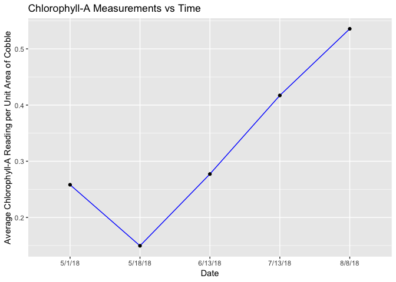
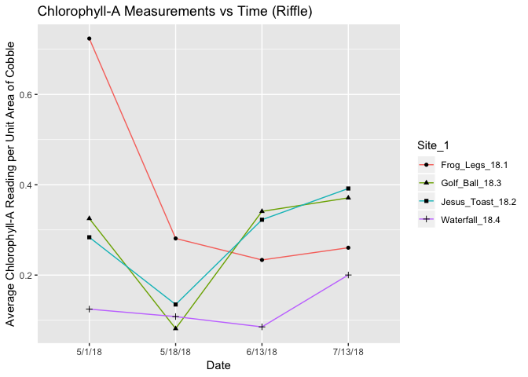
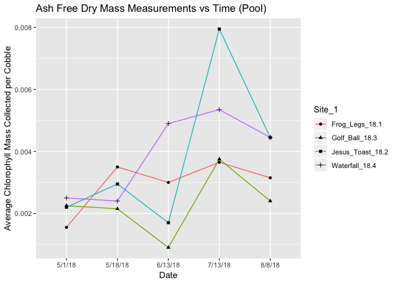
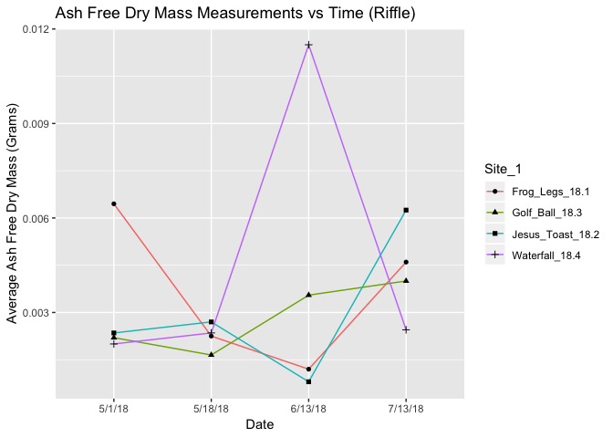
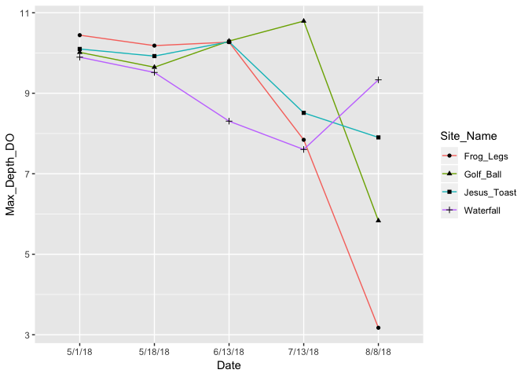

SRF-2018-Code
================
Keane Flynn & Weston Slaughter
12/30/2018

Load Libraries
--------------

``` r
library(dplyr)
```

    ## 
    ## Attaching package: 'dplyr'

    ## The following objects are masked from 'package:stats':
    ## 
    ##     filter, lag

    ## The following objects are masked from 'package:base':
    ## 
    ##     intersect, setdiff, setequal, union

``` r
library(readr)
library(tidyverse)
```

    ## ── Attaching packages ───────────────────────────────────────────────────────────── tidyverse 1.2.1 ──

    ## ✔ ggplot2 3.0.0     ✔ purrr   0.2.5
    ## ✔ tibble  1.4.2     ✔ stringr 1.3.1
    ## ✔ tidyr   0.8.1     ✔ forcats 0.3.0

    ## ── Conflicts ──────────────────────────────────────────────────────────────── tidyverse_conflicts() ──
    ## ✖ dplyr::filter() masks stats::filter()
    ## ✖ dplyr::lag()    masks stats::lag()

``` r
library(ggplot2)
```

ChlA Data
=========

``` r
ChlA_Data_Porter <- 
  readr::read_csv(file = "ChlA-Data/ChlA-Data.csv",
                  col_types = "ccccdcddddddddc") %>%
  filter(Site == "Porter_Above") %>%
  group_by(Date_collected, Site_1)
```

    ## Warning: Duplicated column names deduplicated: 'Site' => 'Site_1' [4]

``` r
ChlA_Data_Porter
```

    ## # A tibble: 72 x 15
    ## # Groups:   Date_collected, Site_1 [20]
    ##    Site  Date_collected Date_processed Site_1 Cobble_SID Pool_or_Riffle
    ##    <chr> <chr>          <chr>          <chr>       <dbl> <chr>         
    ##  1 Port… 5/1/18         5/2/18         Frog_…          1 riffle        
    ##  2 Port… 5/1/18         5/2/18         Frog_…          5 riffle        
    ##  3 Port… 5/1/18         5/2/18         Frog_…          7 pool          
    ##  4 Port… 5/1/18         5/2/18         Frog_…         11 pool          
    ##  5 Port… 5/1/18         5/2/18         Jesus…          8 riffle        
    ##  6 Port… 5/1/18         5/2/18         Jesus…          9 riffle        
    ##  7 Port… 5/1/18         5/2/18         Jesus…         15 pool          
    ##  8 Port… 5/1/18         5/2/18         Jesus…         16 pool          
    ##  9 Port… 5/1/18         5/2/18         Golf_…          4 riffle        
    ## 10 Port… 5/1/18         5/2/18         Golf_…          6 riffle        
    ## # ... with 62 more rows, and 9 more variables: Volume_mL <dbl>,
    ## #   Volume_Added_mL <dbl>, Canister_Num <dbl>, Chla_reading <dbl>,
    ## #   Total_Chla_extracted <dbl>, Total_Chla_in_Sample <dbl>,
    ## #   Chla_area <dbl>, Cobble_Area <dbl>, Notes <chr>

Summarized ChlA Data
--------------------

``` r
Summarized_ChlA_Data_Pool <- ChlA_Data_Porter %>%
  filter(Pool_or_Riffle == "pool") %>%
  group_by(Date_collected, Site_1) %>%
  summarise(mean_ChlA_area = mean(Chla_area))

Summarized_ChlA_Data_Riffle <- ChlA_Data_Porter %>%
  filter(Pool_or_Riffle == "riffle") %>%
  group_by(Date_collected, Site_1) %>%
  summarise(mean_ChlA_area = mean(Chla_area))
```

Plotting ChlA vs Time (Pool)
----------------------------

``` r
ChlA_Graph_Pool <- Summarized_ChlA_Data_Pool %>%
  ggplot(aes(x = Date_collected, y = mean_ChlA_area)) +
  geom_line(aes(group = Site_1, color = Site_1)) +
  geom_point(aes(shape = Site_1)) +
  labs(x = "Date", y = "Average Chlorophyll-A Reading per Unit Area of Cobble") +
  ggtitle("Chlorophyll-A Measurements vs Time (Pool)")
ChlA_Graph_Pool
```



Plotting ChlA vs Time (Riffle)
------------------------------

``` r
ChlA_Graph_Riffle <- Summarized_ChlA_Data_Riffle %>%
  ggplot(aes(x = Date_collected, y = mean_ChlA_area)) +
  geom_line(aes(group = Site_1, color = Site_1)) +
  geom_point(aes(shape = Site_1)) +
  labs(x = "Date", y = "Average Chlorophyll-A Reading per Unit Area of Cobble") +
  ggtitle("Chlorophyll-A Measurements vs Time (Riffle)")
ChlA_Graph_Riffle
```



AFD Data
========

``` r
AFD_Data_Porter <-
  readr::read_csv(file = "ChlA-Data/AFD-Data.csv",
                  col_types = "ccccdcddddddddc") %>%
  filter(Site == "Porter_Above") %>%
  group_by(Date_collected, Site_1) %>%
  select(Date_collected, Site_1, Cobble_SID, Pool_or_Riffle, Dry_Weight_g, AFD_Weight_g, Difference)
```

    ## Warning: Missing column names filled in: 'X14' [14], 'X15' [15]

    ## Warning: Duplicated column names deduplicated: 'Site' => 'Site_1' [4]

    ## Warning in rbind(names(probs), probs_f): number of columns of result is not
    ## a multiple of vector length (arg 1)

    ## Warning: 19 parsing failures.
    ## row # A tibble: 5 x 5 col     row col   expected actual                            file              expected   <int> <chr> <chr>    <chr>                             <chr>             actual 1    30 Notes a double Odd donut shape in filter         'ChlA-Data/AFD-D… file 2    33 Notes a double very small amount of algae scrap… 'ChlA-Data/AFD-D… row 3    48 Notes a double in oven at 5:10 PM                'ChlA-Data/AFD-D… col 4    64 Notes a double in oven at 5:45 PM                'ChlA-Data/AFD-D… expected 5    69 Notes a double MELTED IN OVEN REDO               'ChlA-Data/AFD-D…
    ## ... ................. ... .......................................................................... ........ .......................................................................... ...... .......................................................................... .... .......................................................................... ... .......................................................................... ... .......................................................................... ........ ..........................................................................
    ## See problems(...) for more details.

``` r
AFD_Data_Porter
```

    ## # A tibble: 72 x 7
    ## # Groups:   Date_collected, Site_1 [20]
    ##    Date_collected Site_1 Cobble_SID Pool_or_Riffle Dry_Weight_g
    ##    <chr>          <chr>       <dbl> <chr>                 <dbl>
    ##  1 5/1/18         Frog_…          1 riffle                 1.14
    ##  2 5/1/18         Frog_…          5 riffle                 1.18
    ##  3 5/1/18         Frog_…          7 pool                   1.16
    ##  4 5/1/18         Frog_…         11 pool                   1.15
    ##  5 5/1/18         Jesus…          8 riffle                 1.14
    ##  6 5/1/18         Jesus…          9 riffle                 1.14
    ##  7 5/1/18         Jesus…         15 pool                   1.15
    ##  8 5/1/18         Jesus…         16 pool                   1.15
    ##  9 5/1/18         Golf_…          4 riffle                 1.15
    ## 10 5/1/18         Golf_…          6 riffle                 1.14
    ## # ... with 62 more rows, and 2 more variables: AFD_Weight_g <dbl>,
    ## #   Difference <dbl>

Summarizing AFD Data (Pool)
---------------------------

``` r
Summarized_AFD_Data_Pool <- AFD_Data_Porter %>%
  filter(Pool_or_Riffle == "pool") %>%
  filter(!AFD_Weight_g == "NA") %>%
  group_by(Date_collected, Site_1) %>%
  summarise(mean_diff = mean(Difference))

Summarized_AFD_Data_Riffle <- AFD_Data_Porter %>%
  filter(Pool_or_Riffle == "riffle") %>%
  filter(!AFD_Weight_g == "NA") %>%
  group_by(Date_collected, Site_1) %>%
  summarise(mean_diff = mean(Difference))
```

Plotting AFD vs Time (Pool)
---------------------------

``` r
AFD_Graph_Pool <- Summarized_AFD_Data_Pool %>%
  ggplot(aes(x = Date_collected, y = mean_diff)) +
  geom_line(aes(group = Site_1, color = Site_1)) +
  geom_point(aes(shape = Site_1)) +
  labs(x = "Date", y = "Average Ash Free Dry Mass (Grams)") +
  ggtitle("Ash Free Dry Mass Measurements vs Time (Pool)")
AFD_Graph_Pool
```



Plotting AFD vs Time (Riffle)
-----------------------------

``` r
AFD_Graph_Riffle <- Summarized_AFD_Data_Riffle %>%
  ggplot(aes(x = Date_collected, y = mean_diff)) +
  geom_line(aes(group = Site_1, color = Site_1)) +
  geom_point(aes(shape = Site_1)) +
  labs(x = "Date", y = "Average Ash Free Dry Mass (Grams)") +
  ggtitle("Ash Free Dry Mass Measurements vs Time (Riffle)")
AFD_Graph_Riffle
```



Dissolved Oxygen Data
=====================

``` r
DO_Data_Porter <-
  readr::read_csv(file = "Photosynthesis/2018-Photosynthesis.csv",
                  col_types = "ccccdcddddcdddcdddcdddcddddddcdddddd") %>%
  filter(Stream == "Porter") %>%
  mutate(Max_Depth_DO = (MaxDepth_DO1 + MaxDepth_DO2 + MaxDepth_DO3)/3) %>%
  select(Stream, Date, Site_Name, Site_Num, Pool_Riffle, Max_Depth_DO, Light_Do_s, Light_DO_e, Dark_Do_s, Dark_DO_e)
```

    ## Warning in rbind(names(probs), probs_f): number of columns of result is not
    ## a multiple of vector length (arg 1)

    ## Warning: 50 parsing failures.
    ## row # A tibble: 5 x 5 col     row col        expected actual            file                         expected   <int> <chr>      <chr>    <chr>             <chr>                        actual 1     1 MaxDepth_… a double n/a (did not mea… 'Photosynthesis/2018-Photos… file 2     1 MaxDepth_… a double n/a               'Photosynthesis/2018-Photos… row 3     1 MaxDepth_… a double n/a               'Photosynthesis/2018-Photos… col 4     2 MaxDepth_… a double n/a               'Photosynthesis/2018-Photos… expected 5     2 MaxDepth_… a double n/a               'Photosynthesis/2018-Photos…
    ## ... ................. ... .......................................................................... ........ .......................................................................... ...... .......................................................................... .... .......................................................................... ... .......................................................................... ... .......................................................................... ........ ..........................................................................
    ## See problems(...) for more details.

``` r
DO_Data_Porter
```

    ## # A tibble: 72 x 10
    ##    Stream Date  Site_Name Site_Num Pool_Riffle Max_Depth_DO Light_Do_s
    ##    <chr>  <chr> <chr>        <dbl> <chr>              <dbl>      <dbl>
    ##  1 Porter 5/1/… Frog_Legs     18.1 R                   10.4       10.0
    ##  2 Porter 5/1/… Frog_Legs     18.1 R                   10.4       10.6
    ##  3 Porter 5/1/… Frog_Legs     18.1 P                   10.4       10.6
    ##  4 Porter 5/1/… Frog_Legs     18.1 P                   10.4       10.6
    ##  5 Porter 5/1/… Jesus_To…     18.2 R                   10.1       10.4
    ##  6 Porter 5/1/… Jesus_To…     18.2 R                   10.1       10.5
    ##  7 Porter 5/1/… Jesus_To…     18.2 P                   10.1       10.5
    ##  8 Porter 5/1/… Jesus_To…     18.2 P                   10.1       10.5
    ##  9 Porter 5/1/… Golf_Ball     18.3 R                   10.0       10.6
    ## 10 Porter 5/1/… Golf_Ball     18.3 R                   10.0       10.5
    ## # ... with 62 more rows, and 3 more variables: Light_DO_e <dbl>,
    ## #   Dark_Do_s <dbl>, Dark_DO_e <dbl>

Dissolved Oxygen (Pool)
-----------------------

``` r
Summary_DO_Data_Porter_Pool <- DO_Data_Porter %>%
  group_by(Stream, Date, Site_Name, Site_Num) %>%
  summarise(Max_Depth_DO = mean(Max_Depth_DO), Light_Do_s = mean(Light_Do_s), Light_DO_e = mean(Light_DO_e), Dark_Do_s = mean(Dark_Do_s), Dark_DO_e = mean(Dark_DO_e)) %>%
  arrange(Date, Site_Num)
Summary_DO_Data_Porter_Pool
```

    ## # A tibble: 20 x 9
    ## # Groups:   Stream, Date, Site_Name [20]
    ##    Stream Date  Site_Name Site_Num Max_Depth_DO Light_Do_s Light_DO_e
    ##    <chr>  <chr> <chr>        <dbl>        <dbl>      <dbl>      <dbl>
    ##  1 Porter 5/1/… Frog_Legs     18.1        10.4       10.5       11.1 
    ##  2 Porter 5/1/… Jesus_To…     18.2        10.1       10.5       11.4 
    ##  3 Porter 5/1/… Golf_Ball     18.3        10.0       10.5       11.3 
    ##  4 Porter 5/1/… Waterfall     18.4         9.90      10.3       11.7 
    ##  5 Porter 5/18… Frog_Legs     18.1        10.2       10.3       10.5 
    ##  6 Porter 5/18… Jesus_To…     18.2         9.92      10         10.4 
    ##  7 Porter 5/18… Golf_Ball     18.3         9.65       9.84      10.3 
    ##  8 Porter 5/18… Waterfall     18.4         9.52       9.62       9.96
    ##  9 Porter 6/13… Frog_Legs     18.1        10.3       10.0       10.2 
    ## 10 Porter 6/13… Jesus_To…     18.2        10.3       10.0       10.9 
    ## 11 Porter 6/13… Golf_Ball     18.3        10.3       10.8       11.5 
    ## 12 Porter 6/13… Waterfall     18.4         8.31      10.4       10.9 
    ## 13 Porter 7/13… Frog_Legs     18.1         7.84       7.72       8.34
    ## 14 Porter 7/13… Jesus_To…     18.2         8.51       7.96       9.44
    ## 15 Porter 7/13… Golf_Ball     18.3        10.8       10.6       11.7 
    ## 16 Porter 7/13… Waterfall     18.4         7.60       6.77       8.12
    ## 17 Porter 8/8/… Frog_Legs     18.1         3.17       4.34       6.02
    ## 18 Porter 8/8/… Jesus_To…     18.2         7.90       8.68       9.65
    ## 19 Porter 8/8/… Golf_Ball     18.3         5.83       6.30       6.96
    ## 20 Porter 8/8/… Waterfall     18.4         9.33       9.46      10.5 
    ## # ... with 2 more variables: Dark_Do_s <dbl>, Dark_DO_e <dbl>

Plotting Max Depth DO (Pool)
----------------------------

``` r
DO_Graph_Pool <- Summary_DO_Data_Porter_Pool %>%
  ggplot(aes(Date, Max_Depth_DO)) +
  geom_line(aes(group = Site_Name, color = Site_Name)) +
  geom_point(aes(shape = Site_Name))
DO_Graph_Pool
```


