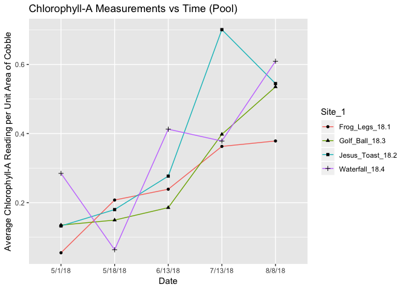

SRF-2018-Code
================
Keane Flynn & Weston Slaughter
12/30/2018

Load Libraries
--------------

``` r
library(dplyr)
```

    ## 
    ## Attaching package: 'dplyr'

    ## The following objects are masked from 'package:stats':
    ## 
    ##     filter, lag

    ## The following objects are masked from 'package:base':
    ## 
    ##     intersect, setdiff, setequal, union

``` r
library(readr)
library(tidyverse)
```

    ## ── Attaching packages ───────────────────────────────────────────────────────────── tidyverse 1.2.1 ──

    ## ✔ ggplot2 3.0.0     ✔ purrr   0.2.5
    ## ✔ tibble  1.4.2     ✔ stringr 1.3.1
    ## ✔ tidyr   0.8.1     ✔ forcats 0.3.0

    ## ── Conflicts ──────────────────────────────────────────────────────────────── tidyverse_conflicts() ──
    ## ✖ dplyr::filter() masks stats::filter()
    ## ✖ dplyr::lag()    masks stats::lag()

``` r
library(ggplot2)
```

ChlA Data
=========

``` r
ChlA_Data_Porter <- 
  readr::read_csv(file = "ChlA-Data/ChlA-Data.csv",
                  col_types = "ccccdcddddddddc") %>%
  filter(Site == "Porter_Above") %>%
  group_by(Date_collected, Site_1)
```

    ## Warning: Duplicated column names deduplicated: 'Site' => 'Site_1' [4]

    ## Warning in rbind(names(probs), probs_f): number of columns of result is not
    ## a multiple of vector length (arg 2)

    ## Warning: 1 parsing failure.
    ## row # A tibble: 1 x 5 col     row col        expected actual                       file              expected   <int> <chr>      <chr>    <chr>                        <chr>             actual 1    94 Volume Ad… a double added 5 mL water after Chl-… 'ChlA-Data/ChlA-… file # A tibble: 1 x 5

``` r
ChlA_Data_Porter
```

    ## # A tibble: 72 x 15
    ## # Groups:   Date_collected, Site_1 [21]
    ##    Site  Date_collected Date_processed Site_1 `Cobble#_SID` `Pool/Riffle`
    ##    <chr> <chr>          <chr>          <chr>          <dbl> <chr>        
    ##  1 Port… 5/1/18         5/2/18         Frog_…             1 riffle       
    ##  2 Port… 5/1/18         5/2/18         Frog_…             5 riffle       
    ##  3 Port… 5/1/18         5/2/18         Frog_…             7 pool         
    ##  4 Port… 5/1/18         5/2/18         Frog_…            11 pool         
    ##  5 Port… 5/1/18         5/2/18         Jesus…             8 riffle       
    ##  6 Port… 5/1/18         5/2/18         Jesus…             9 riffle       
    ##  7 Port… 5/1/18         5/2/18         Jesus…            15 pool         
    ##  8 Port… 5/1/18         5/2/18         Jesus…            16 pool         
    ##  9 Port… 5/1/18         5/2/18         Golf_…             4 riffle       
    ## 10 Port… 5/1/18         5/2/18         Golf_…             6 riffle       
    ## # ... with 62 more rows, and 9 more variables: `Volume (mL)` <dbl>,
    ## #   `Volume Added` <dbl>, `Canister_#` <dbl>, Chla_reading <dbl>,
    ## #   Total_Chla_extracted <dbl>, Total_Chla_in_Sample <dbl>,
    ## #   Chla_area <dbl>, `Cobble Area` <dbl>, Notes <chr>

Summarized ChlA Data
--------------------

``` r
Summarized_ChlA_Data <- ChlA_Data_Porter %>%
  group_by(Date_collected) %>%
  summarise(mean_ChlA_area = mean(Chla_area))
Summarized_ChlA_Data
```

    ## # A tibble: 5 x 2
    ##   Date_collected mean_ChlA_area
    ##   <chr>                   <dbl>
    ## 1 5/1/18                  0.258
    ## 2 5/18/18                 0.150
    ## 3 6/13/18                 0.277
    ## 4 7/13/18                 0.417
    ## 5 8/8/18                  0.536

Plotting ChlA vs Time
---------------------

``` r
ChlA_Graph <- Summarized_ChlA_Data %>%
  ggplot(aes(x = Date_collected, y = mean_ChlA_area, group = 1)) +
  geom_line(color = "blue") +
  geom_point() +
  labs(x = "Date", y = "Average Chlorophyll-A Reading per Unit Area of Cobble") +
  ggtitle("Chlorophyll-A Measurements vs Time")
ChlA_Graph
```



AFD Data
========

``` r
AFD_Data_Porter <-
  readr::read_csv(file = "ChlA-Data/AFD-Data.csv",
                  col_types = "ccccdcddddddddc") %>%
  filter(Site == "Porter_Above") %>%
  group_by(Date_collected, Site_1) %>%
  select(Date_collected, Site_1, Cobble_SID, Pool_or_Riffle, Dry_Weight_g, AFD_Weight_g, Difference)
```

    ## Warning: Missing column names filled in: 'X14' [14], 'X15' [15]

    ## Warning: Duplicated column names deduplicated: 'Site' => 'Site_1' [4]

    ## Warning in rbind(names(probs), probs_f): number of columns of result is not
    ## a multiple of vector length (arg 1)

    ## Warning: 19 parsing failures.
    ## row # A tibble: 5 x 5 col     row col   expected actual                            file              expected   <int> <chr> <chr>    <chr>                             <chr>             actual 1    30 Notes a double Odd donut shape in filter         'ChlA-Data/AFD-D… file 2    33 Notes a double very small amount of algae scrap… 'ChlA-Data/AFD-D… row 3    48 Notes a double in oven at 5:10 PM                'ChlA-Data/AFD-D… col 4    64 Notes a double in oven at 5:45 PM                'ChlA-Data/AFD-D… expected 5    69 Notes a double MELTED IN OVEN REDO               'ChlA-Data/AFD-D…
    ## ... ................. ... .......................................................................... ........ .......................................................................... ...... .......................................................................... .... .......................................................................... ... .......................................................................... ... .......................................................................... ........ ..........................................................................
    ## See problems(...) for more details.

``` r
AFD_Data_Porter
```

    ## # A tibble: 72 x 7
    ## # Groups:   Date_collected, Site_1 [21]
    ##    Date_collected Site_1 Cobble_SID Pool_or_Riffle Dry_Weight_g
    ##    <chr>          <chr>       <dbl> <chr>                 <dbl>
    ##  1 5/1/18         Frog_…          1 riffle                 1.14
    ##  2 5/1/18         Frog_…          5 riffle                 1.18
    ##  3 5/1/18         Frog_…          7 pool                   1.16
    ##  4 5/1/18         Frog_…         11 pool                   1.15
    ##  5 5/1/18         Jesus…          8 riffle                 1.14
    ##  6 5/1/18         Jesus…          9 riffle                 1.14
    ##  7 5/1/18         Jesus…         15 pool                   1.15
    ##  8 5/1/18         Jesus…         16 pool                   1.15
    ##  9 5/1/18         Golf_…          4 riffle                 1.15
    ## 10 5/1/18         Golf_…          6 riffle                 1.14
    ## # ... with 62 more rows, and 2 more variables: AFD_Weight_g <dbl>,
    ## #   Difference <dbl>

Summarizing AFD Data
--------------------

``` r
Summarized_AFD_Data <- AFD_Data_Porter %>%
  filter(!AFD_Weight_g == "NA") %>%
  group_by(Date_collected) %>%
  summarise(mean_diff = mean(Difference))
Summarized_AFD_Data
```

    ## # A tibble: 5 x 2
    ##   Date_collected mean_diff
    ##   <chr>              <dbl>
    ## 1 5/1/18           0.00269
    ## 2 5/18/18          0.00249
    ## 3 6/13/18          0.00323
    ## 4 7/13/18          0.00475
    ## 5 8/8/18           0.00361

Plotting AFD vs Time
--------------------

``` r
AFD_Graph <- Summarized_AFD_Data %>%
  ggplot(aes(x = Date_collected, y = mean_diff, group = 1)) +
  geom_line(color = "blue") +
  geom_point() +
  labs(x = "Date", y = "Average Chlorophyll Mass Collected per Cobble") +
  ggtitle("Ash Free Dry Mass Measurements vs Time")
AFD_Graph
```


