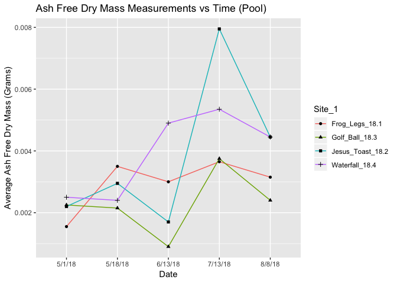
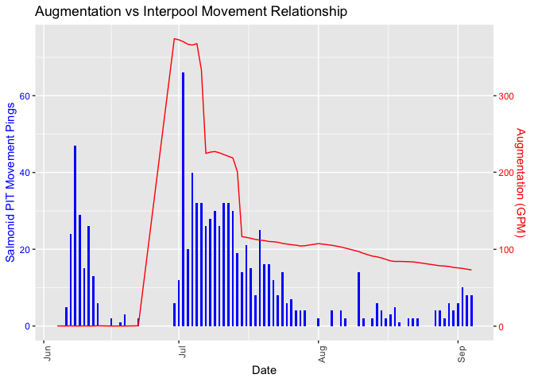

SRF-2018-Code
================
Keane Flynn & Weston Slaughter
12/30/2018

Load Libraries
--------------

``` r
library(dplyr)
```

    ## 
    ## Attaching package: 'dplyr'

    ## The following objects are masked from 'package:stats':
    ## 
    ##     filter, lag

    ## The following objects are masked from 'package:base':
    ## 
    ##     intersect, setdiff, setequal, union

``` r
library(readr)
library(tidyverse)
```

    ## ── Attaching packages ─────────────────────────────────────── tidyverse 1.2.1 ──

    ## ✔ ggplot2 3.0.0     ✔ purrr   0.2.5
    ## ✔ tibble  1.4.2     ✔ stringr 1.3.1
    ## ✔ tidyr   0.8.1     ✔ forcats 0.3.0

    ## ── Conflicts ────────────────────────────────────────── tidyverse_conflicts() ──
    ## ✖ dplyr::filter() masks stats::filter()
    ## ✖ dplyr::lag()    masks stats::lag()

``` r
library(ggplot2)
library(lubridate)
```

    ## 
    ## Attaching package: 'lubridate'

    ## The following object is masked from 'package:base':
    ## 
    ##     date

``` r
library(geometry)
```

    ## Loading required package: magic

    ## Loading required package: abind

``` r
library(rgl)
```

Productivity Data
=================

ChlA Data
---------

``` r
ChlA_Data_Porter <- 
  readr::read_csv(file = "ChlA-Data/ChlA-Data.csv",
                  col_types = "ccccdcddddddddc") %>%
  filter(Site == "Porter_Above") %>%
  group_by(Date_collected, Site_1)
```

    ## Warning: Duplicated column names deduplicated: 'Site' => 'Site_1' [4]

``` r
ChlA_Data_Porter
```

    ## # A tibble: 72 x 15
    ## # Groups:   Date_collected, Site_1 [20]
    ##    Site  Date_collected Date_processed Site_1 Cobble_SID Pool_or_Riffle
    ##    <chr> <chr>          <chr>          <chr>       <dbl> <chr>         
    ##  1 Port… 5/1/18         5/2/18         Frog_…          1 riffle        
    ##  2 Port… 5/1/18         5/2/18         Frog_…          5 riffle        
    ##  3 Port… 5/1/18         5/2/18         Frog_…          7 pool          
    ##  4 Port… 5/1/18         5/2/18         Frog_…         11 pool          
    ##  5 Port… 5/1/18         5/2/18         Jesus…          8 riffle        
    ##  6 Port… 5/1/18         5/2/18         Jesus…          9 riffle        
    ##  7 Port… 5/1/18         5/2/18         Jesus…         15 pool          
    ##  8 Port… 5/1/18         5/2/18         Jesus…         16 pool          
    ##  9 Port… 5/1/18         5/2/18         Golf_…          4 riffle        
    ## 10 Port… 5/1/18         5/2/18         Golf_…          6 riffle        
    ## # ... with 62 more rows, and 9 more variables: Volume_mL <dbl>,
    ## #   Volume_Added_mL <dbl>, Canister_Num <dbl>, Chla_reading <dbl>,
    ## #   Total_Chla_extracted <dbl>, Total_Chla_in_Sample <dbl>,
    ## #   Chla_area <dbl>, Cobble_Area <dbl>, Notes <chr>

### Summarized ChlA Data

``` r
Summarized_ChlA_Data_Pool <- ChlA_Data_Porter %>%
  filter(Pool_or_Riffle == "pool") %>%
  group_by(Date_collected, Site_1) %>%
  summarise(mean_ChlA_area = mean(Chla_area))

Summarized_ChlA_Data_Riffle <- ChlA_Data_Porter %>%
  filter(Pool_or_Riffle == "riffle") %>%
  group_by(Date_collected, Site_1) %>%
  summarise(mean_ChlA_area = mean(Chla_area))
```

### Plotting ChlA vs Time (Pool)

``` r
ChlA_Graph_Pool <- Summarized_ChlA_Data_Pool %>%
  ggplot(aes(x = Date_collected, y = mean_ChlA_area)) +
  geom_line(aes(group = Site_1, color = Site_1)) +
  geom_point(aes(shape = Site_1)) +
  labs(x = "Date", y = "Average Chlorophyll-A Reading per Unit Area of Cobble") +
  ggtitle("Chlorophyll-A Measurements vs Time (Pool)")
ChlA_Graph_Pool
```


### Plotting ChlA vs Time (Riffle)

``` r
ChlA_Graph_Riffle <- Summarized_ChlA_Data_Riffle %>%
  ggplot(aes(x = Date_collected, y = mean_ChlA_area)) +
  geom_line(aes(group = Site_1, color = Site_1)) +
  geom_point(aes(shape = Site_1)) +
  labs(x = "Date", y = "Average Chlorophyll-A Reading per Unit Area of Cobble") +
  ggtitle("Chlorophyll-A Measurements vs Time (Riffle)")
ChlA_Graph_Riffle
```


AFD Data
--------

``` r
AFD_Data_Porter <-
  readr::read_csv(file = "ChlA-Data/AFD-Data.csv",
                  col_types = "ccccdcddddddddc") %>%
  filter(Site == "Porter_Above") %>%
  group_by(Date_collected, Site_1) %>%
  select(Date_collected, Site_1, Cobble_SID, Pool_or_Riffle, Dry_Weight_g, AFD_Weight_g, Difference)
```

    ## Warning: Missing column names filled in: 'X14' [14], 'X15' [15]

    ## Warning: Duplicated column names deduplicated: 'Site' => 'Site_1' [4]

    ## Warning in rbind(names(probs), probs_f): number of columns of result is not
    ## a multiple of vector length (arg 1)

    ## Warning: 19 parsing failures.
    ## row # A tibble: 5 x 5 col     row col   expected actual                            file              expected   <int> <chr> <chr>    <chr>                             <chr>             actual 1    30 Notes a double Odd donut shape in filter         'ChlA-Data/AFD-D… file 2    33 Notes a double very small amount of algae scrap… 'ChlA-Data/AFD-D… row 3    48 Notes a double in oven at 5:10 PM                'ChlA-Data/AFD-D… col 4    64 Notes a double in oven at 5:45 PM                'ChlA-Data/AFD-D… expected 5    69 Notes a double MELTED IN OVEN REDO               'ChlA-Data/AFD-D…
    ## ... ................. ... .......................................................................... ........ .......................................................................... ...... .......................................................................... .... .......................................................................... ... .......................................................................... ... .......................................................................... ........ ..........................................................................
    ## See problems(...) for more details.

``` r
AFD_Data_Porter
```

    ## # A tibble: 72 x 7
    ## # Groups:   Date_collected, Site_1 [20]
    ##    Date_collected Site_1 Cobble_SID Pool_or_Riffle Dry_Weight_g
    ##    <chr>          <chr>       <dbl> <chr>                 <dbl>
    ##  1 5/1/18         Frog_…          1 riffle                 1.14
    ##  2 5/1/18         Frog_…          5 riffle                 1.18
    ##  3 5/1/18         Frog_…          7 pool                   1.16
    ##  4 5/1/18         Frog_…         11 pool                   1.15
    ##  5 5/1/18         Jesus…          8 riffle                 1.14
    ##  6 5/1/18         Jesus…          9 riffle                 1.14
    ##  7 5/1/18         Jesus…         15 pool                   1.15
    ##  8 5/1/18         Jesus…         16 pool                   1.15
    ##  9 5/1/18         Golf_…          4 riffle                 1.15
    ## 10 5/1/18         Golf_…          6 riffle                 1.14
    ## # ... with 62 more rows, and 2 more variables: AFD_Weight_g <dbl>,
    ## #   Difference <dbl>

### Summarizing AFD Data (Pool)

``` r
Summarized_AFD_Data_Pool <- AFD_Data_Porter %>%
  filter(Pool_or_Riffle == "pool") %>%
  filter(!AFD_Weight_g == "NA") %>%
  group_by(Date_collected, Site_1) %>%
  summarise(mean_diff = mean(Difference))

Summarized_AFD_Data_Riffle <- AFD_Data_Porter %>%
  filter(Pool_or_Riffle == "riffle") %>%
  filter(!AFD_Weight_g == "NA") %>%
  group_by(Date_collected, Site_1) %>%
  summarise(mean_diff = mean(Difference))
```

### Plotting AFD vs Time (Pool)

``` r
AFD_Graph_Pool <- Summarized_AFD_Data_Pool %>%
  ggplot(aes(x = Date_collected, y = mean_diff)) +
  geom_line(aes(group = Site_1, color = Site_1)) +
  geom_point(aes(shape = Site_1)) +
  labs(x = "Date", y = "Average Ash Free Dry Mass (Grams)") +
  ggtitle("Ash Free Dry Mass Measurements vs Time (Pool)")
AFD_Graph_Pool
```



### Plotting AFD vs Time (Riffle)

``` r
AFD_Graph_Riffle <- Summarized_AFD_Data_Riffle %>%
  ggplot(aes(x = Date_collected, y = mean_diff)) +
  geom_line(aes(group = Site_1, color = Site_1)) +
  geom_point(aes(shape = Site_1)) +
  labs(x = "Date", y = "Average Ash Free Dry Mass (Grams)") +
  ggtitle("Ash Free Dry Mass Measurements vs Time (Riffle)")
AFD_Graph_Riffle
```


Dissolved Oxygen Data
=====================

``` r
DO_Data_Porter <-
  readr::read_csv(file = "Photosynthesis/2018-Photosynthesis.csv",
                  col_types = "ccccdcddddcdddcdddcdddcddddddcdddddd") %>%
  filter(Stream == "Porter") %>%
  mutate(Max_Depth_DO = (MaxDepth_DO1 + MaxDepth_DO2 + MaxDepth_DO3)/3) %>%
  select(Stream, Date, Site_Name, Site_Num, Pool_Riffle, Max_Depth_DO, Light_Do_s, Light_DO_e, Dark_Do_s, Dark_DO_e)
```

    ## Warning in rbind(names(probs), probs_f): number of columns of result is not
    ## a multiple of vector length (arg 1)

    ## Warning: 50 parsing failures.
    ## row # A tibble: 5 x 5 col     row col        expected actual            file                         expected   <int> <chr>      <chr>    <chr>             <chr>                        actual 1     1 MaxDepth_… a double n/a (did not mea… 'Photosynthesis/2018-Photos… file 2     1 MaxDepth_… a double n/a               'Photosynthesis/2018-Photos… row 3     1 MaxDepth_… a double n/a               'Photosynthesis/2018-Photos… col 4     2 MaxDepth_… a double n/a               'Photosynthesis/2018-Photos… expected 5     2 MaxDepth_… a double n/a               'Photosynthesis/2018-Photos…
    ## ... ................. ... .......................................................................... ........ .......................................................................... ...... .......................................................................... .... .......................................................................... ... .......................................................................... ... .......................................................................... ........ ..........................................................................
    ## See problems(...) for more details.

``` r
DO_Data_Porter
```

    ## # A tibble: 72 x 10
    ##    Stream Date  Site_Name Site_Num Pool_Riffle Max_Depth_DO Light_Do_s
    ##    <chr>  <chr> <chr>        <dbl> <chr>              <dbl>      <dbl>
    ##  1 Porter 5/1/… Frog_Legs     18.1 R                   10.4       10.0
    ##  2 Porter 5/1/… Frog_Legs     18.1 R                   10.4       10.6
    ##  3 Porter 5/1/… Frog_Legs     18.1 P                   10.4       10.6
    ##  4 Porter 5/1/… Frog_Legs     18.1 P                   10.4       10.6
    ##  5 Porter 5/1/… Jesus_To…     18.2 R                   10.1       10.4
    ##  6 Porter 5/1/… Jesus_To…     18.2 R                   10.1       10.5
    ##  7 Porter 5/1/… Jesus_To…     18.2 P                   10.1       10.5
    ##  8 Porter 5/1/… Jesus_To…     18.2 P                   10.1       10.5
    ##  9 Porter 5/1/… Golf_Ball     18.3 R                   10.0       10.6
    ## 10 Porter 5/1/… Golf_Ball     18.3 R                   10.0       10.5
    ## # ... with 62 more rows, and 3 more variables: Light_DO_e <dbl>,
    ## #   Dark_Do_s <dbl>, Dark_DO_e <dbl>

Dissolved Oxygen (Pool)
-----------------------

``` r
Summary_DO_Data_Porter_Pool <- DO_Data_Porter %>%
  group_by(Stream, Date, Site_Name, Site_Num) %>%
  summarise(Max_Depth_DO = mean(Max_Depth_DO), Light_Do_s = mean(Light_Do_s), Light_DO_e = mean(Light_DO_e), Dark_Do_s = mean(Dark_Do_s), Dark_DO_e = mean(Dark_DO_e)) %>%
  arrange(Date, Site_Num)
Summary_DO_Data_Porter_Pool
```

    ## # A tibble: 20 x 9
    ## # Groups:   Stream, Date, Site_Name [20]
    ##    Stream Date  Site_Name Site_Num Max_Depth_DO Light_Do_s Light_DO_e
    ##    <chr>  <chr> <chr>        <dbl>        <dbl>      <dbl>      <dbl>
    ##  1 Porter 5/1/… Frog_Legs     18.1        10.4       10.5       11.1 
    ##  2 Porter 5/1/… Jesus_To…     18.2        10.1       10.5       11.4 
    ##  3 Porter 5/1/… Golf_Ball     18.3        10.0       10.5       11.3 
    ##  4 Porter 5/1/… Waterfall     18.4         9.90      10.3       11.7 
    ##  5 Porter 5/18… Frog_Legs     18.1        10.2       10.3       10.5 
    ##  6 Porter 5/18… Jesus_To…     18.2         9.92      10         10.4 
    ##  7 Porter 5/18… Golf_Ball     18.3         9.65       9.84      10.3 
    ##  8 Porter 5/18… Waterfall     18.4         9.52       9.62       9.96
    ##  9 Porter 6/13… Frog_Legs     18.1        10.3       10.0       10.2 
    ## 10 Porter 6/13… Jesus_To…     18.2        10.3       10.0       10.9 
    ## 11 Porter 6/13… Golf_Ball     18.3        10.3       10.8       11.5 
    ## 12 Porter 6/13… Waterfall     18.4         8.31      10.4       10.9 
    ## 13 Porter 7/13… Frog_Legs     18.1         7.84       7.72       8.34
    ## 14 Porter 7/13… Jesus_To…     18.2         8.51       7.96       9.44
    ## 15 Porter 7/13… Golf_Ball     18.3        10.8       10.6       11.7 
    ## 16 Porter 7/13… Waterfall     18.4         7.60       6.77       8.12
    ## 17 Porter 8/8/… Frog_Legs     18.1         3.17       4.34       6.02
    ## 18 Porter 8/8/… Jesus_To…     18.2         7.90       8.68       9.65
    ## 19 Porter 8/8/… Golf_Ball     18.3         5.83       6.30       6.96
    ## 20 Porter 8/8/… Waterfall     18.4         9.33       9.46      10.5 
    ## # ... with 2 more variables: Dark_Do_s <dbl>, Dark_DO_e <dbl>

Plotting Max Depth DO (Pool)
----------------------------

``` r
Max_Depth_DO_Graph_Pool <- Summary_DO_Data_Porter_Pool %>%
  ggplot(aes(Date, Max_Depth_DO)) +
  geom_line(aes(group = Site_Name, color = Site_Name)) +
  geom_point(aes(shape = Site_Name))
Max_Depth_DO_Graph_Pool
```


Plotting Light DO\_s Data
-------------------------

``` r
Light_DO_s_Graph <- Summary_DO_Data_Porter_Pool %>%
  ggplot(aes(Date, Light_Do_s)) +
  geom_line(aes(group = Site_Name, color = Site_Name)) +
  geom_point(aes(shape = Site_Name))
Light_DO_s_Graph
```


Plotting Light DO\_e Data
-------------------------

``` r
Light_DO_e_Graph <- Summary_DO_Data_Porter_Pool %>%
  ggplot(aes(Date, Light_DO_e)) +
  geom_line(aes(group = Site_Name, color = Site_Name)) +
  geom_point(aes(shape = Site_Name))
Light_DO_e_Graph
```


Plotting Dark DO\_s Data
------------------------

``` r
Dark_DO_s_Graph <- Summary_DO_Data_Porter_Pool %>%
  ggplot(aes(Date, Dark_Do_s)) +
  geom_line(aes(group = Site_Name, color = Site_Name)) +
  geom_point(aes(shape = Site_Name))
Dark_DO_s_Graph
```


Plotting Dark DO\_e Data
------------------------

``` r
Dark_DO_e_Graph <- Summary_DO_Data_Porter_Pool %>%
  ggplot(aes(Date, Dark_DO_e)) +
  geom_line(aes(group = Site_Name, color = Site_Name)) +
  geom_point(aes(shape = Site_Name))
Dark_DO_e_Graph
```


Electrofishing Data
===================

``` r
EFishing_Data <-
  readr::read_csv(file = "FishPopulation/EFishingData2018.csv",
                  col_types = "cccddddttddcdccdccdddddddcddddddddd") %>%
  filter(Stream == "Porter") %>%
  arrange(Date, Unit, Fish_Num, Pass_Num)
```

    ## Warning: Missing column names filled in: 'X36' [36], 'X37' [37],
    ## 'X38' [38], 'X39' [39], 'X40' [40]

    ## Warning: Unnamed `col_types` should have the same length as `col_names`.
    ## Using smaller of the two.

    ## Warning in rbind(names(probs), probs_f): number of columns of result is not
    ## a multiple of vector length (arg 1)

    ## Warning: 2006 parsing failures.
    ## row # A tibble: 5 x 5 col     row col               expected   actual   file                         expected   <int> <chr>             <chr>      <chr>    <chr>                        actual 1     1 Time_Per_Pass_Se… a double   N/A      'FishPopulation/EFishingDat… file 2     1 <NA>              35 columns 40 colu… 'FishPopulation/EFishingDat… row 3     2 Time_Per_Pass_Se… a double   N/A      'FishPopulation/EFishingDat… col 4     2 <NA>              35 columns 40 colu… 'FishPopulation/EFishingDat… expected 5     3 Time_Per_Pass_Se… a double   N/A      'FishPopulation/EFishingDat…
    ## ... ................. ... .......................................................................... ........ .......................................................................... ...... .......................................................................... .... .......................................................................... ... .......................................................................... ... .......................................................................... ........ ..........................................................................
    ## See problems(...) for more details.

``` r
EFishing_Data
```

    ## # A tibble: 524 x 35
    ##    Date  Stream Unit  Fish_Num_Per_Si… Fish_Num Pass_Num Time_Per_Pass_S…
    ##    <chr> <chr>  <chr>            <dbl>    <dbl>    <dbl>            <dbl>
    ##  1 5/23… Porter 18.1…               51      120        1              289
    ##  2 5/23… Porter 18.1…               52      121        1              289
    ##  3 5/23… Porter 18.1…               53      122        1              289
    ##  4 5/23… Porter 18.1…               54      123        1              289
    ##  5 5/23… Porter 18.1…               55      124        1              289
    ##  6 5/23… Porter 18.1…               56      125        1              289
    ##  7 5/23… Porter 18.1…               57      126        1              289
    ##  8 5/23… Porter 18.1…               58      127        1              289
    ##  9 5/23… Porter 18.1…               59      128        1              289
    ## 10 5/23… Porter 18.1…               60      129        1              289
    ## # ... with 514 more rows, and 28 more variables: Start_Time <time>,
    ## #   End_Time <time>, Length_mm <dbl>, Weight_g <dbl>, Species <chr>,
    ## #   Recapture <dbl>, PIT <chr>, Fecal_Num <chr>, Mort <dbl>, Notes <chr>,
    ## #   Fin <chr>, Stage <dbl>, `Pool Length` <dbl>, Width_1 <dbl>,
    ## #   Width_2 <dbl>, Width_3 <dbl>, Max_Depth_cm <dbl>, DS_RCT_cm <dbl>,
    ## #   `SeaGrant HabID` <chr>, Fat1 <dbl>, Fat2 <dbl>, Fat3 <dbl>,
    ## #   Fat4 <dbl>, Fat5 <dbl>, Fat6 <dbl>, Fat7 <dbl>, Fat8 <dbl>,
    ## #   Fat_AVG <dbl>

``` r
CombiningMovement_Efish <- EFishing_Data %>%
  filter(!PIT == "N/A")
```

TU Hydrology Data
=================

``` r
Porter_FlowData <-
  readr::read_csv("Hydrology/PorterCreek_FlowData_TU.csv") %>%
  mutate(Date = str_extract(SampleDate, "\\d......")) %>%
  group_by(Date) %>%
  summarise(Streamflow_cfs = mean(Streamflow_cfs)) %>%
  mutate(Streamflow_gpm = Streamflow_cfs*448) %>%
  mutate(Date = str_extract(Date, "[0-9]{1,2}/[0-9]{1,2}/18")) %>%
  filter(!Date == "NA") 
```

    ## Parsed with column specification:
    ## cols(
    ##   SampleDate = col_character(),
    ##   WaterTemp_C = col_double(),
    ##   WaterDepth_ft = col_double(),
    ##   Streamflow_cfs = col_double()
    ## )

``` r
Porter_FlowData
```

    ## # A tibble: 247 x 3
    ##    Date    Streamflow_cfs Streamflow_gpm
    ##    <chr>            <dbl>          <dbl>
    ##  1 1/1/18           0.470           210.
    ##  2 1/10/18         13.2            5893.
    ##  3 1/11/18          7.14           3197.
    ##  4 1/12/18          4.74           2126.
    ##  5 1/13/18          3.44           1540.
    ##  6 1/14/18          2.69           1206.
    ##  7 1/15/18          2.19            983.
    ##  8 1/16/18          2.07            925.
    ##  9 1/17/18          1.75            782.
    ## 10 1/18/18          1.95            874.
    ## # ... with 237 more rows

Augmentation Data
=================

``` r
Porter_AugmentationData <- 
  readr::read_csv("Hydrology/PorterCreek_AugmentationData.csv") %>%
  select(X1, Date, avg_gpm)
```

    ## Warning: Missing column names filled in: 'X1' [1]

    ## Parsed with column specification:
    ## cols(
    ##   X1 = col_integer(),
    ##   Date = col_character(),
    ##   avg_gpm = col_double(),
    ##   Min = col_integer(),
    ##   Max = col_integer(),
    ##   avg_clean = col_double(),
    ##   gpd = col_double(),
    ##   `ac-ft` = col_double(),
    ##   cum_ac_ft = col_double()
    ## )

``` r
Porter_AugmentationData
```

    ## # A tibble: 367 x 3
    ##       X1 Date    avg_gpm
    ##    <int> <chr>     <dbl>
    ##  1     1 1/3/18  73.2   
    ##  2     2 1/4/18  25.1   
    ##  3     3 1/5/18   0.0208
    ##  4     4 1/6/18   0.0625
    ##  5     5 1/7/18   0     
    ##  6     6 1/8/18   0.167 
    ##  7     7 1/9/18   0.0625
    ##  8     8 1/10/18  0.125 
    ##  9     9 1/11/18  0.146 
    ## 10    10 1/12/18  0.0417
    ## # ... with 357 more rows

Movement Data
=============

``` r
PIT_Data <- 
  readr::read_csv(file = "FishPopulation/POR_MovementStudy.csv",
                  col_types = "cccctccccc") %>%
  mutate(PIT = str_extract(PITNumber, "06....")) %>%
  select(Species_Lookup, PIT, Date_Lookup, Date, Time, Site, HabitatType, UnitNumber, Survey, Comments) 
PIT_Data
```

    ## # A tibble: 624 x 10
    ##    Species_Lookup PIT   Date_Lookup Date  Time  Site  HabitatType
    ##    <chr>          <chr> <chr>       <chr> <tim> <chr> <chr>      
    ##  1 COHO SALMON    068D… 6/7/18      6/7/… 12:15 POR 1 POOL       
    ##  2 COHO SALMON    068D… 6/7/18      6/8/… 13:28 POR … (blank)    
    ##  3 COHO SALMON    068D… 6/7/18      6/12… 19:57 POR … (blank)    
    ##  4 COHO SALMON    068D… 6/7/18      6/7/… 12:44 POR 1 POOL       
    ##  5 COHO SALMON    068D… 6/7/18      6/8/… 13:42 POR … (blank)    
    ##  6 COHO SALMON    068D… 6/7/18      6/8/… 20:35 POR … (blank)    
    ##  7 COHO SALMON    068D… 6/7/18      6/7/… 12:23 POR 1 POOL       
    ##  8 COHO SALMON    068D… 6/7/18      6/8/… 13:35 POR … (blank)    
    ##  9 COHO SALMON    068D… 6/7/18      6/9/… 05:15 POR … (blank)    
    ## 10 COHO SALMON    06A7… 6/7/18      6/7/… 11:14 POR 1 POOL       
    ## # ... with 614 more rows, and 3 more variables: UnitNumber <chr>,
    ## #   Survey <chr>, Comments <chr>

Creating a Movement vs Augmentation Dataset
-------------------------------------------

``` r
EFish_Movement_Data <- left_join(PIT_Data, CombiningMovement_Efish, by = "PIT") %>%
  select(Species, PIT, Date_Lookup, Date.x, Time, Site, UnitNumber, Survey, Unit, Fish_Num_Per_Site, Fish_Num, Length_mm, Weight_g, Recapture, Fat_AVG, Comments) %>%
  mutate(Survey_tally = if_else(Survey == "ANT", 1, 0)) %>%
  group_by(Date.x) %>%
  mutate(Movement_tally = cumsum(Survey_tally)) %>%
  mutate(Max_Ping_Tally = max(Movement_tally)) %>%
  arrange(Date.x, Time) 
EFish_Movement_Data
```

    ## # A tibble: 1,048 x 19
    ## # Groups:   Date.x [69]
    ##    Species PIT   Date_Lookup Date.x Time  Site  UnitNumber Survey Unit 
    ##    <chr>   <chr> <chr>       <chr>  <tim> <chr> <chr>      <chr>  <chr>
    ##  1 Omykiss 06A7… 6/7/18      6/10/… 02:00 POR … (blank)    ANT    18.6 
    ##  2 Cottus… 06A7… 6/7/18      6/10/… 03:54 POR … (blank)    ANT    18.6 
    ##  3 Okisut… 06A8… 6/7/18      6/10/… 05:19 POR … (blank)    ANT    18.6 
    ##  4 Okisut… 06A8… 6/7/18      6/10/… 05:19 POR … (blank)    ANT    18.6 
    ##  5 Omykiss 068D… 6/7/18      6/10/… 05:45 POR … (blank)    ANT    18.55
    ##  6 Okisut… 06A7… 6/7/18      6/10/… 06:02 POR … (blank)    ANT    18.6 
    ##  7 Okisut… 06A7… 6/7/18      6/10/… 06:02 POR … (blank)    ANT    18.6 
    ##  8 Omykiss 06A8… 6/4/18      6/10/… 09:54 POR … (blank)    ANT    18.3 
    ##  9 Omykiss 068D… 6/7/18      6/10/… 15:39 POR … (blank)    ANT    18.55
    ## 10 Omykiss 068D… 6/7/18      6/10/… 17:29 POR … (blank)    ANT    18.5 
    ## # ... with 1,038 more rows, and 10 more variables:
    ## #   Fish_Num_Per_Site <dbl>, Fish_Num <dbl>, Length_mm <dbl>,
    ## #   Weight_g <dbl>, Recapture <dbl>, Fat_AVG <dbl>, Comments <chr>,
    ## #   Survey_tally <dbl>, Movement_tally <dbl>, Max_Ping_Tally <dbl>

``` r
Augmentation_MovementData <- EFish_Movement_Data %>%
  distinct(Max_Ping_Tally) %>%
  left_join(Porter_AugmentationData, EFish_Movement_Data, by = c("Date.x" = "Date")) %>%
  arrange(X1) %>%
  select(X1, Date.x, Max_Ping_Tally, avg_gpm) %>%
  filter(!X1 == "NA") 
  names(Augmentation_MovementData)[2] <- "Date"
Augmentation_MovementData 
```

    ## # A tibble: 68 x 4
    ## # Groups:   Date.x [68]
    ##       X1 Date    Max_Ping_Tally avg_gpm
    ##    <int> <chr>            <dbl>   <dbl>
    ##  1   153 6/4/18               0  0.132 
    ##  2   155 6/6/18               5  0.0417
    ##  3   156 6/7/18              24  0.194 
    ##  4   157 6/8/18              47  0.0417
    ##  5   158 6/9/18              29  0     
    ##  6   159 6/10/18             15  0.174 
    ##  7   160 6/11/18             26  0     
    ##  8   161 6/12/18             13  0.0417
    ##  9   162 6/13/18              6  0.312 
    ## 10   165 6/16/18              2  0.0208
    ## # ... with 58 more rows

``` r
Augmentation_MovementData$Date <- as.Date(Augmentation_MovementData$Date, "%m/%d/%Y")
```

### Movement Data vs Flow Graph

``` r
ggplot(Augmentation_MovementData) + 
  geom_col(aes(x = Date, y = Max_Ping_Tally), width = 0.5, fill = "blue") + 
  geom_line(aes(x = Date, y = avg_gpm/5), group = 1, color = "red") + 
  theme(axis.text.x = element_text(angle = 90, hjust = 1)) + 
  scale_y_continuous(sec.axis = sec_axis(~.*5, name = "Augmentation (GPM)")) + 
  labs(x = "Date", y = "Salmonid PIT Movement Pings") + 
  ggtitle("Augmentation vs Interpool Movement Relationship") +
  theme(axis.text.y.right = element_text(colour="red"), axis.text.y.left = element_text(colour="blue"), axis.title.y.right = element_text(color = "red"), axis.title.y.left = element_text(color = "blue"))
```



Movement Data vs Discharge Data
-------------------------------

``` r
Flow_MovementData <- EFish_Movement_Data %>%
  distinct(Max_Ping_Tally) %>%
  left_join(Porter_FlowData, EFish_Movement_Data, by = c("Date.x" = "Date")) %>%
  select(Date.x, Max_Ping_Tally, Streamflow_gpm) %>%
  filter(!Date.x == "NA")
  names(Flow_MovementData)[1] <- "Date"
Flow_MovementData
```

    ## # A tibble: 68 x 3
    ## # Groups:   Date.x [68]
    ##    Date    Max_Ping_Tally Streamflow_gpm
    ##    <chr>            <dbl>          <dbl>
    ##  1 6/10/18             15           242.
    ##  2 6/11/18             26           234.
    ##  3 6/12/18             13           229.
    ##  4 6/13/18              6           212.
    ##  5 6/16/18              2           204.
    ##  6 6/18/18              1           228.
    ##  7 6/19/18              3           220.
    ##  8 6/22/18              2           175 
    ##  9 6/30/18              6           473.
    ## 10 6/4/18               0           298.
    ## # ... with 58 more rows

``` r
Flow_MovementData$Date <- as.Date(Flow_MovementData$Date, "%m/%d/%Y")
```

### Movement Data vs Discharge Data

``` r
ggplot(Flow_MovementData) + 
  geom_col(aes(x = Date, y = Max_Ping_Tally), width = 0.5, fill = "blue") + 
  geom_line(aes(x = Date, y = Streamflow_gpm/5), group = 1, color = "red") + 
  theme(axis.text.x = element_text(angle = 90, hjust = 1)) + 
  scale_y_continuous(sec.axis = sec_axis(~.*5, name = "Discharge (GPM)")) + 
  labs(x = "Date", y = "Salmonid PIT Movement Pings") + 
  ggtitle("Discharge vs Interpool Movement Relationship") +
  theme(axis.text.y.right = element_text(colour="red"), axis.text.y.left = element_text(colour="blue"), axis.title.y.right = element_text(color = "red"), axis.title.y.left = element_text(color = "blue"))
```


VidSync Data
============

This section of the code is devoted to importing, analyzing, and creating correlations with 3-D Videogrammetry data collected using VidSync from the summer of 2018 on Porter Creek. This is my child and I will keep it neat.

Importing Data
--------------

### Pre-Augmentation

``` r
GolfBall_VidSync_Pre <- 
  readr::read_csv(file = "VidSync-Data/PreAugmentation/Porter_BACI_GolfBall_30June2018_Part3.csv",
           skip = 2,
                    col_names = c("objects", "event", "timecode", "time", "X", "Y", "Z", "pld_error", "projection_error", "nearest_camera_distance", "screen_coordinates"),
                    col_types = "cccdddddddd")
```

    ## Warning in rbind(names(probs), probs_f): number of columns of result is not
    ## a multiple of vector length (arg 1)

    ## Warning: 168 parsing failures.
    ## row # A tibble: 5 x 5 col     row col   expected   actual   file                                     expected   <int> <chr> <chr>      <chr>    <chr>                                    actual 1     1 <NA>  11 columns 10 colu… 'VidSync-Data/PreAugmentation/Porter_BA… file 2     2 <NA>  11 columns 10 colu… 'VidSync-Data/PreAugmentation/Porter_BA… row 3     3 <NA>  11 columns 10 colu… 'VidSync-Data/PreAugmentation/Porter_BA… col 4     4 <NA>  11 columns 10 colu… 'VidSync-Data/PreAugmentation/Porter_BA… expected 5     5 <NA>  11 columns 10 colu… 'VidSync-Data/PreAugmentation/Porter_BA…
    ## ... ................. ... .......................................................................... ........ .......................................................................... ...... .......................................................................... .... .......................................................................... ... .......................................................................... ... .......................................................................... ........ ..........................................................................
    ## See problems(...) for more details.

``` r
HalfTire_VidSync_Pre <-
  readr::read_csv(file = "VidSync-Data/PreAugmentation/Porter_BACI_HalfTire_29June2018_Part2.csv",
           skip = 2,
                    col_names = c("objects", "event", "timecode", "time", "X", "Y", "Z", "pld_error", "projection_error", "nearest_camera_distance", "screen_coordinates"),
                    col_types = "cccdddddddd")
```

    ## Warning in rbind(names(probs), probs_f): number of columns of result is not
    ## a multiple of vector length (arg 1)

    ## Warning: 113 parsing failures.
    ## row # A tibble: 5 x 5 col     row col   expected   actual   file                                     expected   <int> <chr> <chr>      <chr>    <chr>                                    actual 1     1 <NA>  11 columns 10 colu… 'VidSync-Data/PreAugmentation/Porter_BA… file 2     2 <NA>  11 columns 10 colu… 'VidSync-Data/PreAugmentation/Porter_BA… row 3     3 <NA>  11 columns 10 colu… 'VidSync-Data/PreAugmentation/Porter_BA… col 4     4 <NA>  11 columns 10 colu… 'VidSync-Data/PreAugmentation/Porter_BA… expected 5     5 <NA>  11 columns 10 colu… 'VidSync-Data/PreAugmentation/Porter_BA…
    ## ... ................. ... .......................................................................... ........ .......................................................................... ...... .......................................................................... .... .......................................................................... ... .......................................................................... ... .......................................................................... ........ ..........................................................................
    ## See problems(...) for more details.

``` r
RoachRun_VidSync_Pre <-
  readr::read_csv(file = "VidSync-Data/PreAugmentation/Porter_BACI_RoachRun_29June2018_Part3.csv",
           skip = 2,
                    col_names = c("objects", "event", "timecode", "time", "X", "Y", "Z", "pld_error", "projection_error", "nearest_camera_distance", "screen_coordinates"),
                    col_types = "cccdddddddd")
```

### Post-Augmentation

``` r
GolfBall_VidSync_Post <-
  readr::read_csv(file = "VidSync-Data/PostAugmentation/Porter_BACI_Golfball_6July2018_Part1.csv",
           skip = 2,
                    col_names = c("objects", "event", "timecode", "time", "X", "Y", "Z", "pld_error", "projection_error", "nearest_camera_distance", "screen_coordinates"),
                    col_types = "cccdddddddd")
```

    ## Warning in rbind(names(probs), probs_f): number of columns of result is not
    ## a multiple of vector length (arg 1)

    ## Warning: 107 parsing failures.
    ## row # A tibble: 5 x 5 col     row col   expected   actual   file                                     expected   <int> <chr> <chr>      <chr>    <chr>                                    actual 1     1 <NA>  11 columns 10 colu… 'VidSync-Data/PostAugmentation/Porter_B… file 2     2 <NA>  11 columns 10 colu… 'VidSync-Data/PostAugmentation/Porter_B… row 3     3 <NA>  11 columns 10 colu… 'VidSync-Data/PostAugmentation/Porter_B… col 4     4 <NA>  11 columns 10 colu… 'VidSync-Data/PostAugmentation/Porter_B… expected 5     5 <NA>  11 columns 10 colu… 'VidSync-Data/PostAugmentation/Porter_B…
    ## ... ................. ... .......................................................................... ........ .......................................................................... ...... .......................................................................... .... .......................................................................... ... .......................................................................... ... .......................................................................... ........ ..........................................................................
    ## See problems(...) for more details.

``` r
RoachRun_VidSync_Post <-
  readr::read_csv(file = "VidSync-Data/PostAugmentation/Porter_BACI_RoachRun_5July2018_Part1.csv",
           skip = 2,
                    col_names = c("objects", "event", "timecode", "time", "X", "Y", "Z", "pld_error", "projection_error", "nearest_camera_distance", "screen_coordinates"),
                    col_types = "cccdddddddd")
```

    ## Warning in rbind(names(probs), probs_f): number of columns of result is not
    ## a multiple of vector length (arg 1)

    ## Warning: 475 parsing failures.
    ## row # A tibble: 5 x 5 col     row col   expected   actual   file                                     expected   <int> <chr> <chr>      <chr>    <chr>                                    actual 1     1 <NA>  11 columns 10 colu… 'VidSync-Data/PostAugmentation/Porter_B… file 2     2 <NA>  11 columns 10 colu… 'VidSync-Data/PostAugmentation/Porter_B… row 3     3 <NA>  11 columns 10 colu… 'VidSync-Data/PostAugmentation/Porter_B… col 4     4 <NA>  11 columns 10 colu… 'VidSync-Data/PostAugmentation/Porter_B… expected 5     5 <NA>  11 columns 10 colu… 'VidSync-Data/PostAugmentation/Porter_B…
    ## ... ................. ... .......................................................................... ........ .......................................................................... ...... .......................................................................... .... .......................................................................... ... .......................................................................... ... .......................................................................... ........ ..........................................................................
    ## See problems(...) for more details.

Analyzation
-----------
